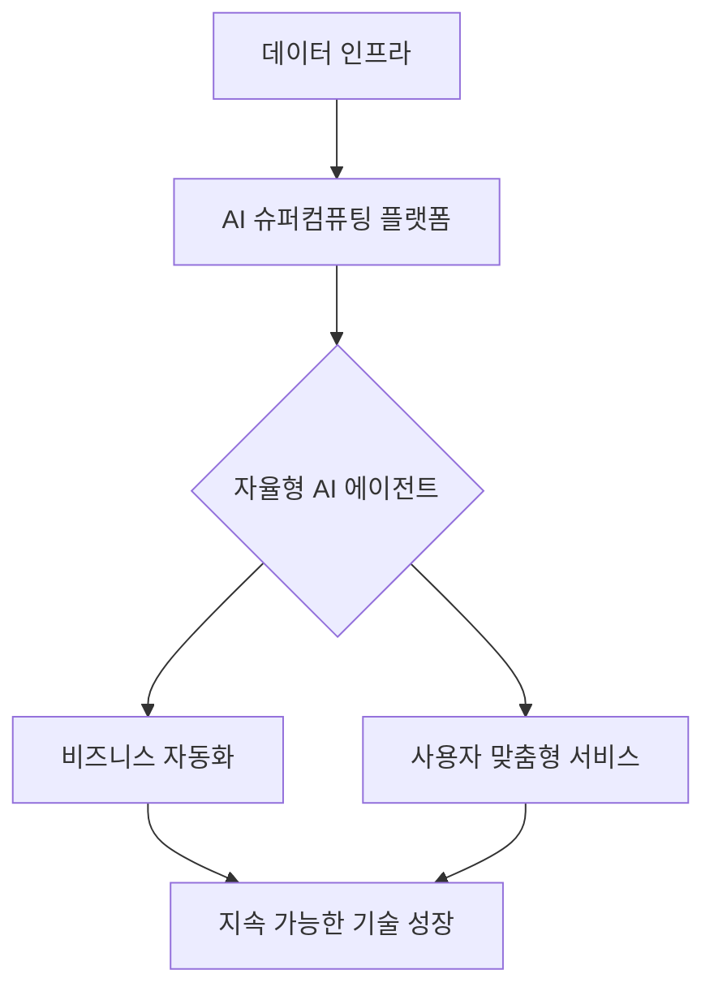

---

## 무엇이 우리의 비즈니스 지도를 지우고 다시 그리는가?

2025년이 'AI 도입'의 원년이었다면, 다가올 2026년은 그 AI가 실질적인 비즈니스 인프라로 뿌리내리는 '구조적 전환'의 시기입니다. 하지만 대다수의 기업과 개인은 여전히 "어떤 툴을 쓸까?"라는 단기적 고민에 매몰되어 있습니다. 

단순히 AI 서비스를 도입하는 것만으로는 충분하지 않습니다. 이제는 'AI를 어떻게 운영할 것인가'를 넘어, 'AI가 구축한 새로운 기술 생태계 위에서 어떤 가치를 창출할 것인가'로 시야를 확장해야 합니다. 기술의 파도에 휩쓸리지 않고 올라타기 위해 우리가 지금 직면한 문제와 전략적 해법을 짚어봅니다.

## 기술의 복잡성: 왜 우리는 길을 잃는가?

지금 우리는 '기술 과잉'의 시대에 살고 있습니다. 매일같이 쏟아지는 새로운 프레임워크와 트렌드는 오히려 의사결정을 마비시킵니다.

*   **기술 부채의 누적:** 급하게 도입한 AI 툴들이 레거시 시스템과 충돌하며 기술 부채를 양산하고 있습니다.
*   **전략의 부재:** 'AI 슈퍼컴퓨팅'이나 '에이전트 시스템'이라는 거창한 단어에 가려져, 정작 우리 비즈니스에 필요한 실질적 데이터 연결 고리를 놓치고 있습니다.
*   **실행력의 괴리:** 트렌드를 읽는 것과 이를 실현할 소프트웨어 역량 사이의 간극이 점차 벌어지고 있습니다.

## 2026년, 기술 생태계의 재편 흐름

성공적인 미래 대응을 위해 우리는 기술의 흐름을 단일 서비스가 아닌 '시스템적 구조'로 이해해야 합니다. 가트너가 강조한 AI 슈퍼컴퓨팅과 소프트웨어의 진화는 결국 다음의 흐름으로 수렴됩니다.

## Solve: 기술의 복잡성을 돌파하는 3가지 전략

단순히 기술을 습득하는 단계를 넘어, 비즈니스의 '구조적 경쟁력'을 확보하기 위한 핵심 액션 플랜을 제안합니다.

### 1. ‘모델’ 중심에서 ‘인프라’ 중심의 사고로
AI 모델 그 자체는 이제 범용재(Commodity)가 되어가고 있습니다. 독창성을 만드는 것은 모델의 성능이 아니라, **데이터를 처리하는 컴퓨팅 플랫폼과 파이프라인**입니다. 
*   우리만의 고유 데이터가 흐르는 효율적인 파이프라인을 구축하십시오.
*   공용 AI 서비스에 의존하기보다, 특정 도메인에 최적화된 컴퓨팅 자원을 확보하는 방향을 검토해야 합니다.

### 2. 에이전트 기반의 워크플로우 설계
2026년의 소프트웨어는 사용자가 버튼을 클릭하는 방식이 아니라, AI 에이전트가 스스로 판단하고 실행하는 방향으로 진화합니다. 
*   단순 업무 자동화(RPA)를 넘어, **복합적인 목표를 달성할 수 있는 자율형 에이전트 워크플로우**를 설계하십시오.
*   이를 위해 팀 내 '소프트웨어 엔지니어링'적 사고방식(시스템 간의 연결과 API 활용 능력)을 전사적으로 배양해야 합니다.

### 3. 기술적 직관(Technical Intuition) 키우기
쏟아지는 기술 트렌드를 다 알 필요는 없습니다. 대신 **'기술이 비즈니스 가치를 어떻게 변환시키는가'**에 대한 직관을 길러야 합니다.
*   새로운 기술이 발표되면 "이게 무엇인가?"가 아니라 **"이 기술이 우리 업무의 병목 구간을 어디서 해소해 주는가?"**를 먼저 자문하십시오.
*   기술 도입의 기준을 '화제성'이 아닌 '운영 비용 절감'과 '가치 창출 속도'에 두는 실용주의적 접근이 필수적입니다.

결론적으로, 2026년은 기술이 인간을 대체하는 시대가 아니라, **기술을 인프라처럼 다루는 사람과 그렇지 못한 사람의 격차가 극명하게 갈리는 시대**가 될 것입니다. 지금 당장 필요한 것은 더 많은 AI 툴이 아니라, 내 비즈니스를 기술의 언어로 재해석하는 '전략적 통찰'입니다.