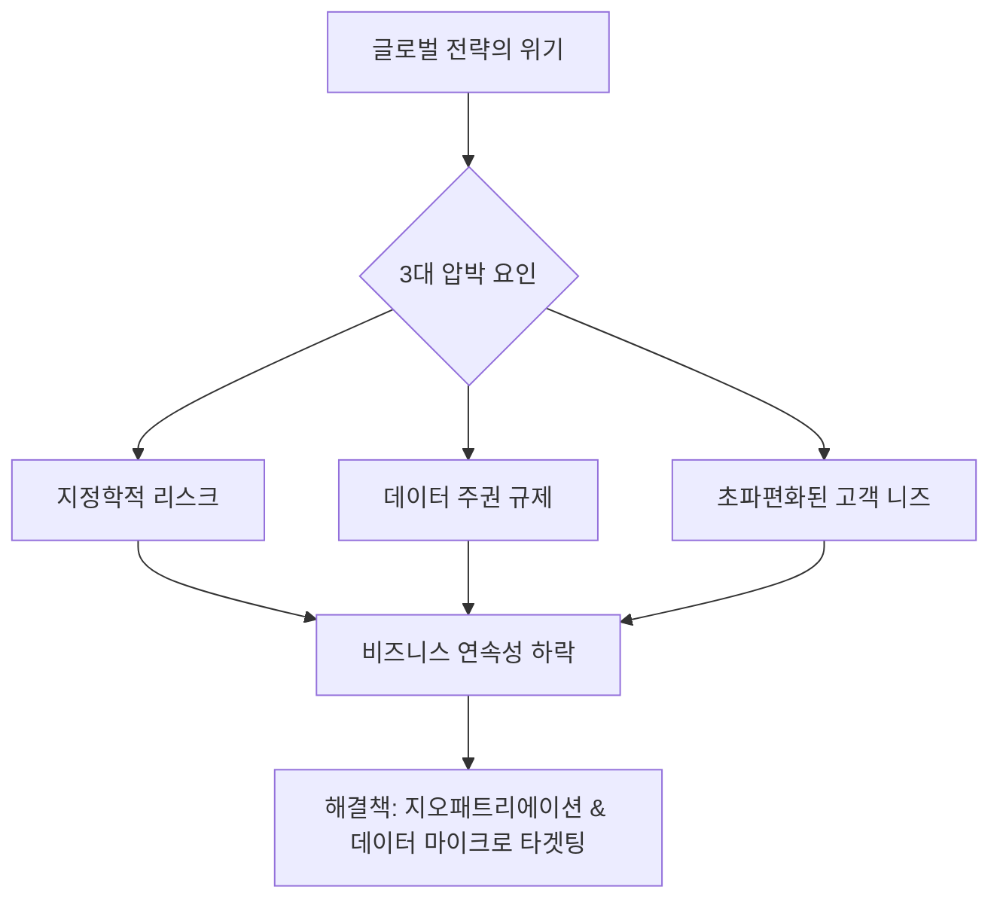

## 왜 지금 글로벌 기업들은 '본국'으로 회귀하는가?

과거의 비즈니스 문법은 '효율성'이 지배했습니다. 비용이 저렴한 곳으로 공장을 옮기고, 전 세계 어디서든 균일한 서비스를 제공하는 것이 미덕이었죠. 하지만 최근 글로벌 경영진 사이에서 '지오패트리에이션(Geopatriation, 지리적 본국 회귀)'이 가장 뜨거운 화두로 떠오르고 있습니다.

단순한 애국주의가 아닙니다. 지정학적 리스크가 공급망을 끊어버리고, 국가별로 상이한 규제와 데이터 주권 문제가 비즈니스의 발목을 잡는 시대가 도래했기 때문입니다. 이제 기업은 '글로벌'이라는 환상에서 벗어나, 각 시장의 특수성을 깊숙이 파고드는 '현지화된 실재'를 구축해야 하는 과제에 직면했습니다.

## 기업을 가로막는 3중고: 왜 지금인가?

많은 비즈니스 리더들이 다음과 같은 문제에 봉착해 있습니다. 

* **공급망 불확실성:** 특정 지역의 전쟁이나 정치적 변화가 기업의 생존을 위협함.
* **데이터 주권주의:** 각국 정부가 자국민의 데이터를 외부 유출로부터 엄격히 통제하기 시작함.
* **소비자 취향의 초파편화:** 획일화된 글로벌 제품이 더 이상 전 세계 소비자의 지갑을 열지 못함.

이러한 문제들을 시각화하면 다음과 같습니다.

## Solve: '현지 맞춤형 데이터'가 바꾸는 생존 전략

단순히 생산 거점을 옮기는 것만으로는 부족합니다. 진짜 승자는 '데이터'를 통해 각 시장의 맥락을 읽어내는 기업입니다. 롯데멤버스의 2025 트렌드 인사이트 보고서가 시사하듯, 이제 소비자의 행동 데이터는 파편화된 조각들 속에서 명확한 패턴을 찾아내야 합니다. 

우리가 취해야 할 전략적 대응은 다음과 같습니다.

### 1. ‘글로벌 스탠다드’에서 ‘지역별 에코시스템’으로
- 모든 시장에 동일한 앱과 서비스를 강요하지 마십시오.
- 각 지역의 문화와 규제 환경에 맞춰 데이터 저장 및 처리 방식을 분리하는 '엣지 컴퓨팅(Edge Computing)' 전략을 검토하세요.

### 2. 고도화된 타겟팅의 시대: ‘엘포인트’식 인사이트 활용
- 이제 대규모 마케팅보다는 특정 지역, 특정 커뮤니티의 실질적인 소비 행태를 분석해야 합니다.
- 매경 재테크 채널들이 대중의 관심을 얻는 것처럼, 우리 비즈니스도 고객이 직접 체감하는 '실질적 이득'과 '지역적 밀착도'를 데이터로 증명해야 합니다.

### 3. 유연한 조직 구조 설계
- 지오패트리에이션은 물리적 복귀만을 의미하지 않습니다.
- 현지 시장의 리스크를 감지하고 즉각 대응할 수 있는 '자율적인 현지 운영팀'에 권한을 대폭 위임하는 조직 문화가 필수적입니다.

### 핵심 요약
결국 2025년 이후의 비즈니스는 **"멀리서 보는 글로벌 전략"이 아니라 "현지 깊숙이 들어가는 데이터 전략"**에 의해 성패가 갈릴 것입니다. 기업은 이제 본국으로 돌아가 뿌리를 튼튼히 하되, 데이터라는 혈관을 통해 그 지역 소비자의 심장박동을 읽어내야만 합니다. 당신의 비즈니스는 지금 어느 지점에 뿌리를 내리고 있습니까?