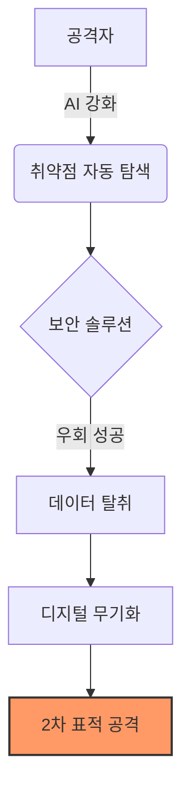

## 1. 보이지 않는 전쟁터: 당신의 데이터가 무기가 될 때 (Problem)

최근 중국의 주요 보안 기업인 ‘Knownsec’이 해킹당하며, 국가 지원을 받는 사이버 무기 정보와 정밀 타격 대상 명단이 유출되었습니다. 이는 단순히 기업 내부의 보안 사고가 아닙니다. 

지금까지 우리는 해킹을 ‘데이터 도난’이나 ‘시스템 마비’의 관점에서만 바라봤습니다. 하지만 이제 데이터는 그 자체로 살상력을 가진 ‘디지털 무기’가 되었습니다. 기업이 방어에 실패하는 순간, 그 정보는 공격자의 손에서 더 큰 표적을 향한 정밀 타격 도구로 변질됩니다. 당신의 기업이 뚫리는 순간, 당신은 가해자의 공범 혹은 다음 전쟁의 발판이 될 수 있다는 사실을 인지해야 합니다.

## 2. 보안의 역설: AI가 가속화하는 ‘공격의 민주화’ (Agitate)

2025년을 관통하는 사이버 위협의 핵심은 ‘AI를 통한 공격의 자동화와 고도화’입니다. 과거에는 정교한 해킹이 고도의 기술력을 가진 조직의 전유물이었다면, 이제는 AI를 활용해 누구나 저비용으로 높은 수준의 침투를 시도할 수 있습니다.

*   **공격의 지능화:** AI는 기업 내부망의 취약점을 실시간으로 학습하고, 인간이 알아채지 못할 수준의 정교한 피싱 메일을 대량 생산합니다.
*   **공격의 대칭성 붕괴:** 방어는 완벽해야 하지만, 공격은 단 하나의 틈만 노리면 됩니다. AI는 이 ‘단 하나의 틈’을 찾는 시간을 비약적으로 단축했습니다.
*   **보안 기업의 신뢰 위기:** 보안 기업조차 해킹당하는 시대, 우리가 믿었던 ‘보안 솔루션’이 오히려 가장 위험한 경로가 될 수 있다는 공포가 현실화되었습니다.

## 3. 회복 탄력성에서 ‘제로 트러스트(Zero Trust)’의 일상화로 (Solve)

단순히 방화벽을 높이는 방식으로는 더 이상 생존할 수 없습니다. 이제 보안 전략은 ‘예방’에서 ‘침해 후 대응(Post-Breach)’ 체계로 근본적인 패러다임을 전환해야 합니다.

### 데이터 중심의 파편화 전략
*   **데이터 파편화(Sharding):** 중요한 정보는 단일 서버에 보관하지 말고, 구조를 쪼개어 분산 저장하십시오. 특정 서버가 털려도 공격자가 전체 그림을 완성할 수 없도록 해야 합니다.
*   **무신뢰(Zero Trust) 아키텍처:** 내부망이라고 해서 안전하다고 간주하지 마십시오. 모든 접속과 요청은 실시간으로 인증하고 권한을 최소화해야 합니다.

### 보안 관점의 AI 리터러시 강화
*   **공격자 관점의 모의 해킹:** 기업 내부의 보안 팀은 항상 ‘공격자의 AI’가 어떻게 우리망을 뚫을지 시뮬레이션해야 합니다. 방어적 AI(Defensive AI)를 도입하여 AI가 AI를 방어하는 루프를 형성하십시오.
*   **공급망 보안 검증:** Knownsec 사례처럼, 우리가 사용하는 보안 툴 자체가 공격의 시발점이 되지 않도록 솔루션 공급사의 보안 체계까지 실사(Due Diligence)의 범주에 포함해야 합니다.

### 결론: 보안은 비용이 아닌 ‘생존의 필수 조건’
기업 경영자들에게 이제 보안은 IT 부서의 예산 항목이 아니라, 기업 가치를 방어하는 최전선의 전략 자산입니다. 디지털 무기가 범람하는 2025년, 당신의 기업이 가진 데이터가 누군가를 공격하는 무기가 되지 않도록, 지금 당장 ‘침해를 가정한 보안 체계’로 전환하십시오. 방어의 실패는 이제 단순히 복구의 문제가 아니라, 기업의 생존을 결정짓는 핵심 변수가 될 것입니다.