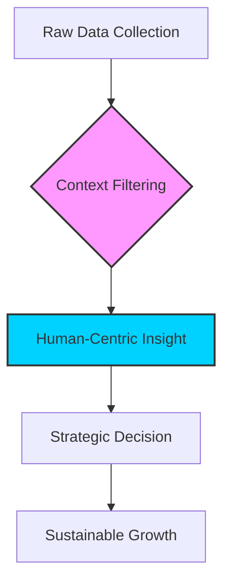

## 1. Problem: 파편화된 데이터, 고립되는 소비자
최근 기업들은 저마다의 데이터를 확보하고 분석하는 데 혈안이 되어 있습니다. 롯데멤버스의 최신 트렌드 보고서에서 알 수 있듯이, 기업은 이제 고객의 미세한 행동 패턴까지 추적하여 초개인화 서비스를 제공하려 합니다.

하지만 여기서 역설이 발생합니다.
* **선택 과부하**: 소비자들은 너무 많은 맞춤형 추천에 피로감을 느낍니다.
* **맥락의 상실**: 데이터는 파편화되어 있어, 고객의 '진짜 의도'를 읽기보다 '과거의 기록'만 재생산합니다.
* **신뢰의 붕괴**: 기업이 내 개인 데이터를 어디까지, 어떻게 활용하는지에 대한 막연한 불안감이 커지고 있습니다.

## 2. Agitate: 왜 지금의 데이터 전략은 실패하는가
유튜브 경제 채널의 폭발적인 성장과 ‘지오패트리에이션(Geopatriation)’과 같은 개념이 화두가 된 이유는 단 하나입니다. 세상이 예측 불가능해졌기 때문입니다.

과거에는 "데이터를 많이 가진 자가 승리한다"는 공식이 통했습니다. 하지만 지금은 다릅니다.
* **데이터의 가치 하락**: 누구나 AI를 통해 데이터를 수집할 수 있게 되면서, 정보 자체의 희소성이 사라졌습니다.
* **지정학적 리스크**: 생산 기지를 본국으로 옮기는 지오패트리에이션은 글로벌 공급망의 데이터를 다시 짜야 한다는 의미입니다.
* **해석의 부재**: 데이터는 넘쳐나지만, 이를 기업의 생존 전략으로 연결하는 '통찰(Insight)'의 부재가 심각합니다. 단순히 데이터를 수집하는 수준에 머물면, 결국 시장의 변화 속도를 따라가지 못합니다.

## 3. Solve: 데이터 전략의 판을 바꾸는 3단계 메커니즘
이제 기업과 개인은 ‘데이터 수집가’가 아닌 ‘데이터 큐레이터’가 되어야 합니다. 아래의 다이어그램은 데이터 중심 기업에서 통찰 중심 기업으로 전환하는 프로세스를 시각화한 것입니다.

### 데이터 큐레이션의 핵심 전략
* **데이터의 질(Quality)에 집중하라**: 양보다 중요한 것은 맥락입니다. 고객이 특정 상품을 구매한 '이유'를 추론할 수 있는 질적 데이터를 확보하십시오.
* **데이터 리터러시의 내재화**: 조직 내부의 모든 구성원이 데이터를 도구로 다룰 수 있어야 합니다. 전문 분석가에게만 의존하는 시대는 끝났습니다.
* **윤리적 데이터 가치 창출**: 투명성을 높이십시오. 데이터 제공 대가로 고객에게 어떤 실질적인 효용(Time-saving, 비용 절감 등)을 줄 것인지 명확한 가치 교환 구조를 만들어야 합니다.

결국, 다가오는 시대의 승자는 거대 데이터를 보유한 자가 아니라, 파편화된 데이터 속에서 인간의 보편적 욕망과 변화하는 시장의 맥락을 연결하는 사람입니다. 기술은 도구일 뿐, 핵심은 항상 ‘사람의 의도’에 있다는 사실을 기억하십시오.