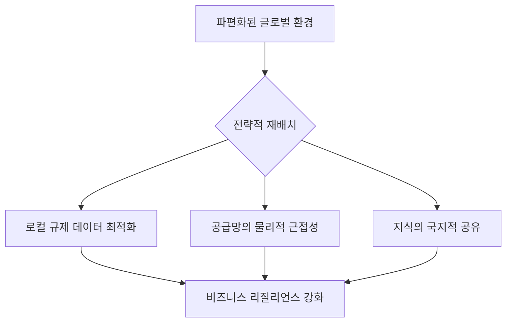

## 연결이 끊긴 세상에서 경영은 어디로 향하는가

최근 글로벌 비즈니스 현장에서는 ‘지오패트리에이션(Geopatriation)’이라는 단어가 화두입니다. 하지만 많은 기업이 이를 단순히 ‘공급망의 근거리 이전’ 정도로만 이해하고 있습니다. 이는 치명적인 오판입니다. 

글로벌 경영인들의 고민은 이제 ‘어디에 공장을 지을 것인가’를 넘어, ‘파편화된 세계 속에서 어떻게 데이터와 신뢰를 재조립할 것인가’로 옮겨갔습니다. 

*   **문제(Problem):** 공급망은 물리적으로 쪼개졌고, 데이터 주권은 국가별로 파편화되고 있습니다. 기존의 '효율 중심 글로벌 전략'은 더 이상 작동하지 않습니다.
*   **선동(Agitate):** 과거의 방식대로 비용 절감만을 외치다가는, 디지털 무기고가 털리거나 로컬 규제에 발목 잡혀 순식간에 경쟁력을 잃을 것입니다. 연결이 끊긴 세상에서 ‘고립된 효율성’은 곧 ‘도태’를 의미합니다.

## 전략적 재배치를 위한 3단계 프레임워크

지오패트리에이션의 핵심은 단순히 생산지를 옮기는 것이 아니라, **‘비즈니스의 운영 체제(OS)를 물리적 위치와 동기화하는 것’**입니다. 이를 위해 우리는 다음과 같은 시각적 구조를 통해 전략을 다시 세워야 합니다.

## 해결책: ‘로컬 인텔리전스’의 구축

단순히 물류를 옮기는 것만으로는 부족합니다. 진정한 승자는 지역별 데이터 리터러시를 높이고, 현장에서 생성되는 지식을 본사와 실시간으로 동기화하는 기업이 될 것입니다.

### 1. 데이터의 국지적 자립
*   모든 데이터를 중앙 서버로 집중시키는 모델은 리스크가 큽니다.
*   각 거점(Geo)별로 독자적인 데이터 분석 환경을 구축하여 규제 변화에 즉각 대응하십시오.

### 2. 학습하는 조직의 재설계
*   최근 매경 등 미디어 플랫폼을 통해 확인되듯, 대중의 재테크 및 비즈니스 학습 열기는 그 어느 때보다 뜨겁습니다. 
*   기업 내부에서도 이러한 ‘인사이트의 공유 체계’를 만들어야 합니다. 단순히 보고서를 올리는 것이 아니라, 각 거점의 책임자가 ‘현장의 언어’로 비즈니스 트렌드를 해석하게 하십시오.

### 3. 신뢰를 기반으로 한 거버넌스
*   물리적 거리가 멀어질수록 신뢰 비용은 상승합니다.
*   투명한 거버넌스 구조를 블록체인이나 실시간 대시보드로 가시화하여, 파편화된 조직원들이 ‘하나의 목표’를 향하고 있다는 확신을 제공하십시오.

## 결론: 새로운 트렌드에 올라타는 법

우리는 2026년을 앞두고 비즈니스 트렌드의 거대한 변곡점에 서 있습니다. 이제는 ‘글로벌’이라는 단어의 정의를 다시 써야 합니다. 

글로벌이란 ‘어디에나 존재하는 것’이 아니라, **‘각각의 장소에서 그곳에 최적화된 모습으로 깊게 뿌리내리는 것’**입니다. 당신의 기업은 지금 파편화를 위기로 보고 있습니까, 아니면 새로운 전략적 재배치의 기회로 보고 있습니까? 지금 바로 당신의 비즈니스 지도를 다시 그리십시오.