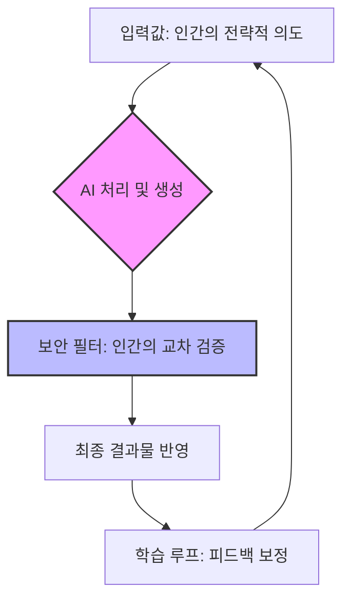

## 문제(Problem): 편리함이 불러온 '디지털 부채'
오늘날 우리는 AI를 통해 업무 효율을 극대화하고 있습니다. UN과 같은 국제기구조차 보도자료 초안을 AI에 맡기는 시대입니다. LLM(대규모 언어 모델) 시장은 2033년까지 폭발적인 성장이 예견되며, AI는 이제 단순한 도구를 넘어 '조직의 필수 사원'이 되었습니다.

하지만 이 눈부신 편리함 뒤에는 간과하고 있는 위험이 있습니다.
* **보안의 취약성**: AI가 생성한 비밀번호나 코드는 패턴화되기 쉬워 해커의 정교한 공격 대상이 됩니다.
* **생산성의 함정**: AI가 뱉어내는 매끄러운 텍스트를 검증 없이 수용할 때, 기업은 보이지 않는 '데이터 오염'에 노출됩니다.
* **통제권 상실**: 업무 프로세스 깊숙이 들어온 AI가 '블랙박스'로 작용하며, 오류 발생 시 책임 소재가 불분명해집니다.

## 선동(Agitate): 우리가 간과하는 'AI의 그림자'
AI가 생성한 콘텐츠가 많아질수록, 역설적으로 우리 시스템은 더 취약해집니다.
* "AI가 만든 비밀번호는 의외로 뚫기 쉽다"는 최근의 지적은 단지 보안의 문제를 넘어, AI가 가진 '예측 가능성'이라는 근본적 한계를 보여줍니다.
* 인간의 직관이 빠진 데이터 생산은 AI가 가진 통계적 확률에만 의존하며, 이는 곧 비즈니스의 '독창성 상실'과 '보안 취약점'을 동시에 야기합니다.
* AI 도입률은 높지만, 정작 그 결과물을 관리할 '보안 리터러시'는 2023년 수준에 머물러 있는 것이 현재 기업들이 처한 냉혹한 현실입니다.

## 해결(Solve): AI를 길들이는 3단계 전략
AI를 맹신하는 단계에서 '관리하는 단계'로 전환해야 합니다. 아래는 AI와 공생하기 위한 필수 프레임워크입니다.

### 1. 보안의 인간화 (Human-in-the-loop Security)
AI가 생성한 모든 산출물(코드, 비밀번호, 문서)은 '신뢰할 수 없는 가설'로 간주해야 합니다.
* **교차 검증**: AI가 제안한 보안 키값은 반드시 2차 인간 검증 단계를 거쳐 변형(Salt)을 가해야 합니다.
* **최소 권한 원칙**: AI 모델이 접근할 수 있는 기업 내부 데이터의 범위를 물리적으로 제한하십시오.

### 2. 가치 사슬의 재설계
단순 생산성 향상을 넘어, '지속 가능한 AI 거버넌스'를 구축해야 합니다.

### 3. 통찰적 리터러시로의 전환
단순히 AI를 '쓰는 방법'이 아니라 'AI가 언제 틀리는가'를 공부하는 것이 진짜 실력입니다.
* **데이터 흐름 가시화**: 우리 회사의 데이터가 어떤 LLM API를 거쳐 나가는지 파악하십시오.
* **오류 피드백 루프**: AI의 결과물이 왜 비즈니스적으로 위험한지를 기록하여, 사내용 프롬프트 엔지니어링 가이드라인을 업데이트하십시오.

결론적으로, AI 시대의 생존은 'AI를 얼마나 많이 쓰는가'가 아니라 **'AI의 결과물을 인간의 필터로 얼마나 안전하게 통제할 수 있는가'**에 달려 있습니다. 기술의 속도에 현혹되지 마십시오. 당신의 직관이 가장 강력한 최종 보안 방어선입니다.