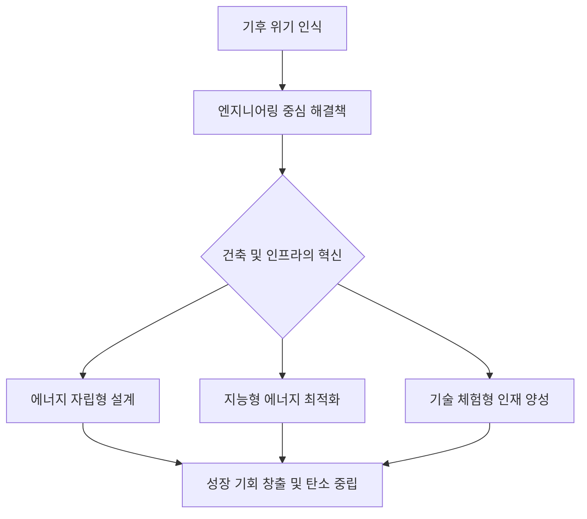

---

## 멈추지 않는 온도 상승, 우리는 왜 아직 '건물'을 탓하는가?

기후 위기가 현실화되면서 많은 기업이 탄소 중립을 외치고 있습니다. 하지만 놀랍게도 전 세계 온실가스 배출량의 상당 부분이 '건물'에서 발생한다는 사실을 간과합니다. 우리는 여전히 에너지 효율이 낮은 공간에서 머물며, 기술적 해결책보다는 단순히 '절약'만을 강조하는 모순적인 상황에 처해 있습니다.

*   **에너지 누수**: 현대의 건축물은 마치 구멍 난 바구니와 같습니다. 열 손실이 많은 단열 구조는 불필요한 냉난방 에너지를 유발합니다.
*   **소극적 대응**: 신재생 에너지를 도입하더라도, 건물의 설계 단계부터 에너지 자립을 고려하지 않으면 '밑 빠진 독에 물 붓기'가 됩니다.
*   **인식의 격차**: 대중은 기후 위기를 '먼 미래의 재난'으로 느끼며, 건축이나 인프라가 어떻게 기후 대응의 핵심 무기가 될 수 있는지 체감하지 못합니다.

## 불안의 증폭: 우리가 간과하는 인프라의 노후화

기후 변화는 단순한 온도 상승을 넘어, 기존 건축물의 '생존'을 위협합니다. 극한 기후로 인해 냉난방 부하가 급증하면, 현재의 전력망과 건물 설계로는 감당할 수 없는 한계점에 도달하게 됩니다. 

*   **비용의 가중**: 효율 낮은 건물은 탄소세와 에너지 가격 급등이라는 이중고를 맞이할 것입니다.
*   **운영 리스크**: 김태균 한국전력기술 사장의 언급처럼, 이제 발전소 설계와 신재생 에너지는 단순히 따로 노는 기술이 아니라 '통합 설계'의 영역으로 진입했습니다. 우리가 살고 일하는 공간도 이와 같은 '통합형 엔지니어링' 관점이 필요합니다.
*   **체험의 부재**: 경복대 친환경건축과 학생들이 '서울에너지드림센터'를 방문해 기술을 체험한 것은 큰 시사점을 줍니다. 눈으로 보고 손으로 만지는 기술적 성찰 없이는, 기후 변화에 대응하는 올바른 건축 철학이 뿌리내릴 수 없습니다.

## 해법: 엔지니어링적 사고의 전환, ‘에너지 자립형 생태계’

이제 우리는 '얼마나 아끼느냐'에서 '어떻게 시스템을 통합하느냐'로 프레임을 옮겨야 합니다. 기후 위기는 곧 엔지니어링의 거대한 성장 기회입니다.

### 1. 설계의 재정의: '건물'에서 '발전소'로
건물을 단순한 주거 공간이 아닌, 에너지를 스스로 생산하고 저장하는 '마이크로 발전소'로 재정의해야 합니다. 
*   BIPV(건물 일체형 태양광 발전) 기술을 통해 외벽 자체가 에너지를 만드는 스킨이 되어야 합니다.
*   AI를 활용한 지능형 건물 관리 시스템(BEMS)으로 실시간 에너지 소비를 최적화해야 합니다.

### 2. 교육과 기술의 결합
미래 세대는 기후 변화를 교과서 속 이야기가 아닌, 직접 다뤄야 할 '도구'로 배워야 합니다. 현장 중심의 건축 기술 체험이 그 시작점입니다.

### 3. 통합 설계 전략
*   **협업의 확대**: 에너지 엔지니어와 건축가가 초기 설계 단계부터 데이터 기반의 협업을 진행해야 합니다. 
*   **성장으로의 전환**: 친환경 기술을 단순한 비용으로 볼 것이 아니라, 자산 가치를 높이고 운영 비용을 절감하는 '투자'로 인식하십시오.

결국 미래의 승자는 '환경을 지키는 건물'을 넘어 '환경과 상생하는 인프라'를 설계할 수 있는 이들이 될 것입니다. 지금 우리가 짓는 건축물이 내일의 지구 온도를 결정한다는 책임감을, 이제는 엔지니어링의 정교함으로 증명할 때입니다.