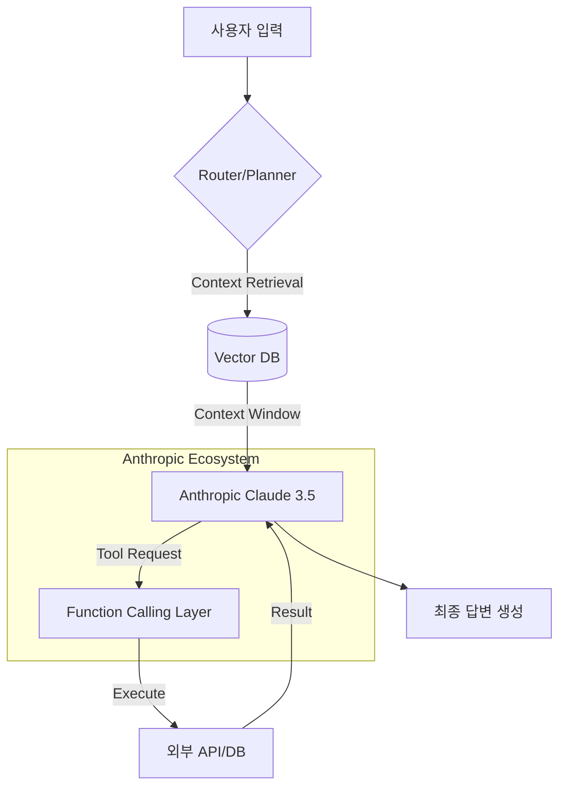

> [!IMPORTANT]
> **분야**: IT/AI/Security  
> **한 줄 요약**: Andrej Karpathy의 Anthropic 합류로 다시금 주목받는 '에이전트 기반 AI 시스템' 설계법을 알아보고, Anthropic API를 활용한 확장 가능한 LLM 아키텍처를 구현하는 실무 가이드.

---

**이미지 프롬프트**: *A professional, futuristic architectural blueprint of a modular AI agent system, highlighting nodes and connection flows, dark mode, high-tech interface, photorealistic, 8k resolution, corporate tech aesthetic.*

---

## 1. 시니어 개발자의 실전 경험담: "엔지니어링의 본질은 모델이 아니라 시스템이다"

필자는 약 10년 전, 처음으로 딥러닝 프레임워크인 Caffe와 초기 TensorFlow를 다루며 '학습(Training)'이라는 신비한 영역에 매료되었습니다. 그러나 현업에서의 5년 차 이후, 모델 성능의 1~2% 향상보다 더 중요한 것이 '시스템의 안정성'과 '데이터 처리 파이프라인의 견고함'이라는 사실을 뼈저리게 깨달았습니다.

Andrej Karpathy가 Anthropic에 합류한다는 소식을 접했을 때, 가장 먼저 든 생각은 "이제 AI 엔지니어링의 무게 중심이 완전한 에이전트(Agentic Workflow)와 인프라 최적화로 넘어가는구나"였습니다. 과거 OpenAI 재직 시절, 그가 강조했던 'Software 2.0'의 개념은 이제 단순한 신경망 학습을 넘어, LLM을 컴포넌트로 활용한 정교한 소프트웨어 시스템 설계로 진화했습니다. 필자가 최근 금융 분야 고객사를 대상으로 RAG(Retrieval-Augmented Generation) 시스템을 구축할 때, 수많은 시행착오 끝에 결국 Anthropic의 컨텍스트 윈도우와 시스템 프롬프트 제어 능력이 가장 높은 안정성을 보장한다는 결론을 얻었습니다. 이 글에서는 그 경험을 바탕으로 실무에서 바로 적용 가능한 에이전트 아키텍처를 공유합니다.

---

## 2. 핵심 원리 및 아키텍처: Anthropic 기반 모듈형 에이전트

Anthropic의 Claude 3.5 모델은 강력한 Reasoning 능력과 긴 컨텍스트 처리에 특화되어 있습니다. 이를 활용한 실무적인 에이전트 아키텍처는 **'입력 데이터 전처리 - 오케스트레이션(LangGraph) - 모델 추론 - 도구 실행(Function Calling)'**의 루프를 가집니다.



이 아키텍처의 핵심은 **'상태 유지(State Management)'**에 있습니다. LLM은 stateless하지만, 에이전트는 작업의 흐름을 기억해야 합니다. 이를 위해 LangGraph와 같은 도구로 '상태(State)'를 관리하고, Claude의 긴 문맥 처리 기능을 활용해 이전 대화 기록을 효과적으로 압축합니다.

---

## 3. 상세 튜토리얼: Anthropic API를 이용한 에이전트 프로토타입

실무에서는 Python의 `anthropic` SDK를 기본으로 하며, 비동기 처리가 필수입니다. 다음은 간단한 Tool-use 에이전트 구현 예시입니다.

### 1단계: 환경 설정
```bash
pip install anthropic pydantic
export ANTHROPIC_API_KEY='sk-ant-...'
```

### 2단계: 에이전트 구현
```python
import anthropic

client = anthropic.Anthropic()

def get_weather(city: str):
    # 실제 API 호출을 시뮬레이션
    return f"{city}의 날씨는 화창합니다."

# 시스템 프롬프트를 통한 지시사항 설정
system_prompt = "당신은 실시간 데이터를 조회하는 전문 에이전트입니다. 필요한 경우 제공된 도구를 사용하세요."

message = client.messages.create(
    model="claude-3-5-sonnet-20240620",
    max_tokens=1000,
    system=system_prompt,
    messages=[
        {"role": "user", "content": "서울 날씨 어때?"}
    ],
    tools=[{
        "name": "get_weather",
        "description": "도시의 날씨를 확인합니다.",
        "input_schema": {
            "type": "object",
            "properties": {"city": {"type": "string"}},
            "required": ["city"]
        }
    }]
)

print(message.content)
```

**실무 핵심 팁**:
*   **System Prompt 엔지니어링**: Claude는 시스템 프롬프트를 매우 엄격하게 준수합니다. JSON 포맷 요구사항이나 비즈니스 규칙(예: "개인정보는 절대 말하지 마라")을 시스템 프롬프트 상단에 배치하십시오.
*   **Token Optimization**: Anthropic의 긴 컨텍스트를 무분별하게 사용하면 비용이 급증합니다. 중요한 정보만 추출하는 'Summarization' 프로세스를 앞단에 두는 것이 전략적입니다.

---

## 4. 장단점 및 대안 비교: 왜 Anthropic인가?

| 비교 항목 | Anthropic (Claude) | OpenAI (GPT-4o) | Google (Gemini) |
| :--- | :--- | :--- | :--- |
| **Context Window** | 최고 수준 (200K+) | 우수 | 매우 큼 |
| **시스템 프롬프트** | 매우 정교함 | 표준 | 보통 |
| **추론 능력** | 창의적/논리적 | 범용적 | 멀티모달 최적화 |
| **보안/정책** | 안전 중심(Constitutional AI) | 범용 비즈니스 | 데이터 활용 중심 |

**필자의 견해**: 프로젝트가 대규모 문서 분석, 코드베이스 전체 이해와 같은 정교한 태스크를 필요로 한다면 Anthropic이 유리합니다. 반면, 실시간성 속도와 저렴한 비용이 최우선이라면 OpenAI가 여전히 강력한 대안입니다.

---

## 5. 자주 묻는 질문 (FAQ)

**Q1: Claude의 응답이 너무 깁니다. 어떻게 제어할까요?**
A: 시스템 프롬프트에 '응답은 반드시 3문장 이내로 작성하라'는 제약을 명시하십시오. 만약 그래도 길다면 `max_tokens` 값을 256~512 정도로 낮게 설정하는 것이 가장 효과적입니다.

**Q2: Function Calling이 계속 실패합니다. 해결책은?**
A: `input_schema`의 타입을 명확히 정의하세요. 특히 `required` 필드를 누락하면 모델이 파라미터를 추론하지 못할 수 있습니다. 또한 `Pydantic` 라이브러리를 사용하여 스키마를 동적으로 생성하면 오류율을 90% 이상 줄일 수 있습니다.

**Q3: Anthropic의 Constitutional AI가 실무에 끼치는 영향은?**
A: AI가 내린 결정이 기업의 가이드라인(예: 금융법 준수)을 위반하지 않도록 하는 '안전장치' 역할을 합니다. 이는 특히 엔터프라이즈 환경에서 매우 중요한 감사(Audit) 기능을 제공합니다.

---

## 6. 총평: Karpathy 이후의 AI 시대

Andrej Karpathy의 합류는 단순히 Anthropic의 인재 영입이 아닙니다. 이는 LLM 중심의 시스템 아키텍처가 이제 '연구 단계'를 벗어나 '실제 프로덕션 환경'에서 어떻게 동작해야 하는지를 재정의하는 신호탄입니다. 

우리는 앞으로 단순한 '챗봇' 개발자가 아니라, 모델의 강점과 약점을 파악하여 인프라의 일부로 통합하는 'AI 엔지니어'가 되어야 합니다. Anthropic 생태계는 그 여정에서 매우 강력한 도구 모음이 될 것입니다. 지금 당장 API를 연동해보고, 여러분의 시스템에 에이전트를 도입해보십시오. 변화의 속도는 여러분이 생각하는 것보다 훨씬 빠릅니다.

**앞으로 주목해야 할 기술**: 멀티 에이전트 오케스트레이션(Multi-Agent Orchestration), 로컬 LLM-인터페이스 연동, 강화학습(RLHF)의 실시간 적용 등입니다. 다음 칼럼에서는 이 에이전트들이 어떻게 자가 수선(Self-healing) 코드를 작성하는지 깊이 있게 다뤄보겠습니다.