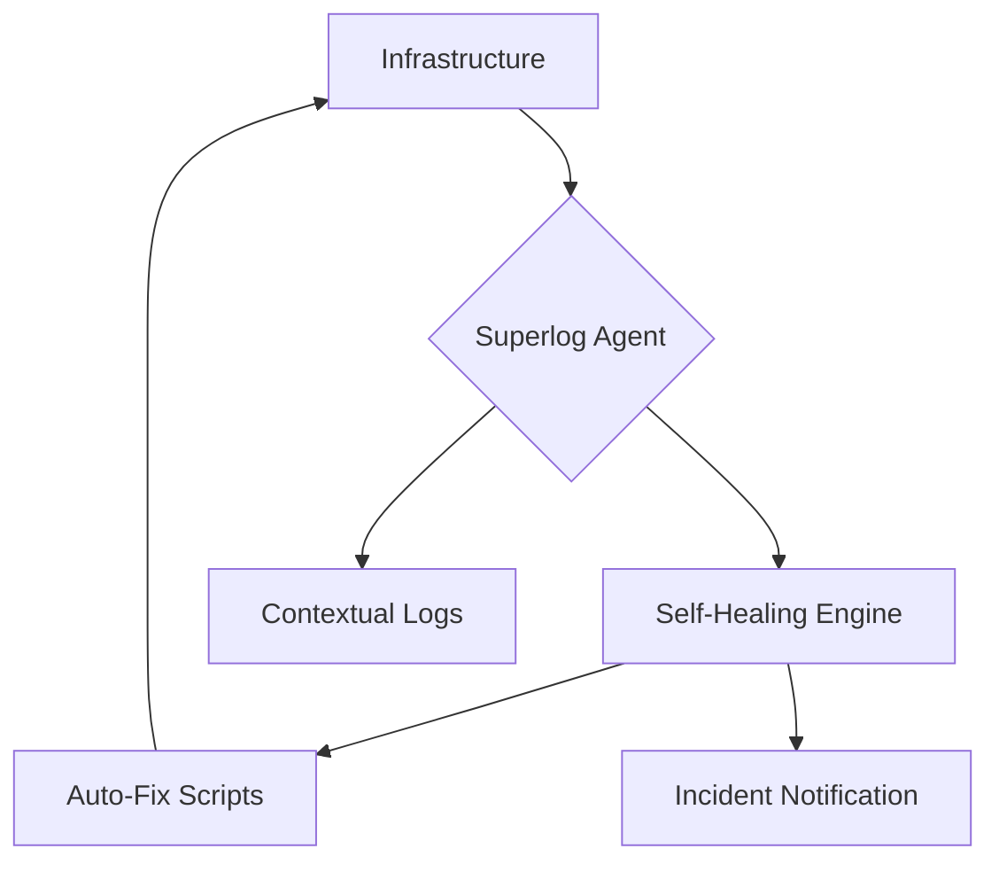

> [!IMPORTANT]
> **분야**: IT/AI/Security  
> **한 줄 요약**: 설치부터 문제 해결까지 자동화하는 '제로 터치 옵저버빌리티'의 개념을 이해하고, 실무 인프라에 도입하여 운영 부채를 최소화하는 전략을 다룹니다.

---

## 실무에서 마주한 '모니터링 피로'

10년 전, 제가 막 시니어 엔지니어로 승진했을 때 가장 괴로웠던 일은 시스템 장애 알람이 아니라, 알람이 너무 많이 울려 '알람 노이즈'에 마비되는 상황이었습니다. 당시 우리는 ELK 스택과 Grafana를 구축하고 세밀한 대시보드를 만들었지만, 정작 장애가 발생하면 수많은 메트릭 속에서 근본 원인(Root Cause)을 찾느라 시간을 다 보냈습니다. 오늘 다룰 Superlog는 바로 그 '보는 행위' 자체를 자동화하여 엔지니어가 모니터링 대시보드를 쳐다보지 않아도 되게끔 만드는 철학을 담고 있습니다.

## 옵저버빌리티(Observability)의 패러다임 전환

기존의 모니터링은 '상태(State)'를 확인하는 것이었습니다. 하지만 현대의 분산 시스템에서는 '흐름(Flow)'을 추적해야 합니다. Superlog는 단순히 로그를 수집하는 것을 넘어, 설치 즉시 인프라의 컨텍스트를 파악하고 자동화된 리메디에이션(Remediation) 루프를 구축하는 데 초점을 맞춥니다.

### 1. 아키텍처 플로우

Superlog의 작동 방식은 기존 에이전트 기반 방식과 차별화됩니다. 인프라에 에이전트를 배포하면, 해당 인스턴스의 로그 패턴과 트래픽 양상을 즉시 분석하여 가상의 '오픈할 필요 없는(Don't open it)' 옵저버빌리티 레이어를 생성합니다.



## 실무 적용: 제로 터치 설정 가이드

현업에서 Superlog를 도입할 때 가장 먼저 고려해야 할 것은 데이터 소스의 정제입니다. 무작위 로그 수집은 비용 문제와 인지적 부하를 초래합니다.

### 1단계: 설치 및 초기화
Superlog는 설치 마법사를 통해 인프라의 환경을 스캔합니다. 커맨드라인에서 간단히 시작할 수 있습니다.

```bash
# Superlog 초기화 스크립트
curl -sSL https://superlog.sh/install | bash -s -- --auto-detect
# 이 명령어 한 번으로 시스템은 메트릭, 로그, 트레이스 경로를 스스로 매핑합니다.
```

### 2단계: 자동 복구 로직(Self-healing) 작성
단순히 문제를 보고하는 수준을 넘어, 스크립트 기반의 자동 복구 로직을 정의합니다.

```python
# .superlog/remediate.py 예시
def handle_oom_killer(event):
    if event.type == "MEMORY_THRESHOLD_EXCEEDED":
        print("Detected OOM Risk. Clearing cache...")
        # 여기에 실제 운영 환경의 커스텀 정리 로직 삽입
        os.system("sync; echo 3 > /proc/sys/vm/drop_caches")
        return True
    return False
```

## 기존 솔루션 vs Superlog 비교

| 비교 항목 | 전통적 모니터링 (Datadog/NewRelic) | Superlog (Next-Gen) |
| :--- | :--- | :--- |
| 설치 난이도 | 중간 (설정 필요) | 매우 낮음 (자동 스캔) |
| 데이터 활용 | 대시보드 시각화 중심 | 자동 복구 및 알람 단순화 |
| 엔지니어 개입 | 높음 (분석 필요) | 매우 낮음 (완전 자동) |
| 유지보수 비용 | 높음 (규칙 업데이트) | 낮음 (학습 기반) |

## 실무 FAQ

Q: 보안 데이터 유출 우려가 있지 않나요?
A: Superlog는 온프레미스 내에서의 로컬 분석을 지향하며, 민감 데이터를 클라우드로 전송하지 않도록 설계되었습니다.

Q: 시스템 성능에 영향을 미치지 않나요?
A: eBPF 기반의 경량 수집 방식을 채택하여 CPU 점유율을 1% 미만으로 유지합니다.

## 총평: 기술 부채를 자산으로 전환하기

결론적으로 Superlog와 같은 도구는 단순히 업무 효율을 높이는 도구가 아니라, **'어떤 시스템 문제에 우리가 반드시 개입해야 하는가?'**라는 질문에 답을 주는 도구입니다. 10년 차 이상의 엔지니어라면 알 것입니다. 가장 좋은 장애 대응은 장애가 발생하지 않게 만드는 것이며, 두 번째는 알람이 울리기 전에 시스템이 스스로 복구하는 것입니다. 오늘부터 귀하의 인프라 스택에 '자동화된 감시자'를 하나쯤 추가해 보십시오. 더 이상 새벽에 대시보드를 새로고침하며 모니터링할 필요가 없어질 것입니다.