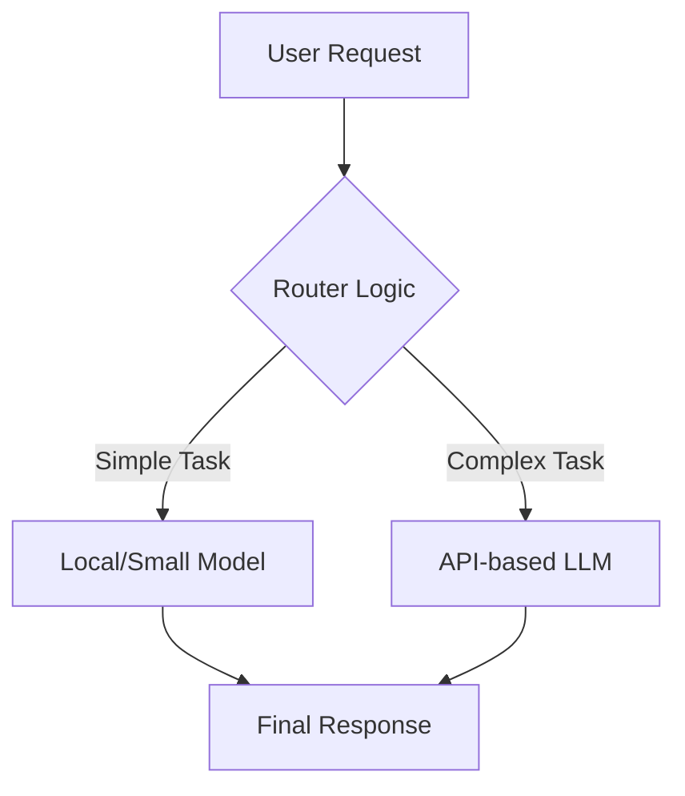

> [!IMPORTANT]
> **분야**: IT/AI/Security  
> **한 줄 요약**: AI 도입의 경제적 지속가능성을 고민하는 엔지니어를 위해, API 의존도를 낮추고 로컬 최적화 및 경량화 모델을 활용한 비용 절감 전략을 상세히 제시합니다.

---

## 1. 서론: 'AI는 너무 비싸다'는 불편한 진실

10년 전 제가 처음으로 기업 인프라를 구축할 때, 서버 비용 최적화는 단순히 인스턴스 타입을 조정하거나 예약 인스턴스를 구매하는 수준이었습니다. 하지만 작년 한 프로젝트에서 LLM API를 도입했을 때, 우리는 불과 3개월 만에 클라우드 예산을 4배 초과하는 상황을 마주했습니다. 단순히 '질문-응답'의 비용이 아니라, 토큰화 과정에서의 데이터 낭비, 문맥 유지(Context Window)의 누적 비용이 엔지니어링 마진을 갉아먹고 있었던 것이죠. 'AI는 너무 비싸다'는 최근의 업계 화두는 단순한 볼멘소리가 아닙니다. 이는 비즈니스 모델을 파괴할 수 있는 심각한 위험 신호입니다.

## 2. 왜 지금 AI 인프라 비용을 재설계해야 하는가?

현재의 AI 도입 흐름은 '프로토타입의 성패'를 넘어 '운영 효율(Ops Efficiency)'의 단계로 진입했습니다. 고성능 모델(GPT-4, Claude 3.5 Sonnet 등)을 모든 태스크에 사용하는 것은 마치 동네 마실을 가기 위해 전투기를 모는 것과 같습니다. 우리는 이제 적절한 크기의 모델을 적재적소에 배치하는 '하이브리드 AI 아키텍처'를 고민해야 합니다.

## 3. 비용 효율적 AI 아키텍처 설계: 개념 증명(PoC)

데이터 처리 파이프라인에서 비용을 줄이는 핵심은 '라우팅(Routing)'입니다. 단순 분류 업무는 소형 모델(SLM)로, 복잡한 추론은 대형 모델(LLM)로 보내는 구조가 필수적입니다.



## 4. 실무 코드: 지능형 라우팅 구현

LangChain 혹은 자체 커스텀 로직을 통해 텍스트 길이나 복잡도에 따라 모델을 전환하는 파이썬 스니펫입니다.

```python
def route_to_model(prompt):
    # 1. 토큰 수 기반 라우팅
    token_count = len(prompt.split())
    
    # 2. 로컬 모델을 사용하는 임계값 설정
    if token_count < 200:
        return call_local_llama3_8b(prompt)
    else:
        return call_openai_gpt4o(prompt)

# 예시: 로컬 모델 호출 (Ollama 사용)
import requests
def call_local_llama3_8b(prompt):
    response = requests.post('http://localhost:11434/api/generate', json={'model': 'llama3', 'prompt': prompt})
    return response.json()['response']
```

## 5. 비용 최적화를 위한 5가지 전략

1. **로컬 모델 도입 (SLM):** Llama 3 8B, Mistral 7B 등은 웬만한 B2B 태스크를 완벽히 소화합니다. GPU 서버를 직접 운영하는 것이 장기적으로 API 비용보다 훨씬 저렴할 수 있습니다.
2. **캐싱 전략 (Semantic Caching):** 동일하거나 유사한 질문이 들어올 때 API 호출을 차단하고 Redis 등에 저장된 결과를 반환합니다. `GPTCache` 라이브러리를 활용하면 매우 효과적입니다.
3. **양자화 (Quantization):** 모델의 가중치를 4-bit 또는 8-bit로 양자화하면 정확도 손실을 최소화하면서 메모리 사용량을 4배 이상 줄일 수 있습니다.
4. **프롬프트 엔지니어링의 효율화:** 토큰 수를 줄이는 것이 곧 비용 절감입니다. 시스템 프롬프트를 간결하게 유지하고, 불필요한 공백과 반복을 제거하세요.
5. **Batch Processing:** 즉각적인 응답이 필요 없는 분석 업무는 API의 Batch API 기능을 사용하여 최대 50%의 비용을 절감하십시오.

## 6. 장단점 비교

| 전략 | 장점 | 단점 | 추천 대상 |
| :--- | :--- | :--- | :--- |
| **API 의존** | 구현 속도 빠름, 최고 성능 | 예측 불가능한 비용 | MVP 개발사 |
| **로컬 호스팅** | 비용 고정, 데이터 프라이버시 | 초기 GPU 인프라 투자 필요 | 대규모 서비스 |

## 7. FAQ

**Q: 로컬 모델로 전환하면 성능 저하가 걱정됩니다.**
**A:** 최근 SLM(Small Language Models)의 추론 능력은 매우 비약적으로 발전했습니다. 파인 튜닝(Fine-tuning)을 특정 데이터셋에 맞게 수행하면, 범용 모델보다 훨씬 나은 성능을 보여줍니다.

**Q: 클라우드 API를 쓰지 않는 것이 진정한 비용 절감인가요?**
**A:** 단순히 클라우드 비용을 줄이는 것이 목적이 아닙니다. 엔지니어링 인건비(유지보수 비용)와 운영 비용(인프라)을 합산하여 '단위 토큰당 처리 비용(Cost per Token)'을 최적화하는 것이 진짜 목표입니다.

## 8. 총평: 기술적 부채가 아닌 경제적 선택

AI는 단순한 기술 스택이 아니라, 회사의 자본 효율성을 결정짓는 핵심 인프라입니다. 이제 '어떤 모델이 더 똑똑한가'를 묻는 시대는 지났습니다. '어떻게 적은 비용으로 가장 안정적인 결과물을 낼 것인가'를 고민하는 엔지니어가 살아남을 것입니다. 위에서 제시한 라우팅과 캐싱 기법을 오늘 당장 적용해 보십시오. 작은 변화가 연간 수천만 원의 비용 절감을 가져올 것입니다.