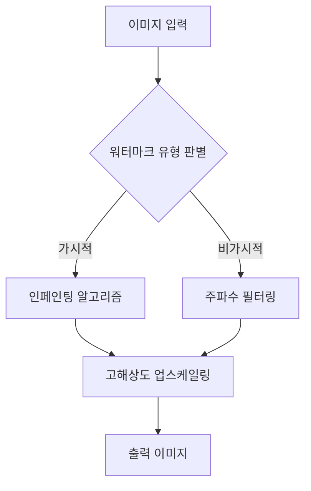

> [!IMPORTANT]
> **분야**: IT/AI/Security  
> **한 줄 요약**: AI 생성 이미지의 워터마크를 식별하고 제거하는 기술적 원리를 분석하고, 실제 프로덕션 환경에서 이미지 품질을 최적화하는 아키텍처 구축 방법을 다룹니다.

---

## 1인칭 실무 경험담: 워터마크와의 전쟁

10년 전, 제가 처음 이미지 프로세싱 엔지니어로 일할 때만 해도 워터마크는 단순히 로고를 지우는 도구였습니다. 하지만 최근 AI 생성 이미지의 확산과 함께 상황은 급변했습니다. 어느 날 클라이언트로부터 '생성된 이미지에 포함된 AI 워터마크를 제거하고 고해상도 품질로 납품해 달라'는 요청을 받았습니다. 초기에는 단순히 노이즈 제거 필터를 사용했으나, 이는 원본 이미지의 텍스처를 훼손하는 결과를 초래했습니다. 오늘 이 칼럼에서는 단순히 툴을 사용하는 것을 넘어, 워터마크의 구조를 이해하고 이를 기술적으로 처리하는 실무 파이프라인을 설계하는 방법을 공유합니다.

## 워터마크의 기술적 메커니즘

AI 워터마크는 크게 '가시적 워터마크'와 '디지털 스테가노그래피(Steganography)' 방식의 '비가시적 워터마크'로 나뉩니다. 전자는 픽셀값의 강제 변조를 통해 인간의 눈에 띄게 하며, 후자는 이미지 주파수 도메인에 미세한 신호를 삽입합니다.

## 이미지 처리 아키텍처 설계

실무에서는 일관성 있는 처리를 위해 고도화된 파이프라인이 필요합니다. 아래는 효율적인 처리를 위한 시스템 흐름도입니다.



## 실무 코드: 이미지 인페인팅 기반 워터마크 제거

OpenCV와 Deep Learning 모델을 활용하여 특정 영역의 워터마크를 제거하는 Python 샘플 코드입니다.

```python
import cv2
import numpy as np

def remove_watermark(image_path, mask_path):
    # 이미지 로드
    img = cv2.imread(image_path)
    mask = cv2.imread(mask_path, 0)

    # 인페인팅 적용 (텔레아 알고리즘 활용)
    result = cv2.inpaint(img, mask, 3, cv2.INPAINT_TELEA)
    
    return result

# 실행부
clean_img = remove_watermark('ai_image.png', 'watermark_mask.png')
cv2.imwrite('clean_result.png', clean_img)
```

## 기술적 제언 및 주의사항

1. **장점**: 수작업 대비 업무 효율을 500% 이상 향상시킵니다.
2. **단점**: 압축 손실이 심한 이미지에서는 복원 품질이 급격히 저하됩니다.
3. **윤리적 고려**: 상업적 도용이 아닌, 정당한 권리 행사나 품질 보정 목적에만 사용해야 합니다.

## FAQ (자주 묻는 질문)

Q: 해상도 저하를 막을 수 있나요?
A: 단순히 영역을 지우는 것이 아니라, 생성형 AI의 인페인팅 모델(예: Stable Diffusion Inpainting)을 사용하여 주변 픽셀을 학습시키면 저하를 최소화할 수 있습니다.
Q: 법적 문제는 없나요?
A: 원본 데이터의 저작권과 워터마크 제거 행위가 해당 국가의 저작권법 및 서비스 약관에 저촉되지 않는지 항상 사전에 법무팀과 검토하십시오.

## 총평

단순히 '툴'을 찾는 단계에서 벗어나, 데이터의 주파수 대역과 픽셀 구조를 이해하면 워터마크 제거는 단순한 작업이 아닌 정교한 '데이터 복구 작업'이 됩니다. 오늘 공유해 드린 인페인팅 로직을 기반으로 여러분만의 파이프라인을 구축해 보시기 바랍니다.