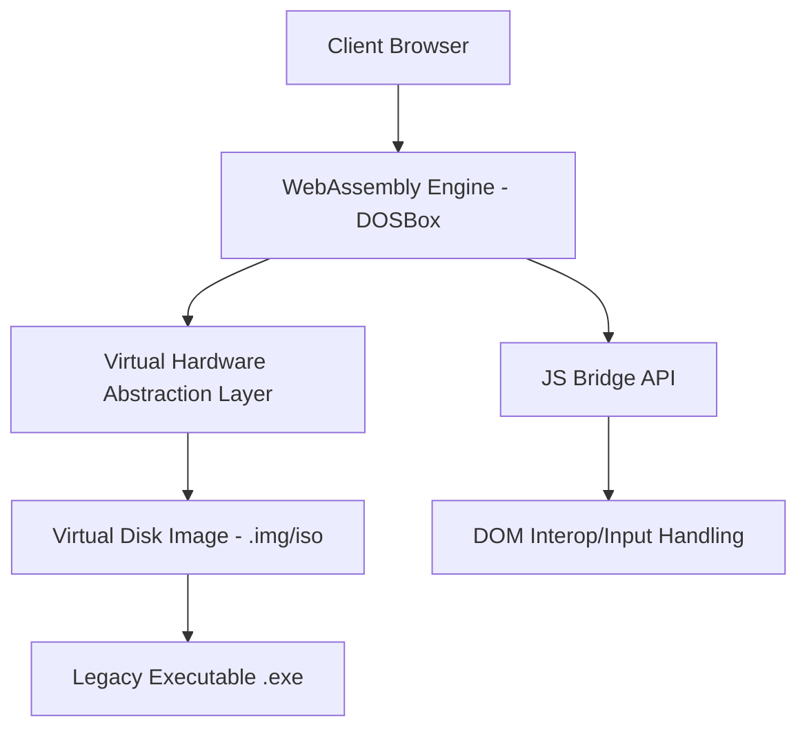

> [!IMPORTANT]
> **분야**: IT/AI/Security  
> **한 줄 요약**: 웹 브라우저 기반 DOS 에뮬레이션 기술인 DOS Zone을 분석하고, 이를 통해 기업 내 레거시 시스템 마이그레이션 전략을 수립하는 실무 가이드.

---

## 서론: 3.5인치 플로피 디스크의 악몽을 회상하며

10년 전, 금융권 인프라 고도화 프로젝트에 투입되었을 때의 일입니다. 당시 운영체제는 윈도우 10으로 업그레이드되었지만, 특정 회계 모듈은 여전히 16비트 기반 DOS 환경을 고집하고 있었습니다. '왜 아직도 이걸 쓰는가'라는 의문은 '어떻게 죽지 않게 만들 것인가'라는 생존형 엔지니어링 과제로 바뀌었죠. 그때 느꼈습니다. 레거시는 사라지는 것이 아니라, 적절한 추상화 계층(Abstraction Layer) 아래에서 숨을 쉬고 있을 뿐이라는 것을요. 오늘 우리가 살펴볼 DOS Zone은 단순히 추억의 게임을 돌리는 플랫폼이 아닙니다. 이것은 현대적인 웹 기술로 과거의 아키텍처를 완벽하게 격리(Isolation)하는 강력한 샌드박스 모델입니다.

## 1. DOS Zone의 기술적 핵심: WebAssembly와 에뮬레이션

DOS Zone은 'js-dos' 라이브러리를 통해 브라우저 내에서 DOS 환경을 에뮬레이션합니다. 핵심은 x86 명령어를 웹 환경에서 해석하는 것이 아니라, WebAssembly(Wasm)로 컴파일된 에뮬레이터(주로 DOSBox)를 브라우저의 샌드박스 내에서 실행하는 것입니다.

### 시스템 아키텍처 로직



## 2. 실무 적용: 레거시 앱의 브라우저 이식 가이드

기업 내부의 오래된 도구(예: 사내 관리 도구, 특정 데이터 처리 스크립트)를 현대적인 브라우저로 가져오려면 다음 과정을 따라야 합니다.

### 단계 1: 프로젝트 의존성 추가
먼저 js-dos를 프로젝트에 추가합니다.

```bash
npm install js-dos
```

### 단계 2: 실행 파이프라인 구현
도스 파일 시스템 이미지를 마운트하고 실행하는 기본 코드입니다.

```javascript
import { DosFactory } from "js-dos";
require("js-dos/dist/js-dos.css");

const dos = DosFactory.create(document.getElementById("dos"));

dos.run("bundle.jsdos").then((fs) => {
  console.log("Legacy App Initialized");
  // 커스텀 키보드 매핑 및 데이터 동기화 로직 위치
});
```

## 3. 실무에서의 장단점 비교

### 장점
- **플랫폼 독립성**: 브라우저만 있다면 OS에 관계없이 실행 가능.
- **보안성**: OS 커널 수준의 접근이 불가능하며, Wasm 샌드박스 내부에서 안전하게 격리됨.
- **배포 용이성**: 클라이언트 설치 없이 배포 및 업데이트 관리.

### 단점
- **성능 오버헤드**: 하드웨어 가상화가 아닌 SW 에뮬레이션이므로 CPU 집약적 작업에는 부적합.
- **데이터 입출력 제한**: 브라우저와 로컬 파일 시스템 간의 I/O 연결이 복잡함.

## 4. 보안 엔지니어링 관점의 주의사항

레거시 소프트웨어는 기본적으로 보안 패치가 존재하지 않습니다. DOS Zone 내에서 구동하는 애플리케이션은 반드시 다음 보안 프로토콜을 준수해야 합니다.

1. **네트워크 격리**: 에뮬레이터 내에서 외부 네트워크 연결을 금지하십시오. 
2. **입출력 필터링**: JS Bridge를 통해 오가는 데이터를 반드시 검증(Sanitize)하십시오.
3. **상태 초기화**: 세션이 종료될 때마다 파일 시스템을 초기화(Ephemeral Storage)하여 영구적인 공격 흔적을 방지하십시오.

## FAQ: 자주 묻는 질문

- **Q: 왜 컨테이너 대신 에뮬레이터를 사용하나요?**
  - A: 16비트/32비트 DOS 실행 환경은 현대의 리눅스 컨테이너와 아키텍처가 완전히 다릅니다. 에뮬레이션은 바이너리 수정 없이 '있는 그대로' 실행하기 위한 최선의 선택입니다.
- **Q: 대량 데이터 처리가 가능한가요?**
  - A: 불가능합니다. 이는 뷰어 혹은 보존용으로 적합하며, 로직 처리는 반드시 백엔드(API)로 이관해야 합니다.

## 총평: 레거시의 박물관화가 아닌, 현업화로의 전환

DOS Zone과 같은 기술은 단순한 과거 회귀가 아닙니다. 20년 전 설계된 비즈니스 로직을 현대적인 웹 클라우드 인프라 위에서 생존시키는 '디지털 고고학'의 실무적 도구입니다. 당신의 조직에 죽어가는 레거시 앱이 있다면, 그들을 박물관에 가두지 말고 브라우저 안에서 숨 쉬게 하십시오. 그것이 진정한 시니어 엔지니어가 취해야 할 태도입니다.