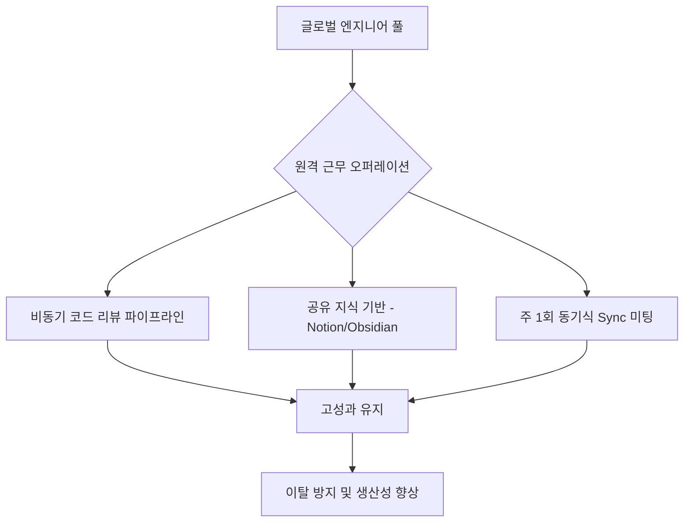

> [!IMPORTANT]
> **분야**: IT/AI/Security  
> **한 줄 요약**: 캐나다발 인재 유출을 사례로 분석한 글로벌 원격 개발팀의 현실과, 국경을 초월한 고성과 엔지니어링 조직을 운영하기 위한 전략적 가이드를 제공합니다.

---

## 1. 서론: 실리콘밸리라는 중력과 국경의 무력화

10년 전, 제가 처음으로 캐나다의 기술 스택을 접했을 때만 해도 토론토와 밴쿠버는 북미 IT의 차세대 허브로 각광받았습니다. 하지만 최근 동료들과의 커피챗에서 반복적으로 나오는 이야기는 하나입니다. "미국 회사로 옮기기로 했어." 연봉 차이는 물론이고, 주식 기반 보상(RSU)의 규모 차이가 압도적이기 때문이죠. 이는 단순한 개인의 선택이 아니라, 거대한 '인재 이동(Brain Drain)'의 흐름입니다.

이 현상은 IT/AI 팀을 운영하는 관리자들에게 아주 중요한 시사점을 던집니다. '인재가 국경을 넘어 이동한다면, 우리 팀도 국경을 넘어서 인재를 영입하거나, 그들을 유지할 환경을 구축해야 한다'는 것이죠.

## 2. 왜 인재는 움직이는가: 아키텍처적 관점의 분석

이 현상을 시스템 아키텍처에 빗대어 보면, '부하 분산(Load Balancing)'과 '데이터 지역성(Data Locality)'의 문제입니다. 연봉과 커리어 기회라는 높은 가중치를 가진 노드(미국 기업)로 데이터(인재)가 쏠리는 현상입니다. 이를 막기 위해 기업은 이제 '지리적 제약'을 제거하는 오퍼레이션 시스템을 도입해야 합니다.

### 인재 이동 가속화의 핵심 요인
* **보상 격차 (Latency):** 국경을 넘어 지불되는 달러의 구매력과 실질 소득 차이.
* **기술 스택 (Throughput):** 최첨단 LLM, 대규모 클라우드 인프라 등 더 높은 복잡도를 다룰 수 있는 환경.
* **네트워킹 (Bandwidth):** 실리콘밸리의 기술 커뮤니티가 제공하는 정보와 기회의 밀도.

## 3. 실무 가이드: 국경을 초월한 원격 개발 조직 구축하기

지리적 제약이 사라진 환경에서 엔지니어링 리더는 어떻게 팀을 유지해야 할까요? 핵심은 '비동기식 운영 아키텍처'입니다.

### Mermaid 아키텍처 플로우: 분산 개발 팀 효율성 모델



## 4. 실무 코드: 글로벌 개발 팀의 비동기식 생산성 측정 스크립트

원격 팀의 가장 큰 골칫거리는 '보이지 않는 곳에서의 번아웃'입니다. 이를 방지하기 위한 PR(Pull Request) 기반 생산성 추적 자동화 파이프라인(Python 예시)입니다.

```python
import requests
from datetime import datetime, timedelta

def check_team_velocity(repo_url, token):
    """리모트 팀의 PR 반응 속도를 측정하여 번아웃 위험군을 사전에 탐색합니다."""
    headers = {'Authorization': f'token {token}'}
    since = (datetime.now() - timedelta(days=7)).isoformat()
    url = f"{repo_url}/pulls?state=closed&since={since}"
    
    response = requests.get(url, headers=headers)
    prs = response.json()
    
    for pr in prs:
        created_at = datetime.strptime(pr['created_at'], "%Y-%m-%dT%H:%M:%SZ")
        updated_at = datetime.strptime(pr['updated_at'], "%Y-%m-%dT%H:%M:%SZ")
        duration = (updated_at - created_at).total_seconds() / 3600
        
        if duration > 48: # 48시간 이상 방치된 PR은 관리 요망
            print(f"Warning: PR {pr['number']} delayed for {duration} hours.")

# Usage
# check_team_velocity("https://api.github.com/repos/org/repo", "your_token")
```

## 5. 장단점 비교 및 FAQ

### 장단점 분석
* **장점:** 전 세계 최고의 인재 영입 가능, 24시간 팔로워십(Follow-the-sun) 모델 구현으로 장애 대응 속도 향상.
* **단점:** 커뮤니케이션 오버헤드 증가, 시차 문제로 인한 협업 피로도, 기업 문화 전파의 어려움.

### FAQ
- **Q: 원격 근무가 생산성을 떨어뜨리지 않나요?**
- A: 적절한 CI/CD 파이프라인과 문서화가 동반된다면 오히려 관리 비용이 줄고 집중력이 향상됩니다.
- **Q: 미국 기업으로 떠나는 인재를 잡을 방법은?**
- A: 보상도 중요하지만, '의미 있는 문제(Hard Problem)'를 팀에서 제공하는지가 핵심입니다. 사람들은 더 큰 기술적 도전을 위해 움직입니다.

## 6. 총평

캐나다발 인재 유출은 단순한 지역 뉴스가 아니라, 디지털 노동 시장의 '자유화'를 상징합니다. 이제 기업은 물리적 오피스의 테두리를 넘어, 전 세계 엔지니어들이 기여하고 싶어 하는 **'기술적 가치 플랫폼'**이 되어야 합니다. 인프라를 클라우드로 옮겼듯, 팀 운영 체제도 '글로벌 분산 시스템'으로 전환하십시오. 그것이 인재를 잡는 유일한 방법입니다.