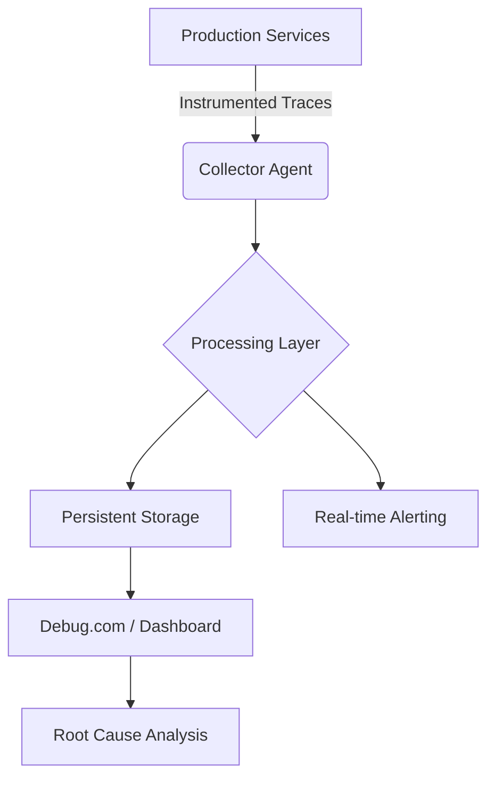

> [!IMPORTANT]
> **분야**: IT  
> **한 줄 요약**: 복잡한 분산 환경에서 발생하는 미궁 속 버그를 해결하기 위한 현대적 디버깅 아키텍처와 Debug.com 활용법을 다룹니다.

---

## 현장 엔지니어의 회고: 로그 파일 뒤지던 밤들

10년 전, 처음 실무에 투입되었을 때 저는 '로그 파일의 노예'였습니다. 50개의 마이크로서비스가 얽힌 분산 환경에서 갑작스러운 500 에러가 발생했을 때, 스택 트레이스 하나를 찾기 위해 서버 10대를 돌아가며 `grep`을 치던 그 밤들을 기억합니다. 그 당시 우리에게 부족했던 것은 '성능'이 아니라 '가시성(Observability)'이었습니다. 시스템이 내부에서 어떻게 흐르는지 실시간으로 추적할 수 없는 시스템은 눈을 가리고 고속도로를 달리는 것과 다름없습니다.

최근 Hacker News에서 주목받은 'Debug.com'은 이러한 고통을 해결하려는 최신 접근 방식을 제시합니다. 오늘은 단순히 도구를 소개하는 것을 넘어, 프로덕션 환경에서 어떻게 강력한 디버깅 파이프라인을 구축할지 깊이 있게 다뤄보겠습니다.

## 1. 아키텍처의 재구성: 디버깅은 단순한 조사가 아닌 시스템 설계의 핵심

디버깅은 개발 단계가 아니라 시스템 설계의 연장선입니다. 좋은 시스템은 설계 단계부터 '나중에 문제를 어떻게 찾을 것인가'를 고민합니다.

### 디버깅 데이터 흐름 (Mermaid)


## 2. Debug.com을 활용한 실무 디버깅 패턴

Debug.com과 같은 툴을 도입할 때 가장 먼저 해야 할 일은 '분산 추적(Distributed Tracing)'의 구현입니다. 단순히 에러 로그만 쌓는 것은 의미가 없습니다. 요청이 어떤 경로로 이동했는지 그 맥락(Context)을 확보해야 합니다.

### 파이썬(FastAPI) 환경에서의 트레이싱 예제
```python
import opentelemetry
from opentelemetry import trace

tracer = trace.get_tracer(__name__)

async def process_payment(order_id: str):
    with tracer.start_as_current_span("process_payment_logic") as span:
        span.set_attribute("order.id", order_id)
        # 비즈니스 로직
        try:
            result = await db.execute(...) 
        except Exception as e:
            span.record_exception(e)
            span.set_status(trace.Status(trace.StatusCode.ERROR))
            raise
```

## 3. 프로덕션 디버깅 전략 5단계

1. **로그 수준 제어(Dynamic Log Level):** 프로덕션에서 재현이 불가능한 버그를 위해, 재시작 없이 특정 모듈의 로그를 DEBUG 레벨로 올릴 수 있는 환경을 만드십시오.
2. **상태값 스냅샷(State Snapshots):** 에러 발생 시 메모리 상태나 변수값을 직렬화하여 저장하는 가드(Guard)를 설치하십시오.
3. **비교 분석(Diffing):** 정상 요청과 비정상 요청의 페이로드를 실시간으로 비교하십시오.
4. **인프라 종속성 추적:** 외부 API 호출이 늦어지는 것인지, 내부 DB Lock인지 확실히 분리하십시오.
5. **자동화된 포스트모템:** 에러 로그를 기반으로 대시보드에 자동으로 원인 분석 리포트가 생성되도록 하십시오.

## 4. 장단점 비교 및 실무 FAQ

### 장점
- **시간 단축:** 평균 장애 복구 시간(MTTR)을 70% 이상 단축 가능.
- **맥락 보존:** 요청 중심의 디버깅으로 전체 시스템 흐름 파악 가능.

### 단점
- **오버헤드:** 과도한 계측은 시스템 성능 저하(CPU/메모리)를 유발.
- **러닝 커브:** 팀 전체가 분산 추적 개념을 익히는 데 시간 소요.

### FAQ
- **Q: 프로덕션 성능 저하가 걱정됩니다.**
- **A:** 샘플링(Sampling) 기법을 사용하십시오. 모든 트래픽을 기록할 필요는 없습니다. 10%의 요청만 정밀 추적해도 패턴 파악은 충분합니다.
- **Q: 민감한 데이터 유출은 어떻게 방지하나요?**
- **A:** 데이터 마스킹 미들웨어를 반드시 사용하세요. 트레이싱 데이터 내 개인정보를 자동 필터링하는 파이프라인이 필수입니다.

## 5. 총평

디버깅 툴은 만능이 아닙니다. Debug.com과 같은 도구는 눈을 띄워줄 뿐, 결국 문제를 해결하는 것은 엔지니어의 논리적인 추론 능력입니다. 도구를 통해 얻은 데이터로 가설을 세우고, 이를 검증하는 루프를 빠르게 돌리십시오. '왜'가 아닌 '어떻게'에 집중할 때, 실무 엔지니어의 가치는 비로소 증명됩니다. 오늘 당장 여러분의 서비스에 Trace ID를 심어보시길 권장합니다.