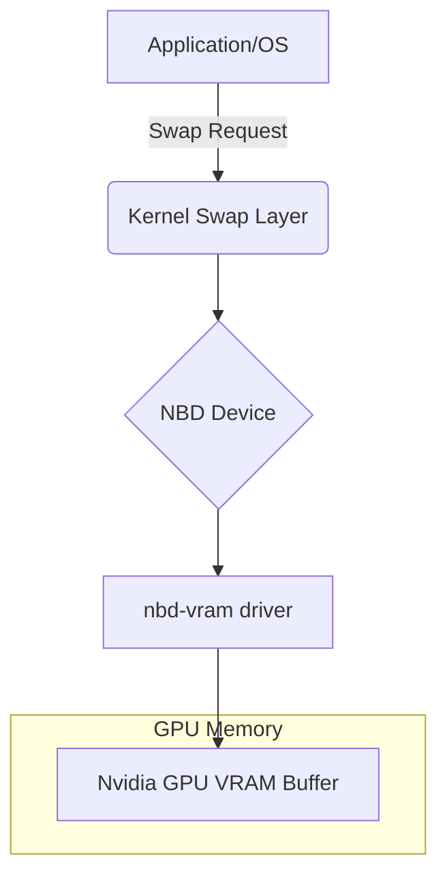

> [!IMPORTANT]
> **분야**: IT/AI/Security  
> **한 줄 요약**: Nvidia GPU의 여유 VRAM을 리눅스 시스템의 스왑(Swap) 공간으로 전환하여 대규모 작업 시 발생하는 OOM(Out of Memory) 문제를 방어하는 아키텍처 및 구현 가이드입니다.

---

## 서론: VRAM이 남는데 시스템이 멈춘다고?

10년 전, 제가 처음으로 머신러닝 모델 학습을 돌리던 시절의 일입니다. 고가의 GPU 서버를 빌렸음에도 불구하고, 데이터 로딩 단계에서 시스템이 메모리 부족(OOM)으로 뻗어버리는 황당한 경험을 했습니다. VRAM은 16GB가 남아돌고 있는데, 시스템 RAM 32GB가 부족해 OOM Killer가 프로세스를 강제 종료하는 상황이었죠. 그때 깨달았습니다. 'RAM이 부족하면 GPU가 아무리 좋아도 무용지물이다.'

최근 LLM 환경이나 대규모 데이터셋 처리 환경에서 이런 병목은 더욱 빈번합니다. 오늘은 리눅스 커널의 NBD(Network Block Device) 기능을 활용해 남는 GPU VRAM을 가상 스왑으로 사용하는 기법을 정리합니다.

## 아키텍처 이해: GPU-backed Swap

이 기술의 핵심은 VRAM의 일부를 블록 디바이스로 에뮬레이션하여 리눅스의 스왑 공간으로 마운트하는 것입니다. 



## 실전 구축 가이드: nbd-vram 활용법

### 1. 사전 요구 사항
- Nvidia 드라이버 및 CUDA 툴킷 설치 완료
- `nbd` 커널 모듈 활성화 (`modprobe nbd`)
- Python 3.x 환경 및 `pynvml` 라이브러리

### 2. 구현 단계
먼저, `nbd-vram` 저장소의 핵심 로직을 사용하여 GPU 메모리를 할당하고 이를 리눅스 인터페이스에 연결합니다.

```bash
# 커널 모듈 로드
sudo modprobe nbd

# nbd-vram 클라이언트 실행 (VRAM 4GB 할당 예시)
git clone https://github.com/c0dejedi/nbd-vram
cd nbd-vram
# 의존성 설치
pip install -r requirements.txt

# vram-swap 데몬 실행 (4096MB)
sudo python3 nbd-vram.py --size 4096 --device /dev/nbd0
```

### 3. 스왑 활성화

이제 `/dev/nbd0`를 시스템 스왑으로 등록합니다.

```bash
# 1. 파티션 초기화
sudo mkswap /dev/nbd0

# 2. 스왑 우선순위 설정 (낮게 설정하여 RAM 부족 시에만 사용하도록)
sudo swapon /dev/nbd0 -p 10

# 3. 확인
cat /proc/swaps
```

## 기술적 검증: 왜 효율적인가?

- **장점**: 
  - 비싼 물리 RAM 업그레이드 없이 긴급 메모리 공간 확보 가능.
  - PCIe 대역폭을 사용하므로 일반적인 SSD 스왑보다 응답 속도가 훨씬 빠름.
- **단점**:
  - PCIe 버스 부하 발생: 스왑이 활발하게 일어날 경우 GPU 성능 저하가 동반됨.
  - 전원 차단 시 데이터 휘발: 스왑 공간이므로 재부팅 시 초기화됨.

## FAQ: 자주 묻는 질문

**Q: 이 방법이 일반적인 SSD 스왑보다 빠른가요?**
A: 그렇습니다. PCIe Gen4 기준 대역폭은 수십 GB/s에 달하므로, SATA SSD보다 훨씬 빠릅니다.

**Q: GPU 성능에 영향을 미치지 않나요?**
A: 당연히 영향을 미칩니다. VRAM은 공유 자원이므로 스왑 사용량이 많아지면 모델 추론 속도가 느려집니다. `swappiness` 값을 조정하여 최적점을 찾으십시오.

## 총평

이 기법은 '비상용 엔진'과 같습니다. 평상시에는 끄고 사용하다가, 대규모 데이터 처리나 모델 학습 시에만 메모리를 확장하는 용도로 매우 훌륭합니다. 단순한 트릭을 넘어, 시스템 엔지니어링 관점에서 하드웨어 자원을 유연하게 재배치하는 매우 실용적인 패턴입니다.