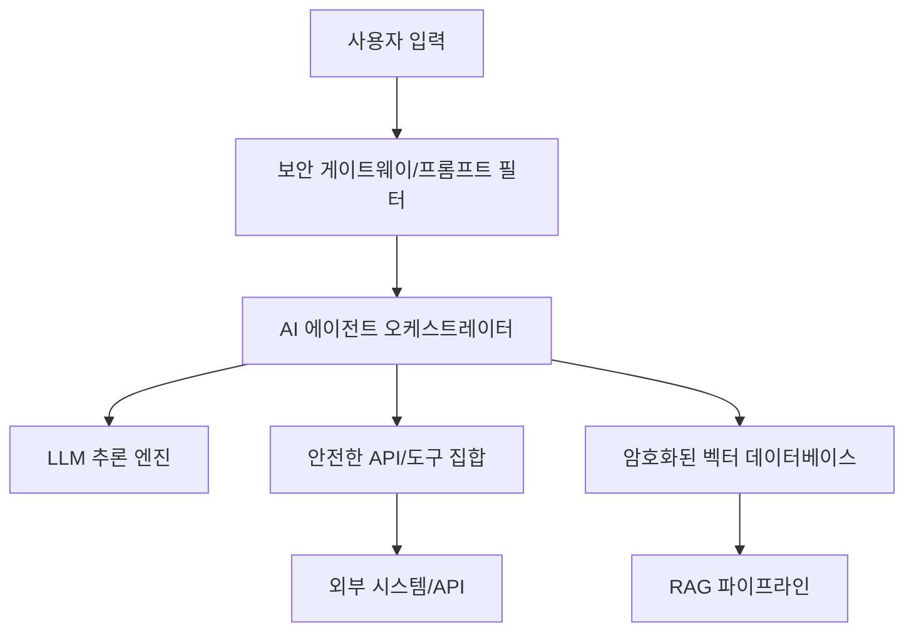

> [!IMPORTANT]
> **분야**: IT/AI/Security  
> **한 줄 요약**: AI 개인 비서 기술이 사용자 경험을 지배하는 시대, 실무 엔지니어가 고려해야 할 에이전트 아키텍처와 보안 전략을 분석합니다.

---

## 1인칭 실무 경험담: '자동화'인가 '종속'인가

10년 전, 제가 처음 자동화 스크립트를 작성했을 때의 기억이 납니다. 반복적인 서버 로그 분석을 쉘 스크립트로 해결했을 때의 희열은 엄청났죠. 하지만 최근 AI 에이전트 시스템을 설계하면서 느낀 것은, 이제는 단순히 '자동화'를 넘어 '에이전트가 우리의 의사결정 경로를 학습하고 있다'는 사실입니다. 최근 Microsoft Scout와 같은 시스템이 사용자의 일상을 깊숙이 파고드는 것을 보며, 엔지니어로서 우리가 단순히 '기능'을 구현하는 것을 넘어 '사용자의 데이터 의존성과 시스템 무결성'을 어떻게 확보할지 심각하게 고민해야 한다고 느꼈습니다. 오늘은 AI 개인 비서를 단순히 도입하는 것이 아니라, 보안과 아키텍처 관점에서 어떻게 안전하게 설계할지 다룹니다.

## AI 개인 비서의 시스템 아키텍처

AI 에이전트는 단순히 모델 호출이 아닙니다. 기억(Memory), 도구(Tools), 그리고 추론 엔진(Reasoning Engine)의 유기적 결합입니다. 아래는 우리가 지향해야 할 안전한 에이전트 아키텍처입니다.



## 실무 코드: Python을 활용한 에이전트 도구 제한 및 호출

많은 개발자가 LLM에게 전권을 부여하는 실수를 합니다. 다음은 'Tool-Use' 모델을 사용하여 안전하게 함수를 호출하는 실무 패턴입니다.

```python
import openai
import json

def execute_task(prompt):
    # 엄격하게 정의된 툴 목록
    tools = [{
        "type": "function",
        "function": {
            "name": "get_system_status",
            "description": "서버 상태를 확인합니다.",
            "parameters": {"type": "object", "properties": {}}
        }
    }]
    
    response = openai.chat.completions.create(
        model="gpt-4o",
        messages=[{"role": "user", "content": prompt}],
        tools=tools
    )
    
    # 실행 로직 보완: 무조건적인 실행 대신 컨펌 프로세스 포함
    if response.choices[0].message.tool_calls:
        print("에이전트가 시스템 명령을 수행하려 합니다. 승인하시겠습니까?")
        # 여기에 승인 로직 구현
```

## 보안 가이드: 에이전트 중독 예방

사용자가 AI 비서에 중독되는 것은 사용성(Usability)의 승리이지만, 보안 관점에서는 거대한 공격 표면입니다. 

### 1. 프롬프트 인젝션 방어
사용자 입력을 그대로 LLM에 넘기지 마십시오. 항상 신뢰할 수 있는 중간 계층(Guardrails)을 두어 명령을 필터링하세요.

### 2. 데이터 격리
개인화된 데이터(Memory)는 반드시 사용자별로 격리된(Multi-tenancy) 환경의 암호화된 저장소에 보관해야 합니다.

## 장단점 비교

| 구분 | 장점 | 단점 | 
| :--- | :--- | :--- | 
| **AI 개인 비서** | 생산성 극대화, 사용자 경험 최적화 | 데이터 프라이버시 위협, 시스템 의존성 |
| **전통적 수동 방식** | 보안 통제 용이, 데이터 주권 확보 | 학습 비용, 업무 효율 저하 |

## FAQ (실무자 질문)

**Q: 에이전트가 제 회사의 내부 정보를 학습해도 되나요?**
A: 절대 안 됩니다. 반드시 로컬 LLM 또는 기업용 폐쇄형 클라우드(Azure OpenAI VPC 등)를 사용하고, 데이터 유출 방지(DLP) 솔루션을 연동하세요.

**Q: 사용자가 AI 비서에게 과도하게 의존할 때 어떻게 완화하나요?**
A: 에이전트의 판단 근거를 항상 로그로 남기고, 주기적으로 사용자가 검토할 수 있는 '투명성 대시보드'를 제공하십시오.

## 총평: 엔지니어의 윤리적 책임

Microsoft Scout와 같은 강력한 AI 비서는 생산성의 혁신을 가져오지만, 기술을 만드는 우리 엔지니어는 '사용자가 시스템에 종속되는 현상'을 기술적 제약으로 풀어내야 합니다. 기능 구현보다 중요한 것은 사용자의 데이터 주권과 보안을 지키는 아키텍처 설계입니다. 위 예시를 바탕으로 여러분의 서비스에 견고한 에이전트 안전망을 구축하십시오.