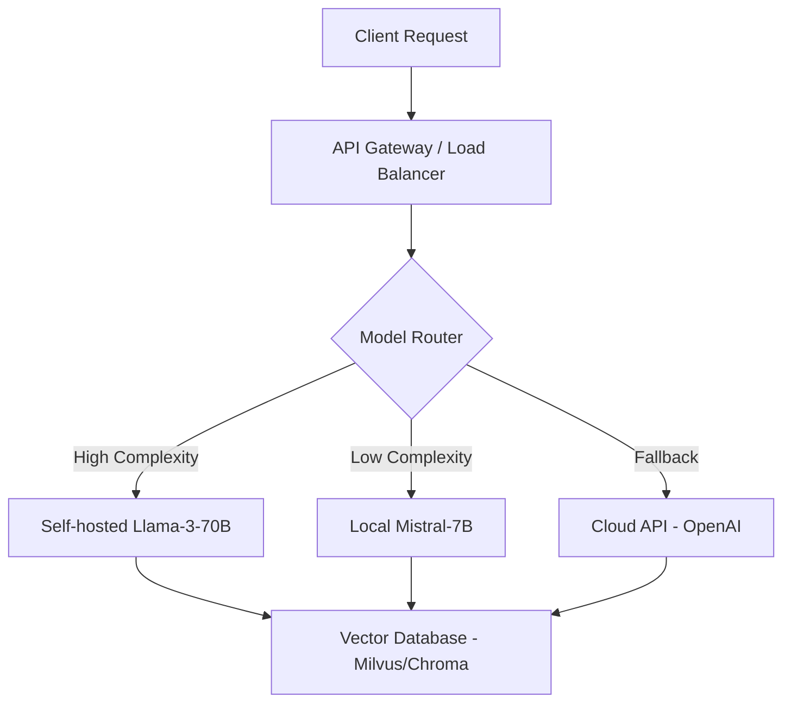

> [!IMPORTANT]
> **분야**: IT/AI/Security  
> **한 줄 요약**: 거대 모델사의 종속성을 극대화하는 중앙 집중형 AI 생태계에서 벗어나, 자체 인프라와 오픈 소스 모델로 기업의 기술적 주도권을 확보하는 실무 가이드.

---

## 서론: 우리는 정말 '기술의 노예'가 되어가고 있는가?

10년 전 처음 클라우드 도입 프로젝트를 수행할 때만 해도, 모든 서버를 로컬 데이터센터에서 클라우드로 옮기는 것이 '혁신'이라 믿었습니다. 하지만 최근 Hacker News의 한 스레드(Are we as society going to let LLM companies take all the values?)를 보며 묘한 기시감을 느꼈습니다. 기업들이 API 호출 한 번에 비즈니스의 핵심 로직을 외주화하고 있다는 사실 말이죠.

얼마 전, 클라이언트사의 AI 전략 컨설팅 중 발생한 일입니다. OpenAI의 GPT-4 API가 일시적으로 중단되자, 해당 기업의 CS 자동화 파이프라인이 6시간 동안 멈췄습니다. 기업의 가치는 모델 그 자체가 아니라, 그 모델이 처리하는 데이터와 서비스 흐름에 있는데, 모델 공급업체에 종속되어 통제권을 완전히 잃어버린 상황이었습니다. 오늘 이 글에서는 거대 기업의 API에만 의존하지 않고, 우리만의 기술 스택을 구축하는 실무적 방안을 제시합니다.

## 1. 아키텍처 재설계: API 의존성 탈피하기

중앙 집중식 AI 모델 의존 구조에서 벗어나기 위해 우리는 '하이브리드 추론 엔진(Hybrid Inference Engine)' 아키텍처를 도입해야 합니다. 핵심은 모델 교체 가능성(Model Agnosticism)을 보장하는 추상화 계층을 두는 것입니다.



## 2. 실무 코드: 로컬 LLM 서버 구축(vLLM 활용)

가장 먼저 해야 할 일은 자체 추론 서버를 띄우는 것입니다. `vLLM`은 처리량(throughput) 측면에서 현재 오픈 소스 업계의 표준입니다.

### 인프라 셋업 (Python 스니펫)

```python
# vLLM 서버 시작 예제
from vllm import LLM, SamplingParams

# 모델 로딩 (로컬 앙상블 환경)
llm = LLM(model="meta-llama/Meta-Llama-3-8B-Instruct", tensor_parallel_size=2)

# 샘플링 파라미터 정의
sampling_params = SamplingParams(temperature=0.7, top_p=0.95)

# 로컬 추론 수행
prompts = ["우리 회사의 API 종속성을 줄이는 방법은 무엇인가?"]
outputs = llm.generate(prompts, sampling_params)

for output in outputs:
    print(f"Generated: {output.outputs[0].text}")
```

이 구조를 사용하면 모델을 언제든 `Mistral`, `Qwen` 등으로 변경해도 애플리케이션 코드를 수정할 필요가 없습니다. 이는 거대 모델사가 가격 정책을 변경하거나 API를 종료할 때 우리 비즈니스를 보호하는 최소한의 방어막이 됩니다.

## 3. RAG(Retrieval-Augmented Generation) 내재화

데이터 주권을 지키는 핵심은 외부 모델에 데이터를 보내지 않는 것입니다. RAG는 모델 자체가 아닌, '문맥(Context)'에 집중하는 전략입니다.

- **벡터 DB 선택 전략**: 관리형 서비스(Pinecone)보다는 오픈 소스(Milvus, Qdrant)를 추천합니다. 데이터가 우리 VPC(Virtual Private Cloud) 안에 존재해야 보안 감사를 통과할 수 있기 때문입니다.
- **데이터 보안**: 민감 정보를 필터링하는 PII(Personal Identifiable Information) 마스킹 계층을 추론 엔진 앞에 배치하십시오.

## 4. 장단점 및 실무 가이드라인

| 특징 | 클라우드 API 의존형 | 자체 구축(Self-hosted)형 |
| :--- | :--- | :--- |
| 구축 속도 | 매우 빠름 | 느림 (인프라 필요) |
| 비용 구조 | 사용량 기반(가변) | 고정비(GPU 감가상각) |
| 데이터 프라이버시 | 위험(외부 전송) | 안전(내부 폐쇄망) |
| 기술 통제권 | 없음 | 높음 |

### FAQ
- **Q: GPU 비용이 너무 비싸지 않나요?**
  - A: 특정 태스크에는 경량화 모델(LoRA 적용)을 사용하십시오. 7B 모델을 잘 튜닝하면 70B 모델보다 특정 도메인에서 훨씬 나은 성능을 냅니다.
- **Q: 사내 엔지니어링 역량이 부족하다면?**
  - A: 처음부터 전체를 바꾸지 말고, 내부 데이터 처리에만 로컬 LLM을 사용하는 '하이브리드 전략'부터 시작하십시오.

## 총평: 기술적 자립은 비즈니스 생존의 필수 조건

LLM 시대의 비즈니스는 '누가 더 좋은 프롬프트를 쓰느냐'가 아니라 '누가 더 안전하고 지속 가능한 인프라를 가지고 있느냐'로 승패가 갈릴 것입니다. 오픈 소스 모델은 이제 충분히 성숙했습니다. 지금 당장 클라우드 API 호출 코드 위에 추상화 레이어를 씌우고, 로컬 추론 테스트를 시작하십시오. 그것이 거대 기업의 정책 변화에 휘둘리지 않고 비즈니스의 가치를 보존하는 유일한 방법입니다.