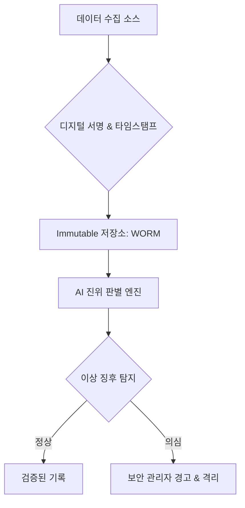

> [!IMPORTANT]
> **분야**: Security  
> **한 줄 요약**: AI가 생성한 데이터가 법적 증거로 악용되는 시대, 엔지니어가 시스템 무결성을 보장하고 AI 조작을 탐지하기 위해 갖추어야 할 검증 아키텍처와 대응 전략.

---

## 실무에서 마주한 'AI 그림자'의 무게

10년 전, 제가 막 주니어 개발자로 일하던 시절에는 로그 파일 하나만 제대로 조작해도 '고수' 소리를 듣던 시절이 있었습니다. 하지만 최근 들려오는 경찰관의 AI 증거 조작 사례를 보며 등골이 서늘해짐을 느낍니다. 이제 기술은 단순히 기록을 삭제하는 수준을 넘어, 아예 존재하지 않았던 사실을 '그럴듯하게' 창조해내는 단계에 이르렀습니다. 기술적 진보가 사회적 신뢰를 갉아먹는 이 시점에서, 우리는 엔지니어로서 어떻게 시스템의 진실성을 사수해야 할까요? 단순히 '믿는 것'은 더 이상 보안 정책이 될 수 없습니다. 데이터 무결성을 보장하는 아키텍처, 그것이 우리가 당장 구축해야 할 최후의 보루입니다.

## 1. 디지털 증거의 생명주기와 신뢰 모델

증거 데이터가 생성되는 시점부터 저장, 폐기되기까지의 전체 흐름에서 AI 개입 여부를 파악하는 것은 불가능에 가깝습니다. 따라서 우리는 '제로 트러스트(Zero Trust) 데이터 아키텍처'를 채택해야 합니다. 

### 엔드-투-엔드 검증 시스템 아키텍처



## 2. AI 데이터 조작 탐지: 실무 코드 가이드

AI가 생성한 미디어나 문서의 패턴을 분석하는 첫 번째 단계는 메타데이터의 '노이즈 프로파일'을 확인하는 것입니다. 다음은 파이썬을 활용한 기본적인 데이터 무결성 검증 예제입니다.

```python
import hashlib
import hmac
import time

# 데이터 생성 시 고유 해시와 서명 부여 (무결성 보장)
def sign_data(data, secret_key):
    signature = hmac.new(secret_key, data.encode(), hashlib.sha256).hexdigest()
    return {'data': data, 'timestamp': time.time(), 'signature': signature}

# 증거 검증 함수
def verify_evidence(evidence, secret_key):
    expected_signature = hmac.new(secret_key, evidence['data'].encode(), hashlib.sha256).hexdigest()
    if hmac.compare_digest(evidence['signature'], expected_signature):
        return True
    return False

# 사용 예시
key = b'my-super-secret-key'
evidence = sign_data("incident_report_001", key)
print(f"검증 결과: {verify_evidence(evidence, key)}")
```

## 3. 실무자를 위한 핵심 체크리스트

- **데이터 출처(Provenance) 확보**: 데이터가 생성된 기기의 로그와 시스템 런타임 정보를 반드시 연동하십시오.
- **해시 체이닝**: 기록의 전후 관계를 블록체인 방식으로 연결하여 중간 수정이 불가능하게 만드십시오.
- **AI 워터마킹 확인**: 최신 AI 모델이 삽입하는 잠재적 워터마크를 탐지하는 스캐너를 보안 스택에 추가하십시오.

## 4. 장단점 분석 및 FAQ

### 장점
- **무결성 극대화**: 조작 시도 즉시 탐지 가능.
- **법적 증명력 확보**: 기술적 데이터에 기반한 객관적 입증 가능.

### 단점
- **비용 증가**: 대규모 로그 데이터 관리 비용 및 인프라 복잡도 상승.
- **성능 오버헤드**: 매 기록마다 서명 및 해싱 처리 시 레이턴시 발생 가능.

### FAQ
- **Q: AI 기술이 발전하면 이 검증 시스템도 무력화되지 않나요?**
- **A**: 그렇습니다. 따라서 '검증 시스템'도 지속적으로 모델링을 업데이트하는 앙상블 학습이 필요합니다. 보안은 단판 승부가 아닌 끝없는 추격전입니다.
- **Q: 하드웨어 수준의 증거 보존은 어떻게 하나요?**
- **A**: TPM(Trusted Platform Module)과 연동된 커널 레벨의 로깅을 권장합니다.

## 총평: 기술은 도구일 뿐, 책임은 인간에게

경찰관의 사례처럼 AI를 악용하는 시도는 앞으로 더 지능화될 것입니다. 엔지니어인 우리는 시스템을 설계할 때 '사람을 믿지 마라'는 보안의 제1원칙을 다시금 되새겨야 합니다. 우리가 만드는 것은 단순한 데이터베이스가 아니라, 사실과 거짓을 판별하는 사회적 시스템의 토대입니다. 오늘 배운 검증 아키텍처를 여러분의 프로덕션 환경에 즉시 적용하십시오. 그것이 기술자가 세상을 정의롭게 만드는 가장 강력한 방법입니다.