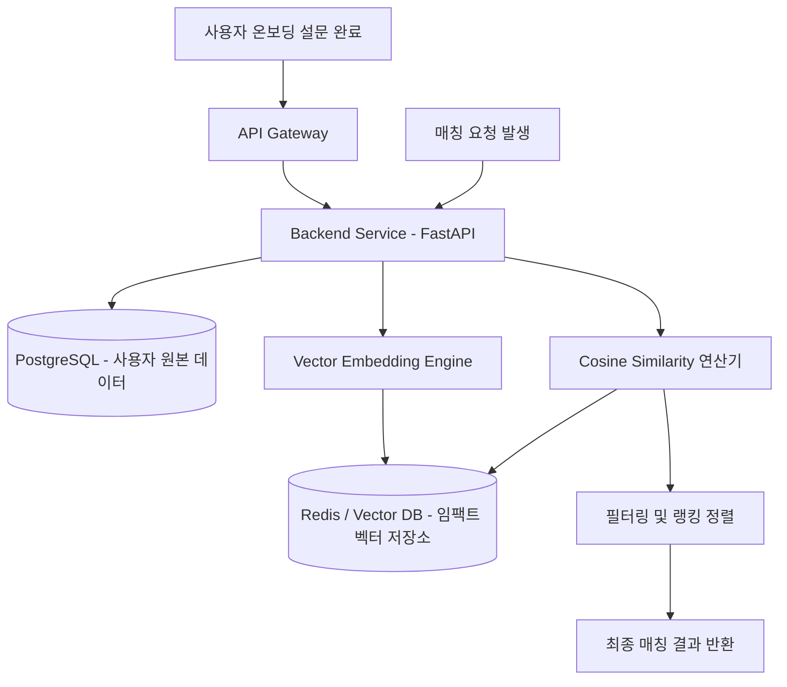

> [!IMPORTANT]
> **분야**: IT/AI/Security  
> **한 줄 요약**: 단순 거리나 외모 기반 매칭을 넘어, 복잡한 다차원 가치관 데이터를 벡터 공간에 매핑하고 코사인 유사도로 최적의 인연을 찾아내는 실무 매칭 알고리즘 구축 가이드

---

## 서론: 외모와 거리를 넘어, '가치관'이라는 고차원 데이터 다루기

10년 전, 제가 처음 소셜 매칭 서비스를 개발할 때의 일입니다. 당시 비즈니스 요구사항은 단순했습니다. 'GPS 기반으로 반경 5km 이내의 이성을 노출하고, 프로필 사진을 스와이프하게 만들자.' 개발자로서 이 구조는 매우 직관적이고 구현하기 쉬웠습니다. 관계형 데이터베이스의 `ST_Distance` 함수 몇 번이면 끝나는 작업이었죠. 하지만 서비스 런칭 후 3개월 만에 치명적인 이탈률(Churn Rate)을 마주했습니다. 사용자들이 진정으로 원하는 것은 '가까운 사람'이 아니라 '대화가 잘 통하는, 삶의 가치관이 비슷한 사람'이었던 것입니다.

최근 Hacker News(HN)에 소개된 **ValuePair**라는 프로젝트는 이러한 본질적인 고민에서 출발했습니다. 사용자가 온보딩 과정에서 깊이 있는 설문을 거치고, 그 결과를 바탕으로 가치관이 일치하는 친구를 찾아준다는 개념입니다. 단순히 레디메이드 매칭 로직을 쓰는 것이 아니라, 다차원의 설문 데이터를 어떻게 정량화하고 알고리즘으로 녹여낼 것인가는 백엔드 및 AI 엔지니어에게 언제나 매력적이면서도 까다로운 과제입니다.

이번 칼럼에서는 ValuePair의 컨셉을 바탕으로, **실무에서 즉시 활용할 수 있는 가치관 기반 매칭 시스템의 아키텍처 설계부터 파이썬 코드 구현, 최적화 및 보안 고려사항**까지 완벽하게 파헤쳐 보겠습니다.

---

## 1. 시스템 아키텍처 설계

가치관 매칭 시스템의 핵심은 사용자의 주관적인 답변을 정량적인 벡터로 변환하고, 이를 고성능으로 탐색하는 것입니다. 전체적인 데이터 흐름은 온보딩 설문 응답 수집 -> 벡터화 및 가중치 부여 -> 코사인 유사도 연산 -> 결과 캐싱으로 이어집니다.

아래는 전체 시스템의 아키텍처 흐름도입니다.



이 아키텍처에서 가장 중요한 부분은 **벡터 연산의 효율성**입니다. 사용자가 늘어날수록 모든 사용자를 대상으로 실시간 유사도를 계산하는 것은 O(N)의 시간 복잡도를 가지므로 병목이 발생합니다. 따라서 실무에서는 인메모리 캐시나 전용 벡터 DB(예: FAISS, Redis Vector Set)를 활용해야 합니다.

---

## 2. 실무 구현: 다차원 가치관 매칭 엔진 개발

이제 실제로 복잡한 설문 데이터를 파싱하고, 가중치를 적용하여 코사인 유사도를 계산하는 파이썬 코드를 작성해 보겠습니다. 이 코드는 프로덕션 환경에서 즉시 활용할 수 있도록 타입 힌트와 예외 처리를 포함하고 있습니다.

```python
import numpy as np
from typing import Dict, List, Union

class ValuePairMatcher:
    def __init__(self, question_weights: Dict[str, float]):
        """
        question_weights: 각 질문의 중요도(가중치) 딕셔너리
        예: {"q1_life_goal": 1.5, "q2_weekend_style": 1.0, "q3_spending_habit": 2.0}
        """
        self.question_weights = question_weights
        self.sorted_keys = sorted(question_weights.keys())
        self.weight_vector = np.array([self.question_weights[k] for k in self.sorted_keys])

    def _dict_to_vector(self, user_answers: Dict[str, float]) -> np.ndarray:
        """
        사용자의 답변 딕셔너리를 가중치가 적용된 넘파이 벡터로 변환합니다.
        """
        vector = []
        for k in self.sorted_keys:
            # 응답이 없는 경우 기본값 0.0 처리
            answer_val = user_answers.get(k, 0.0)
            vector.append(answer_val)
        
        raw_vector = np.array(vector)
        # 가중치 적용 (Element-wise multiplication)
        return raw_vector * self.weight_vector

    def calculate_similarity(self, user_a: Dict[str, float], user_b: Dict[str, float]) -> float:
        """
        두 사용자 간의 가중 코사인 유사도(Weighted Cosine Similarity)를 계산합니다.
        반환값: -1.0 ~ 1.0 사이의 유사도 점수
        """
        vec_a = self._dict_to_vector(user_a)
        vec_b = self._dict_to_vector(user_b)

        dot_product = np.dot(vec_a, vec_b)
        norm_a = np.linalg.norm(vec_a)
        norm_b = np.linalg.norm(vec_b)

        # 0 나누기 에러 방지
        if norm_a == 0.0 or norm_b == 0.0:
            return 0.0

        similarity = dot_product / (norm_a * norm_b)
        return float(similarity)

    
    def find_best_matches(self, target_user: Dict[str, float], candidate_pool: Dict[str, Dict[str, float]], top_n: int = 5) -> List[tuple]:
        """
        후보군 중에서 가장 가치관이 잘 맞는 상위 N명의 사용자를 찾습니다.
        """
        scores = {}
        for candidate_id, answers in candidate_pool.items():
            score = self.calculate_similarity(target_user, answers)
            scores[candidate_id] = score

        # 점수가 높은 순으로 정렬
        sorted_matches = sorted(scores.items(), key=lambda x: x[1], reverse=True)
        return sorted_matches[:top_n]

# --- 실행 예제 ---
if __name__ == "__main__":
    # 질문별 가중치 정의
    weights = {
        "life_goal": 2.0,      # 인생 목표 (매우 중요)
        "weekend_style": 1.0,  # 주말 스타일 (보통)
        "spending_habit": 1.8  # 소비 습관 (중요)
    }

    matcher = ValuePairMatcher(question_weights=weights)

    # 사용자 A의 응답 (-1.0 ~ 1.0 스케일)
    user_a_answers = {
        "life_goal": 0.8,
        "weekend_style": -0.5,
        "spending_habit": 0.5
    }

    # 후보군 풀
    candidates = {
        "user_b": {"life_goal": 0.7, "weekend_style": -0.4, "spending_habit": 0.6},
        "user_c": {
            "life_goal": -0.8,
            "weekend_style": 0.9,
            "spending_habit": -0.9
        },
        "user_d": {"life_goal": 0.9, "weekend_style": -0.6, "spending_habit": 0.4}
    }

    best_matches = matcher.find_best_matches(user_a, candidates, top_n=2)
    print("최적의 매칭 결과:")
    for uid, score in best_matches:
        print(f"ID: {uid}, Similarity Score: {score:.4f}")
```

---

## 3. 아키텍처 및 알고리즘 장단점 비교

실무 시스템을 설계할 때는 항상 트레이드오프(Trade-off)를 고려해야 합니다. 가치관 매칭 알고리즘의 주요 구현 방식별 장단점을 비교해 봅니다.

| 방식 | 장점 | 단점 | 실무 권장 시나리오 |
| :--- | :--- | :--- | :--- |
| **단순 유클리드 거리 (Euclidean Distance)** | 직관적이고 구현이 극도로 단순함 | 데이터의 스케일에 민감하며, 차원이 커질수록 변별력 상실 | 초기 MVP 단계, 질문 수가 5개 미만일 때 |
| **코사인 유사도 (Cosine Similarity)** | 방향성(성향의 일치도)을 정확히 측정하며 절대적 크기에 영향 안 받음 | 영벡터(Zero Vector) 처리 및 역방향 성향에 대한 정의 필요 | **가장 범용적으로 추천 (ValuePair 컨셉에 최적)** |
| **머신러닝 기반 임베딩 (BERT / LLM Embedding)** | 사용자의 텍스트 서술형 답변까지 깊이 있게 이해 가능 | 연산 비용이 매우 높고 실시간 서비스 응답 속도 확보가 어려움 | 대규모 자금과 고성능 GPU 인프라가 갖추어진 고도화 단계 |

---

## 4. 실무 운영 시 주의사항 및 보안(Security) 고려사항

가치관 매칭 서비스는 사용자의 내면, 정치적 성향, 종교, 소비 패턴 등 민감한 개인정보(PII)를 다루므로 보안에 각별한 주의가 필요합니다.

1. **개인정보 익명화 및 암호화**: 사용자의 설문 응답 데이터는 데이터베이스 저장 시점에 대칭 암호화(AES-256)를 적용하거나, 로그 파일에 절대 평문으로 노출되지 않도록 마스킹 처리를 해야 합니다.
2. **공격자 방어 (Matching Manipulation)**: 악의적인 사용자가 시스템의 매칭 로직을 역추적하여 특정 타인과 의도적으로 매칭되거나, 반대로 매칭을 교란하기 위해 무작위 설문 응답을 반복 주입하는 스팸 행위를 방어해야 합니다. (Rate Limiting 적용 필수)
3. **데이터 편향성(Bias) 관리**: 특정 가치관 그룹에만 매칭이 과도하게 집중되어 고립되는 현상(Echo Chamber)을 막기 위해, 매칭 결과에 무작위 탐색(Exploration) 요소를 일정 비율(예: 10%) 섞어주는 알고리즘적 보정이 필요합니다.

---

## 5. 자주 묻는 질문 (FAQ)

**Q1. 질문의 개수가 계속 늘어날 경우 벡터 연산 속도가 느려지지 않나요?**  
A1. 네, 질문이 수백 개로 늘어나면 연산 부하가 생깁니다. 이 경우 실시간 연산 대신 배치(Batch) 작업으로 매일 밤 사용자별 사전 매칭 후보군을 미리 계산해 Redis에 캐싱해 두는 구조(Pre-computation Strategy)를 채택하는 것이 정석입니다.

**Q2. 사용자가 응답하지 않은 문항(Missing Value)은 어떻게 처리해야 하나요?**  
A2. 위 코드 예제에서 보듯 0.0(중립)으로 처리하거나, 해당 문항을 제외한 나머지 문항들만 가지고 벡터의 노름(Norm)을 다시 계산하는 방식을 씁니다. 단, 결측치가 너무 많으면 매칭 정확도가 급감하므로 온보딩 시 최소 응답 문항 수를 강제해야 합니다.

**Q3. ValuePair처럼 회원가입을 강제하는 UX는 이탈률을 높이지 않나요?**  
A3. 맞습니다. 회원가입 장벽은 높지만, 가치관 매칭의 특성상 깊이 있는 데이터가 필수적이므로 '점진적 온보딩(Progressive Onboarding)' 전략을 추천합니다. 처음에는 소셜 로그인과 3개의 핵심 질문만 받고, 서비스를 둘러본 뒤 추가 설문을 유도하는 방식이 이탈률을 낮추는 데 효과적입니다.

---

## 총평

소셜 및 커뮤니티 서비스의 본질은 결국 '연결'입니다. 틴더류의 외모 중심 매칭이 대세였던 과거와 달리, 이제는 ValuePair처럼 내면의 가치관과 깊은 성향을 매칭의 코어로 삼는 서비스들이 주목받고 있습니다. 백엔드 엔지니어와 AI 엔지니어의 관점에서 이러한 서비스를 구축할 때, 화려한 AI 모델부터 도입하기보다는 오늘 다룬 **가중 코사인 유사도와 효율적인 벡터 파이프라인** 같은 견고하고 직관적인 알고리즘부터 탄탄히 다지는 것이 성공의 지름길입니다. 당장 프로젝트에 위 코드를 적용하여 나만의 가치관 매칭 엔진을 구축해 보시기 바랍니다.