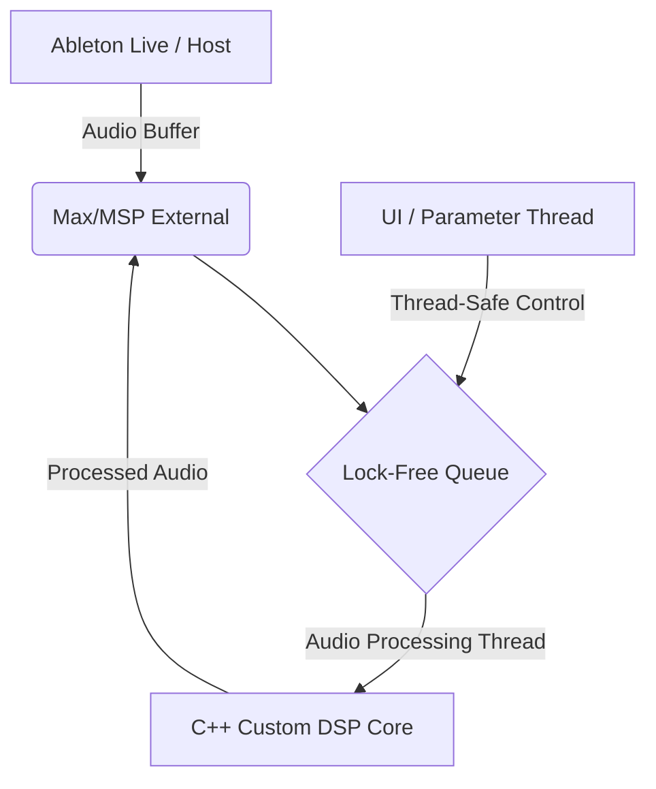

> [!IMPORTANT]
> **분야**: IT/AI/Security  
> **한 줄 요약**: C++과 Max/MSP SDK를 활용하여 고성능 실시간 오디오 DSP 모듈을 직접 개발하고, 이를 Ableton Live 환경에 통합하는 아키텍처 및 구현 가이드입니다.

---

## 1. 실무 도입 배경: 오디오 엔지니어링의 한계를 넘어서기

10년 전, 처음 라이브 공연용 오디오 소프트웨어를 구축할 때 겪었던 가장 큰 악몽은 오디오 드랍아웃(Audio Dropout)이었습니다. C#이나 Python 등 고수준 언어로 프로토타입을 만들었을 때는 원활하게 돌아가던 알고리즘이, 수백 명이 모인 공연장에서 갑자기 밀려드는 버퍼 언더런(Buffer Underrun)으로 인해 멈춰버렸던 기억이 생생합니다. 그날 이후로 저는 실시간 오디오 처리 영역에서 C++은 선택이 아닌 생존의 문제라는 것을 깨달았습니다.

최근 Hacker News에서 주목받은 `Max Studio Tools` 같은 C++ 기반 DSP 모듈 오픈소스 프로젝트들을 보면, 현대의 음악 제작 및 오디오 프로세싱 환경이 얼마나 고성능 저지연(Low-Latency) 아키텍처를 요구하는지 잘 알 수 있습니다. Max/MSP와 Ableton Live(Max for Live) 환경은 사운드 디자이너와 개발자 모두에게 강력한 샌드박스를 제공하지만, 기본 제공되는 오브젝트만으로는 복잡한 실시간 오디오 분석이나 커스텀 신디사이저 알고리즘을 처리하기에 CPU 부하가 큽니다.

이번 가이드에서는 C++을 이용해 고성능 실시간 오디오 DSP 모듈을 작성하고, 이를 Max/MSP 외부 객체(External)로 컴파일하여 Ableton Live 환경에 완벽하게 통합하는 전 과정을 실무 관점에서 파헤쳐 보겠습니다.

---

## 2. 오디오 DSP 모듈 아키텍처 설계

효과적인 실시간 오디오 플러그인을 만들기 위해서는 오디오 스레드(Audio Thread)와 UI/메인 스레드 간의 명확한 역할 분리가 필수적입니다. 오디오 스레드 내에서는 메모리 할당(malloc/new)이나 락(Lock)을 유발하는 연산을 절대 수행해서는 안 됩니다.



위 아키텍처에서 보듯, 파라미터 제어는 메인 스레드에서 일어나지만, 실제 샘플 단위의 연산은 별도의 고립된 오디오 처리 코어에서 수행되어야 지연 없는(Zero-Latency) 퍼포먼스를 보장할 수 있습니다.

---

## 3. 실무 구현: C++ 기반 커스텀 DSP 외부 객체 작성

실무 환경에서 바로 복사해서 컴파일해 볼 수 있는 미니멀한 C++ 기반 Max 외부 객체 스니펫입니다. 이 코드는 입력된 오디오 신호에 간단한 게인(Gain)과 클리핑을 적용하는 DSP 모듈입니다.

```cpp
#include "ext.h"
#include "ext_obex.h"
#include "z_dsp.h"

// DSP 객체 구조체 정의
typedef struct _custom_gain {
    t_pxobject m_ob;
    double m_gain;
} t_custom_gain;

// 메서드 선언
void *custom_gain_new(t_symbol *s, long argc, t_atom *argv);
void custom_gain_free(t_custom_gain *x);
void custom_gain_assist(t_custom_gain *x, void *b, long m, long a, char *s);
void custom_gain_perform64(t_custom_gain *x, t_object *dsp64, double **ins, long numins, double **outs, long numouts, long sampleframes, long flags, void *userparam);
void custom_gain_dsp64(t_custom_gain *x, t_object *dsp64, short *count, double samplerate, long maxvectorsize, long flags);

static t_class *custom_gain_class = NULL;

// 엔트리 포인트 (ExtMain)
extern "C" void ext_main(void *r) {
    t_class *c = class_new("custom_gain~", (method)custom_gain_new, (method)custom_gain_free, (long)sizeof(t_custom_gain), 0L, A_GIMME, 0);
    
    class_addmethod(c, (method)custom_gain_dsp64, "dsp64", A_CANT, 0);
    class_addmethod(c, (method)custom_gain_assist, "assist", A_CANT, 0);
    
    class_dspinit(c);
    class_register(CLASS_BOX, c);
    custom_gain_class = c;
}

// 객체 생성자
void *custom_gain_new(t_symbol *s, long argc, t_atom *argv) {
    t_custom_gain *x = (t_custom_gain *)object_alloc(custom_gain_class);
    if (x) {
        dsp_setup((t_pxobject *)x, 1); // 입력 채널 1개
        outlet_new(x, "signal");      // 출력 채널 1개
        x->m_gain = 0.8;
        
        if (argc > 0) {
            x->m_gain = atom_getfloat(argv);
        }
    }
    return (x);
}

void custom_gain_free(t_custom_gain *x) {
    dsp_free((t_pxobject *)x);
}

void custom_gain_assist(t_custom_gain *x, void *b, long m, long a, char *s) {
    if (m == ASSIST_INHIBIT) {
        sprintf(s, "(signal) Input");
    } else {
        sprintf(s, "(signal) Output");
    }
}

// 64비트 오디오 루프 설정
void custom_gain_dsp64(t_custom_gain *x, t_object *dsp64, short *count, double samplerate, long maxvectorsize, long flags) {
    object_method(dsp64, gensym("dsp_add64"), x, (method)custom_gain_perform64, 0, NULL);
}

// 핵심 DSP 연산 루프 (오디오 스레드에서 실행)
void custom_gain_perform64(t_custom_gain *x, t_object *dsp64, double **ins, long numins, double **outs, long numouts, long sampleframes, long flags, void *userparam) {
    t_double *in = ins[0];
    t_double *out = outs[0];
    int n = sampleframes;
    double gain = x->m_gain;

    while (n--) {
        double sample = *in++;
        // 실시간 연산: 하드 클리핑 및 게인 적용
        sample *= gain;
        if (sample > 1.0) sample = 1.0;
        else if (sample < -1.0) sample = -1.0;
        *out++ = sample;
    }
}
```

---

## 4. 빌드 및 Ableton Live 연동 방법

위 코드를 작성한 후, CMake를 이용하여 Max SDK와 연동하여 컴파일할 수 있습니다.

1. **CMakeLists.txt 작성 예시**:
```cmake
cmake_minimum_required(VERSION 3.15)
project(custom_gain)

set(CMAKE_CXX_STANDARD 17)
add_library(custom_gain MODULE main.cpp)

# Max SDK 경로 설정 필요
include_directories(/path/to/max-sdk/source/max-api/include)
include_directories(/path/to/max-sdk/source/msp-api/include)

set_target_properties(custom_gain PROPERTIES
    PREFIX ""
    SUFFIX ".mxo" # macOS 기준 (Windows는 .mxe64)
)
```

2. **Ableton Live 배치**:
   - 컴파일된 `.mxo` 또는 `.mxe64` 파일을 Max search path가 지정된 폴더(예: `Documents/Max 8/Library`)에 복사합니다.
   - Ableton Live에서 Max for Live 장치(`Max Audio Effect`)를 트랙에 올리고, 내부 패치에 `custom_gain~` 객체를 생성하여 라우팅합니다.

---

## 5. 장단점 분석

### 장점 (Pros)
- **최고의 퍼포먼스**: 고수준 스크립팅 언어 대비 CPU 사용량을 최소화하여 저지연 실시간 모니터링이 가능합니다.
- **무한한 확장성**: 표준 라이브러리나 외부 C++ 라이브러리(Eigen, JUCE 등)를 직접 포팅하여 고도화된 머신러닝 오디오 분석 모델을 연동할 수 있습니다.

### 단점 (Cons)
- **가파른 학습 곡선**: C++ 메모리 관리 및 Max/MSP 내부 C API에 대한 깊은 이해가 필요합니다.
- **디버깅의 어려움**: 오디오 스레드에서 발생하는 크래시(Crash)는 호스트 애플리케이션(Ableton Live) 전체를 다운시킬 수 있어 안정성 테스트가 까다롭습니다.

---

## 6. 자주 묻는 질문 (FAQ)

**Q1: 오디오 처리 중에 메모리를 동적 할당하면 왜 문제가 되나요?**  
A: `malloc`이나 `new`는 OS 커널의 락을 유발할 수 있어 실행 시간이 일정하지 않습니다. 오디오 스레드는 정해진 마이크로초(Microsecond) 내에 버퍼를 처리해야 하므로, 지연이 발생하면 바로 오디오 팝(Pop)이나 끊김 현상으로 이어집니다.

**Q2: Windows와 macOS에서 동시에 컴파일하려면 어떻게 해야 하나요?**  
A: 플랫폼별 타겟 확장자(`.mxe64` vs `.mxo`)와 SDK 경로를 CMake 설정에서 분기 처리하여 크로스 플랫폼 빌드 파이프라인(GitHub Actions 등)을 구축하는 것이 정석입니다.

---

## 7. 총평

실무에서 오디오 DSP 시스템을 구축할 때, 기성품 플러그인에만 의존하면 비즈니스나 예술적 요구사항의 한계에 부딪히기 쉽습니다. C++을 활용해 자신만의 맞춤형 DSP 모듈을 개발하고 이를 Ableton Live와 같은 전문 DAW 환경에 통합할 수 있는 역량은 엔지니어로서 강력한 무기가 됩니다. 오늘 소개한 아키텍처와 코드를 바탕으로 여러분만의 실시간 오디오 파이프라인을 확장해 보시길 바랍니다.