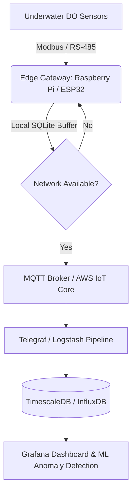

> [!IMPORTANT]
> **분야**: IT/AI/Security  
> **한 줄 요약**: 해양 산소 소실이라는 지구 환경 위기에 맞서, Edge IoT 센서부터 실시간 시계열 데이터 파이프라인, 그리고 이상 탐지 머신러닝 모델까지 구축하는 실무 완벽 가이드.

---

## 1. 서두: 해양 데이터 수집 시스템 구축의 최전선에서

10년 전, 처음 대규모 환경 모니터링 프로젝트에 투입되었을 때의 기억이 생생합니다. 당시 우리는 단순히 RS-485 통신을 통해 센서 값을 긁어모으는 데 급급했습니다. 패킷이 유실되거나 데이터베이스가 다운되는 일은 부지기수였고, '데이터 유실'은 곧 환경 재난 징후의 누락을 의미했습니다. 최근 Scripps 연구소 등에서 경고하는 **수중 용존산소(Dissolved Oxygen, DO) 감소**와 같은 전 지구적 위기는 이제 단순한 학술적 관심사를 넘어섭니다. 해양 생태계의 붕괴는 인류 생존과 직결된 문제이며, 이를 감지하기 위한 **실시간 고가용성 센서 데이터 파이프라인**을 설계하고 운영하는 것은 오늘날 시니어 엔지니어인 우리에게 주어진 무거운 책무입니다.

이번 칼럼에서는 수중 산소 농도 저하와 같은 환경 위기를 실시간으로 모니터링하고 예측하기 위한 **Edge-to-Cloud 아키텍처**를 설계하고, 실제 복사해서 사용할 수 있는 데이터 수집 에이전트 코드와 시계열 DB 파이프라인 구축 방법을 다룹니다.

---

## 2. 시스템 아키텍처 설계 (Edge to Cloud Pipeline)

수중 환경은 통신 음영 지역이 많고 전력 공급이 제한적입니다. 따라서 센서 노드(Edge)에서는 저전력으로 데이터를 수집·버퍼링하고, 통신 가능 지역(Gateway)을 통해 클라우드로 안정적으로 전송하는 구조가 필수적입니다.



### 아키텍처 핵심 구성 요소
1. **Edge Node**: 수중 산소 센서(Optical DO Sensor)와 연결된 저전력 MCU/게이트웨이. 네트워크 단절 시 로컬 DB(SQLite)에 데이터를 버퍼링.
2. **Ingestion Layer**: MQTT 프로토콜을 활용한 경량 메시징 및 대역폭 최적화.
3. **Storage Layer**: 시계열 데이터 처리에 최적화된 TimescaleDB(PostgreSQL 기반)를 활용하여 대규모 센서 타임시리즈 저장.
4. **Analytics Layer**: 임계값 기반 알람 및 머신러닝 기반의 이상 탐지(Anomaly Detection).

---

## 3. 실무 구현: Edge 데이터 수집 에이전트 (Python)

아래 코드는 수중 센서로부터 Modbus RTU 또는 가상 시뮬레이션을 통해 용존산소(DO, mg/L), 수온(Temperature, °C), 염도(Salinity, PSU)를 수집하고, 네트워크 장애 시 로컬 SQLite에 안전하게 버퍼링한 뒤 클라우드로 전송하는 프로덕션 레벨의 에이전트 스니펫입니다.

```python
import time
import sqlite3
import json
import paho.mqtt.client as mqtt
from datetime import datetime

# 설정값
MQTT_BROKER = "mqtt.eclipseprojects.io"
MQTT_TOPIC = "ocean/sensors/do_monitor"
DB_PATH = "local_buffer.db"

class EdgeDataCollector:
    def __init__(self):
        self.init_db()
        self.mqtt_client = mqtt.Client()
        self.connect_mqtt()

    def init_db(self):
        self.conn = sqlite3.connect(DB_PATH, check_same_thread=False)
        self.cursor = self.conn.cursor()
        self.cursor.execute('''
            CREATE TABLE IF NOT EXISTS sensor_buffer (
                id INTEGER PRIMARY KEY AUTOINCREMENT,
                timestamp TEXT,
                do_level REAL,
                temperature REAL,
                salinity REAL,
                synced INTEGER DEFAULT 0
            )
        ''')
        self.conn.commit()

    def connect_mqtt(self):
        try:
            self.mqtt_client.connect(MQTT_BROKER, 1883, 60)
            self.mqtt_client.loop_start()
            self.is_connected = True
        except Exception as e:
            print(f"[WARN] MQTT Connection failed: {e}. Running in offline buffer mode.")
            self.is_connected = False

    def read_sensors(self):
        # 실제 환경에서는 minimalmodbus 등을 활용하여 센서 값을 읽어옴
        # 여기서는 시뮬레이션 값 반환
        return {
            "timestamp": datetime.utcnow().isoformat(),
            "do_level": 4.2,  # mg/L (위험 수치 가정)
            "temperature": 18.5,
            "salinity": 34.2
        }

    def store_locally(self, data):
        self.cursor.execute('''
            INSERT INTO sensor_buffer (timestamp, do_level, temperature, salinity, synced)
            VALUES (?, ?, ?, ?, 0)
        ''', (data['timestamp'], data['do_level'], data['temperature'], data['salinity']))
        self.conn.commit()

    def flush_buffer(self):
        if not self.is_connected:
            try:
                self.mqtt_client.reconnect()
                self.is_connected = True
            except:
                return

        self.cursor.execute('SELECT id, timestamp, do_level, temperature, salinity FROM sensor_buffer WHERE synced = 0 LIMIT 50')
        rows = self.cursor.fetchall()
        
        for row in rows:
            row_id, ts, do, temp, sal = row
            payload = json.dumps({"timestamp": ts, "do_level": do, "temperature": temp, "salinity": sal})
            try:
                info = self.mqtt_client.publish(MQTT_TOPIC, payload, qos=1)
                info.wait_for_publish()
                if info.is_published():
                    self.cursor.execute('UPDATE sensor_buffer SET synced = 1 WHERE id = ?', (row_id,))
                    self.conn.commit()
            except Exception as e:
                print(f"[ERROR] Failed to sync buffer: {e}")
                self.is_connected = False
                break

    def run(self):
        print("[INFO] Starting Edge Data Collector...")
        while True:
            data = self.read_sensors()
            self.store_locally(data)
            self.flush_buffer()
            time.sleep(10)

if __name__ == "__main__":
    collector = EdgeDataCollector()
    collector.run()
```

---

## 4. 백엔드 시계열 데이터베이스 및 이상 탐지 파이프라인

수집된 데이터는 TimescaleDB에 적재되어 실시간 쿼리와 집계가 이루어집니다. 용존산소의 급격한 저하(Hypoxia)를 실시간으로 감지하기 위해 아래와 같은 SQL 하이퍼테이블 스키마와 연속 집계(Continuous Aggregate) 뷰를 구성합니다.

```sql
-- 1. TimescaleDB Extension 활성화 및 테이블 생성
CREATE EXTENSION IF NOT EXISTS timescaledb;

CREATE TABLE ocean_metrics (
    time TIMESTAMPTZ NOT NULL,
    sensor_id VARCHAR(50) NOT NULL,
    do_level DOUBLE PRECISION NOT NULL,
    temperature DOUBLE PRECISION NOT NULL,
    salinity DOUBLE PRECISION NOT NULL
);

-- 2. 하이퍼테이블 변환 (1일 단위 파티셔닝)
SELECT create_hypertable('ocean_metrics', 'time');

-- 3. 실시간 산소 농도 위험 감지 뷰 (1분 평균)
CREATE MATERIALIZED VIEW ocean_metrics_hourly
WITH (timescaledb.continuous) AS
SELECT
    sensor_id,
    time_bucket('1 minute', time) AS bucket,
    AVG(do_level) AS avg_do,
    MIN(do_level) AS min_do
FROM ocean_metrics
GROUP BY sensor_id, time_bucket('1 minute', time);

-- 4. 자동 새로고침 정책 설정
SELECT add_continuous_aggregate_policy('ocean_metrics_hourly',
    start_offset => INTERVAL '3 hours',
    end_offset => INTERVAL '1 minute',
    schedule_interval => INTERVAL '1 minute');
```

### 머신러닝 기반 이상 탐지 (Isolation Forest)
단순 임계값(예: DO < 2.0 mg/L)을 넘어, 온도와 염도의 변화율을 복합적으로 고려한 Isolation Forest 모델을 파이프라인에 통합합니다.

```python
import numpy as np
from sklearn.ensemble import IsolationForest

class DOAnomalyDetector:
    def __init__(self):
        # [DO, Temperature, Salinity]
        self.model = IsolationForest(contamination=0.01, random_state=42)
        self.is_trained = False

    def train(self, historical_data):
        # historical_data: shape (N, 3)
        self.model.fit(historical_data)
        self.is_trained = True

    def predict(self, current_sample):
        if not self.is_trained:
            return 0
        # -1은 이상치(Anomaly), 1은 정상
        prediction = self.model.predict([current_sample])
        return int(prediction[0])

# 예시 사용법
# detector = DOAnomalyDetector()
# detector.train(np.array([[5.5, 15.0, 33.0], [5.2, 15.2, 33.1], [1.8, 22.0, 36.5]]))
# status = detector.predict([1.5, 23.1, 36.8]) # 결과: -1 (이상 감지)
```

---

## 5. 장단점 비교 분석 (Trade-offs)

실무 환경에서 이러한 아키텍처를 도입할 때 고려해야 할 기술적 트레이드오프는 다음과 같습니다.

| 접근 방식 / 기술 | 장점 (Pros) | 단점 (Cons) | 적합한 유즈케이스 |
| :--- | :--- | :--- | :--- |
| **Edge SQLite 버퍼링 + MQTT** | 네트워크 단절 시 데이터 유실 방지, 경량 통신 | 로컬 스토리지 관리 및 디스크 풀(Full) 처리 로직 구현 필요 | 원격 해양 부이(Buoy), 통신 음영 지역 |
| **TimescaleDB (시계열 DB)** | 표준 SQL 사용 가능, 뛰어난 압축률과 고속 집계 | 대규모 클러스터 운영 시 전문 관리 지식 필요 | 수만 개 센서 데이터 통합 저장 및 분석 |
| **Isolation Forest (이상 탐지)** | 비지도 학습으로 사전 레이블 불필요, 빠른 추론 속도 | 계절적 주기성에 따른 오탐(False Positive) 발생 가능성 | 환경 센서 실시간 이상 징후 조기 경보 |

---

## 6. FAQ (자주 묻는 질문)

**Q1. 수중 센서는 해수 부식으로 인해 데이터 노이즈가 심한데, 전처리 아키텍처는 어떻게 설계해야 하나요?**  
> A. 센서 노드 레벨에서 이동 평균(Moving Average) 필터나 칼만 필터(Kalman Filter)를 적용하여 고주파 노이즈를 1차 제거하고, 백엔드에서는 IQR(Interquartile Range) 기반의 스파이크 제거 쿼리를 적용하는 다중 방어선 구성을 권장합니다.

**Q2. 셀룰러(LTE-M/NB-IoT) 통신 비용을 절감하는 가장 좋은 방법은 무엇인가요?**  
> A. 매초 데이터를 전송하는 대신, Edge에서 일정 시간(예: 10분) 동안 수집된 데이터의 통계치(평균, 최소, 최대)만 묶어서 배치(Batch) 전송하거나, 임계값 이탈 시에만 즉시 전송하는 이벤트 드븐(Event-driven) 방식으로 전환하는 것이 효과적입니다.

---

## 7. 총평

지구 온난화와 해양 산소 소실은 더 이상 거대 담론 속의 이야기나 먼 미래의 위기가 아닙니다. 우리 엔지니어들은 기술을 통해 이 보이지 않는 위기를 가시화하고 방어할 수 있는 시스템을 구축해야 합니다. 오늘 다룬 Edge-to-Cloud 시계열 파이프라인과 이상 탐지 아키텍처는 해양 모니터링뿐만 아니라 스마트 팩토리, 에너지 그리드 등 다양한 미션 크리티컬 환경에 즉시 응용될 수 있습니다. 견고하고 탄력적인 코드로 지구의 안정성을 지키는 데 기여해 봅시다.