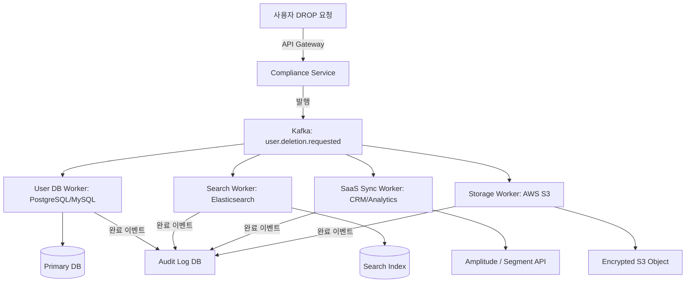

> [!IMPORTANT]
> **분야**: Security  
> **한 줄 요약**: 개인정보 보호법 DROP 시행에 대비하여 실무에서 즉시 구현 가능한 자동화된 데이터 삭제 및 컴플라이언스 파이프라인 구축 방법을 알아봅니다.

---

## 1. 서론: 밤샘 야근을 부르는 '데이터 삭제 요청'의 공포

10년 전, 처음 대규모 사용자 데이터를 다루는 이커머스 백엔드 팀에 합류했을 때가 생각납니다. 당시 유럽의 GDPR이 막 도입되면서 회사 전체가 비상에 걸렸습니다. "사용자가 내 데이터를 완전히 지워달라고 요청(Right to be Forgotten)했는데, 우리가 백업해 둔 S3 스냅샷, 레거시 MySQL DB, 심지어 외부 마케팅 툴(Segment, Amplitude)까지 어떻게 다 찾아서 지우죠?" 당시 CTO의 이 질문에 개발팀 전체가 며칠 밤을 새우며 로그를 뒤졌던 뼈아픈 기억이 있습니다.

이제 캘리포니아주의 **DROP(Delete Request and Opt-out Platform)** 규정이 본격적으로 시행되면서, 북미 시장을 타겟으로 하는 모든 IT 기업들은 수동 대응의 단계를 벗어나야 합니다. 사용자로부터 DELETE 요청이 들어왔을 때, 단 몇 초 만에 분산된 데이터베이스, 캐시, 로그, 그리고 제3자 SaaS API까지 연계하여 안전하고 영구적으로 데이터를 파기할 수 있는 **'실무형 자동화 데이터 삭제 파이프라인'**을 구축해야 할 시점입니다.

이번 글에서는 단순한 법률 해석을 넘어, 시니어 엔지니어의 관점에서 실제로 프로덕션 환경에 투입할 수 있는 비동기 이벤트 기반 데이터 삭제 아키텍처와 구현 코드를 공유합니다.

---

## 2. 데이터 삭제 아키텍처 설계 (DROP 파이프라인)

데이터 삭제는 단순한 `DELETE FROM users WHERE id = ?`로 끝나지 않습니다. 데이터 레이크, 분산 캐시(Redis), 전문 검색 엔진(Elasticsearch), 그리고 외부 서드파티 API까지 모두 동기화해야 합니다. 이를 위해 **이벤트 드븐 아키텍처(Event-Driven Architecture)**와 **사가 패턴(Saga Pattern)**을 응용한 파이프라인을 설계해야 합니다.

아래는 DROP 요청이 접수된 후 전체 시스템에 걸쳐 데이터가 파기되는 과정을 나타낸 아키텍처입니다.



### 핵심 컴포넌트
1. **Compliance Service**: 사용자의 삭제 요청을 접수하고, 유효성을 검증한 뒤 고유 트랜잭션 ID를 발급합니다.
2. **Message Broker (Kafka / RabbitMQ)**: 시스템 간 결합도를 낮추고, 각 데이터토토 스토리지별 워커에 삭제 이벤트를 안정적으로 전달합니다.
3. **Worker Pool**: 각 저장소 특성에 맞게 실제 삭제 로직을 수행합니다. (예: DB는 Hard Delete 대신 암호화 키 폐기 방식 적용 가능)
4. **Audit Log**: 규제 기관 감사(Audit)에 대비하여 '언제, 어떤 사용자의 데이터가, 어떤 상태로 삭제되었는지' 암호화하여 영구 보존합니다.

---

## 3. 실무 구현: Python 기반 비동기 데이터 삭제 워커

실무에서 바로 사용할 수 있도록, `asyncio`와 메시지 큐 개념을 활용한 데이터 삭제 워커의 핵심 코드 스니펫을 제공합니다. 이 코드는 데이터베이스, 검색 엔진, 외부 API 연동을 모사하여 병렬로 삭제 작업을 수행합니다.

```python
import asyncio
import logging
from typing import Dict, List

logging.basicConfig(level=logging.INFO, format='%(asctime)s [%(levelname)s] %(message)s')
logger = logging.getLogger(__name__)

class DataDeletionService:
    def __init__(self, user_id: str):
        self.user_id = user_id

    async def delete_from_database(self) -> bool:
        # 실무에서는 asyncpg, motor 등을 활용한 DB 커넥션 사용
        logger.info(f"[DB Worker] Starting deletion for user: {self.user_id}")
        await asyncio.sleep(0.5)  # DB I/O 지연 시뮬레이션
        logger.info(f"[DB Worker] Successfully deleted user {self.user_id} from Primary DB.")
        return True

    async def delete_from_search_index(self) -> bool:
        logger.info(f"[Search Worker] Removing user {self.user_id} from Elasticsearch index.")
        await asyncio.sleep(0.3)  # ES 삭제 시뮬레이션
        logger.info(f"[Search Worker] Successfully removed user {self.user_id} from Search Index.")
        return True

    async def revoke_third_party_saas(self) -> bool:
        logger.info(f"[SaaS Worker] Calling external APIs (CRM/Analytics) for user {self.user_id}.")
        await asyncio.sleep(0.8)  # 외부 API 호출 지연 시뮬레이션
        logger.info(f"[SaaS Worker] Successfully revoked data for user {self.user_id} in SaaS tools.")
        return True

    async def execute_deletion(self) -> Dict[str, bool]:
        """
        모든 스토리지의 삭제 작업을 비동기 병렬로 처리하고 결과를 반환합니다.
        """
        logger.info(f"=== Starting Complete Deletion Pipeline for User: {self.user_id} ===")
        
        results = await asyncio.gather(
            self.delete_from_database(),
            self.delete_from_search_index(),
            self.revoke_third_party_saas(),
            return_exceptions=True
        )

        task_names = ["Database", "SearchIndex", "ThirdPartySaaS"]
        status_report = {}

        for name, res in zip(task_names, results):
            if isinstance(res, Exception):
                logger.error(f"[Pipeline Error] Failed to delete from {name}: {res}")
                status_report[name] = False
            else:
                status_report[name] = res

        return status_report

async def main():
    target_user_id = "usr_california_99821"
    pipeline = DataDeletionService(target_user_id)
    report = await pipeline.execute_deletion()
    
    logger.info(f"Deletion Pipeline Final Report for {target_user_id}: {report}")

if __name__ == "__main__":
    asyncio.run(main())
```

---

## 4. 아키텍처 장단점 및 트레이드오프 비교

분산 시스템에서 데이터 삭제 기능을 구현할 때 고려해야 할 아키텍처적 트레이드오프는 다음과 같습니다.

| 방식 (Approach) | 장점 (Pros) | 단점 (Cons) | 적합한 유즈케이스 |
| :--- | :--- | :--- | :--- | 
| **동기식 처리 (Synchronous)** | 구현이 단순하며 즉시 삭제 완료 여부 확인 가능 | 타임아웃 위험 높음, 하나의 서비스 장애 시 전체 요청 실패 | 소규모 모놀리식 서비스 |
| **비동기 이벤트 기반 (Asynchronous)** | 확장성 우수, 개별 워커 장애가 전체 파이프라인에 영향 안 줌 | 최종 일관성(Eventual Consistency) 모델로 인한 지연 시간 발생 | 대규모 분산 마이크로서비스 (MSA) |
| **암호화 키 폐기 (Crypto-Shredding)** | 실제 데이터를 지우지 않고 키만 파기하므로 연산 비용이 매우 낮음 | 키 관리 시스템(KMS) 설계가 복잡함 | 대용량 백업 데이터 및 로그 저장소 |

---

## 5. 실무자 FAQ

**Q1. 법적으로 사용자의 데이터를 몇 일 안에 지워야 하나요?**
- 캘리포니아 DROP 및 주요 프라이버시 규정(GDPR, CCPA 등)은 대개 요청 접수 후 **45일 이내** 처리를 요구합니다. 하지만 경쟁력 있는 플랫폼이라면 실시간~최대 24시간 이내에 처리되도록 파이프라인을 자동화하는 것이 안전합니다.

**Q2. 백업 파일(Backup Snapshots)에 남아있는 데이터는 어떻게 처리해야 하나요?**
- 매일 생성되는 S3 백업이나 DB 스냅샷에서 특정 사용자만 골라 지우는 것은 기술적으로 불가능하거나 비용이 막대합니다. 이 경우 **암호화 키 폐기(Crypto-Shredding)** 기법을 적용하여, 백업 파일 내의 데이터가 암호화된 상태로 영구 해독 불가능하게 만드는 방식을 법적으로 인정받는 경우가 많습니다.

**Q3. 제3자(Third-party) 서비스에서 삭제를 거부하거나 API가 지원되지 않으면 어떻게 합니까?**
- 서비스 계약 단계에서 데이터 삭제 요구를 지원하는지(DPA 체결 등) 확인해야 합니다. 만약 자동 API가 없다면 수동 운영 티켓(Manual Operation Ticket)을 발행하는 서브 파이프라인을 두어 관리해야 합니다.

---

## 6. 총평 및 마무리

개인정보 보호 규제는 이제 선택이 아닌 기업 생존의 필수 조건입니다. 캘리포니아 DROP 시행을 계기로, 우리 시스템의 데이터 흐름이 어디로 향하고 있는지 철저하게 감사(Data Auditing)해 보아야 합니다. 

단순히 DB row를 지우는 것에 그치지 않고, 이벤트 기반의 탄력적인 삭제 파이프라인을 구축해 둔다면, 향후 강화될 글로벌 규제 대응에도 야근 없이 우아하게 대처할 수 있을 것입니다. 오늘 공유한 아키텍처와 코드가 여러분의 실무에 단단한 기반이 되기를 바랍니다.