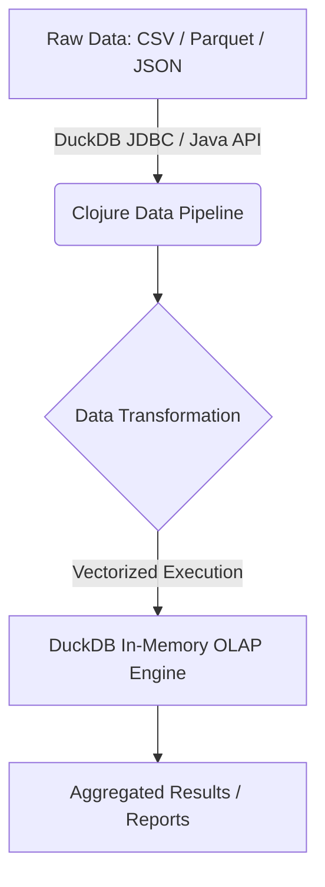

> [!IMPORTANT]
> **분야**: IT/AI/Security  
> **한 줄 요약**: 로컬 노트북 환경에서 DuckDB와 Clojure를 조합하여 대용량 데이터를 고속으로 처리하고 분석하는 실무 가이드입니다.

---

지난주, 수천만 건의 로그 데이터를 로컬 환경에서 빠르게 집계해야 하는 까다로운 과제가 떨어졌습니다. 클라우드 웨어하우스를 띄우기엔 비용과 시간이 아깝고, 그렇다고 기존 RDBMS를 쓰자니 집계 쿼리가 억소리 나게 느려 터졌죠. 10년 차 시니어 엔지니어로서 제가 꺼내 든 비밀병기는 바로 **DuckDB**와 **Clojure**의 조합이었습니다. 이번 글에서는 노트북 환경에서도 수천만 건의 데이터를 수 초 만에 분석할 수 있는 로컬 데이터 파이프라인 구축 법을 A부터 Z까지 공유합니다.

## 1. 아키텍처 개요: 왜 Clojure와 DuckDB인가?

대규모 데이터 분석이라 하면 흔히 Spark나 Trino, 혹은 클라우드 기반의 BigQuery나 Snowflake를 떠올립니다. 하지만 일상적인 분석 작업이나 프로토타이핑, 혹은 경량화된 ETL 파이프라인에서는 무거운 분산 환경 구축이 오히려 독이 됩니다. 

DuckDB는 인메모리 OLAP(Online Analytical Processing) 데이터베이스로, SQLite가 OLTP의 제왕이라면 DuckDB는 OLAP의 제왕이라 불릴 만합니다. 여기에 Lisp 계열의 강력한 데이터 처리 능력을 가진 Clojure를 결합하면, 불변성(Immutability)을 보장하면서도 극도로 빠른 데이터 가공 파이프라인을 구축할 수 있습니다.



## 2. 프로젝트 설정 및 의존성 주입

가장 먼저 `deps.edn` 파일을 열어 DuckDB를 제어하기 위한 Java 라이브러리 의존성을 추가해야 합니다. DuckDB는 표준 JDBC 인터페이스를 완벽하게 지원하므로 Java용 드라이버를 Clojure에서 그대로 가져다 쓸 수 있습니다.

```clojure
;; deps.edn
{:deps {org.clojure/clojure {:mvn/version "1.11.1"}
        org.duckdb/duckdb_java {:mvn/version "0.9.2"}
        next.jdbc/next.jdbc {:mvn/version "1.3.883"}}}
```

DuckDB는 기본적으로 인메모리 모드로 동작하게 할 수도 있고, 단일 파일(`mydb.duckdb`) 기반으로 영속화할 수도 있습니다. 로컬 분석에는 파일 기반이 유리합니다.

## 3. 실무 구현: DuckDB 연결 및 쿼리 실행기 작성

이제 Clojure에서 DuckDB에 연결하고, Parquet 파일을 읽어와 고속으로 집계하는 코드를 작성해 보겠습니다. `next.jdbc` 라이브러리를 활용하면 매우 깔끔하게 JDBC 연결을 관리할 수 있습니다.

```clojure
(ns duckdb-pipeline.core
  (:require [next.jdbc : as jdbc]
            [next.jdbc.result-set : as rs]))

;; 1. DuckDB 연결 설정
(def db-spec
  {:dbtype "duckdb"
   :dbname "local_analytics.duckdb"})

(defn get-connection []
  (jdbc/get-connection db-spec))

;; 2. 대용량 Parquet 파일로부터 데이터 집계 쿼리 실행
(defn analyze-server-logs [conn parquet-path threshold-latency]
  (let [query (str "SELECT client_ip, count(*) as request_count, avg(latency) as avg_latency "
                   "FROM read_parquet(?) "
                   "WHERE latency > ? "
                   "GROUP BY client_ip "
                   "ORDER BY request_count DESC "
                   "LIMIT 10;")]
    (jdbc/execute! conn [query parquet-path threshold-latency]
                   {:builder-fn rs/as-unqualified-maps})))

;; 사용 예시
(comment
  (let [conn (get-connection)]
    (analyze-server-logs conn "data/server_logs_2023.parquet" 500)))
```

이 코드가 강력한 이유는 DuckDB의 **Vectorized Query Execution** 엔진 덕분입니다. 데이터를 행(row) 단위가 아니라 열(column) 단위 벡터로 묶어서 처리하기 때문에, 현대 CPU의 SIMD(Single Instruction, Multiple Data) 연산을 극한으로 활용합니다.

## 4. 데이터 파이프라인의 에러 핸들링과 성능 최적화

실무 환경에서는 데이터 스키마의 변동이나 메모리 부족 현상에 대비해야 합니다. DuckDB는 기본적으로 시스템 메모리를 효율적으로 사용하지만, 대용량 데이터셋을 다룰 때는 메모리 한계(`memory_limit`)를 명시적으로 설정해 주는 것이 안전합니다.

```clojure
(defn configure-duckdb [conn]
  (jdbc/execute! conn ["PRAGMA memory_limit='4GB';"]) 
  (jdbc/execute! conn ["PRAGMA threads=4;"]))
```

이처럼 커넥션 초기화 단계에서 Pragma 설정을 강제하면, 로컬 개발 환경에서 노트북이 다운되는 대참사를 예방할 수 있습니다.

## 5. 장단점 분석

### 장점
- **극강의 속도**: 별도의 클러스터 없이 단일 머신에서 수천만~수억 건의 데이터를 몇 초 만에 처리 가능
- **제로 인프라**: 서버를 따로 띄울 필요 없이 라이브러리 형태로 임베드 가능
- **Clojure와의 궁합**: 풍부한 이뮤터블 데이터 구조와 DuckDB의 고성능 연산이 결합하여 가독성과 성능을 모두 잡음

### 단점
- **동시 쓰기 제약**: SQLite와 유사하게 대규모 동시 쓰기(Concurrent Writes) 작업에는 적합하지 않음 (OLAP 특화)
- **분산 확장 한계**: 단일 머신 디스크/메모리 용량을 초과하는 페타바이트 단위 데이터에는 분산 엔진 필요

## 6. 자주 묻는 질문 (FAQ)

**Q. 기존 PostgreSQL이나 MySQL과 무엇이 다른가요?**
- 포스트그레스나 마이슬은 OLTP에 최적화되어 있어 복잡한 집계 연산 시 풀스캔으로 인해 속도가 저하됩니다. 반면 DuckDB는 컬럼 기반 저장소 구조로 OLAP에 특화되어 있어 집계 쿼리가 수십 배 이상 빠릅니다.

**Q. 메모리에 다 안 들어가는 데이터도 처리할 수 있나요?**
- 네. DuckDB는 메모리 용량을 초과하는 데이터에 대해 자동으로 디스크 기반 외부 정렬 및 해시 집계(Out-of-core processing)를 수행합니다.

## 7. 총평

로컬 환경에서의 데이터 분석 및 가벼운 ETL 파이프라인 구축에 있어서 Clojure와 DuckDB의 조합은 그야말로 '치트키'에 가깝습니다. 복잡한 클라우드 아키텍처를 도입하기 전에, 먼저 노트북 위에서 DuckDB의 강력함을 경험해 보시길 권장합니다. 프로덕션 코드에 당장 적용해 자원의 한계를 뛰어넘는 속도를 체감해 보세요.