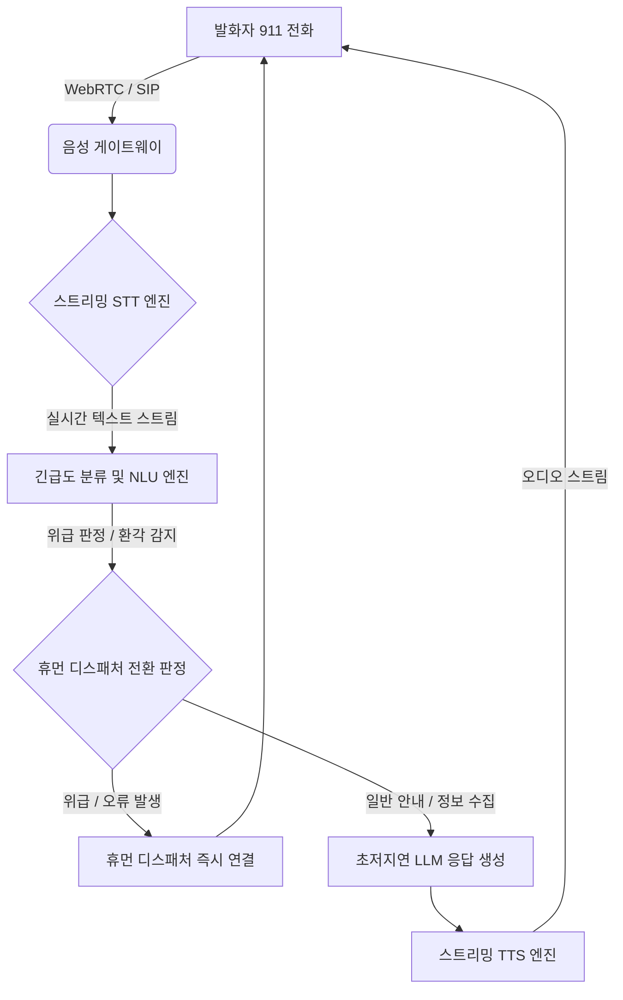

> [!IMPORTANT]
> **분야**: IT/AI/Security  
> **한 줄 요약**: 인력 부족 문제를 해결하기 위해 도입된 뉴올리언스의 AI 911 응답 시스템 사례를 바탕으로, 지연 시간 최소화와 예외 처리를 보장하는 미션 크리티컬 음성 AI 파이프라인 설계 및 구현 방법을 다룹니다.

---

## 1. 서두: 10년 차 엔지니어가 바라본 미션 크리티컬 AI의 현실

몇 년 전, 대규모 트래픽을 처리하는 실시간 채팅 상담 시스템을 구축할 때의 일입니다. LLM 기반의 자동 응답 봇을 도입하면서 '설마 시스템이 멈추기야 하겠어?'라는 안일한 생각으로 타임아웃 처리와 폴백(Fallback) 메커니즘을 대충 구현했다가, 대규모 장애 상황에서 챗봇이 무한 로딩에 빠지며 고객센터 전체가 마비되는 아찔한 경험을 했습니다.

최근 뉴올리언스 시티(New Orleans)가 인력 부족 문제를 해결하기 위해 911 긴급 전화 응답 시스템에 AI를 전격 도입했다는 뉴스를 접했습니다. 기술적 관점에서 이것은 단순한 챗봇 도입이 아닙니다. 사람의 생명이 걸린 '미션 크리티컬(Mission-Critical) 환경'에서 지연 시간(Latency), 네트워크 단절, 환각(Hallucination) 현상, 그리고 긴급 상황 전파 실패라는 극한의 리스크를 방어해야 하는 엄청난 도전입니다.

이번 칼럼에서는 이와 같은 초저지연·고신뢰성 음성 AI 시스템을 설계할 때 반드시 고려해야 할 아키텍처 패턴과, 실무에 즉시 적용할 수 있는 Python 기반의 스트리밍 음성 처리 파이프라인 구현 코드를 공유하고자 합니다.

---

## 2. 미션 크리티컬 음성 AI 시스템 아키텍처

긴급 전화와 같은 환경에서는 오디오 입력부터 자연어 이해(NLU), 응답 생성(LLM), 그리고 음성 합성(TTS)에 이르는 전체 파이프라인의 지연 시간이 1초 이내로 수렴해야 합니다. 또한, AI가 발화자의 위급 상황을 오인하거나 이해하지 못할 경우, 즉시 인간 디스패처(Human Dispatcher)에게 라우팅하는 '휴먼 인 더 루프(Human-in-the-loop)' 아키텍처가 필수적입니다.

아래는 실무에서 설계한 고가용성 음성 AI 파이프라인의 구조입니다.



이 아키텍처의 핵심은 **Fail-Safe** 설계입니다. AI 엔진 내부에서 예외가 발생하거나 신뢰도(Confidence Score)가 임계값 이하로 떨어질 경우, 밀리초 단위로 인간 상담원에게 제어권을 넘겨야 합니다.

---

## 3. 실무 구현: 초저지연 스트리밍 음성 처리 파이프라인

실무에서 바로 활용할 수 있도록, 웹소켓(WebSocket) 기반으로 오디오 스트림을 수신하고, 비동기 처리를 통해 지연 시간을 최소화하는 파이프라인의 핵심 코드 스니펫을 작성했습니다.

```python
import asyncio
import logging
import json
from typing import AsyncGenerator

logging.basicConfig(level=logging.INFO)
logger = logging.getLogger("MissionCriticalVoiceAI")

class EmergencyPipeline:
    def __init__(self, confidence_threshold: float = 0.85):
        self.confidence_threshold = confidence_threshold
        self.is_human_escalated = False

    async def receive_audio_stream(self) -> AsyncGenerator[bytes, None]:
        # 시뮬레이션을 위한 가상의 오디오 청크 스트리밍
        for i in range(5):
            await asyncio.sleep(0.1) # 100ms 단위 오디오 청크
            yield f"audio_chunk_{i}".encode('utf-8')

    async def process_stt(self, audio_chunk: bytes) -> tuple[str, float]:
        # STT (Speech-to-Text) 모듈 호출 시뮬레이션
        await asyncio.sleep(0.05)
        # 가상의 텍스트와 신뢰도 반환
        text = "집에 불이 났어요 도와주세요"
        confidence = 0.92
        return text, confidence

    async def evaluate_intent(self, text: str, confidence: int) -> dict:
        # NLU 및 긴급도 평가
        if confidence < self.confidence_threshold:
            return {"action": "ESCALATE_TO_HUMAN", "reason": "Low confidence"}
        
        if "불" in text or "사고" in text or "응급" in text:
            return {"action": "DISPATCH_EMERGENCY", "urgency": "HIGH"}
        
        return {
            "action": "AI_RESPOND", 
            "response": "위치와 정확한 상황을 다시 한 번 말씀해 주시겠습니까?"
        }

    async def run_pipeline(self):
        logger.info("Emergency Voice AI Pipeline Started...")
        try:
            async for chunk in self.receive_audio_stream():
                if self.is_human_escalated:
                    logger.warning("Pipeline bypassed. Already escalated to human.")
                    break

                text, confidence = await process_stt_chunk = await self.process_stt(chunk)
                logger.info(f"STT Result: '{text}' (Confidence: {confidence})")

                decision = await self.evaluate_intent(text, confidence)
                logger.info(f"AI Decision: {decision}")

                if decision["action"] == "ESCALATE_TO_HUMAN" or decision.get("urgency") == "HIGH":
                    self.is_human_escalated = True
                    logger.critical("CRITICAL: Transferring call to human dispatcher immediately!")
                    await self.trigger_human_handoff(decision)
                    break

        except Exception as e:
            logger.error(f"Critical error in voice pipeline: {str(e)}", exc_info=True)
            await self.trigger_emergency_fallback()

    async def trigger_human_handoff(self, context: dict):
        # 실제 시스템에서는 SIP/WebRTC 기반으로 인간 상담원 큐에 연결
        print(f"[Handoff Protocol] Connecting to human operator with context: {context}")

    async def trigger_emergency_fallback(self):
        print("[Fallback Protocol] Forcing default human routing due to system failure.")

if __name__ == "__main__":
    pipeline = EmergencyPipeline()
    asyncio.run(pipeline.run_pipeline())
```

이 코드는 비동기(Asyncio) 기반으로 설계되어 오디오 스트림 수신과 STT 분석을 논블로킹(Non-blocking)으로 처리하며, 예외 상황이나 응급 키워드 감지 시 즉시 인간 상담원에게 핸드오프(Handoff)하는 로직을 포함하고 있습니다.

---

## 4. 장단점 비교 (Pros & Cons)

미션 크리티컬 환경에서의 AI 도입은 명확한 장점과 치명적인 단점이 공존합니다.

| 구분 | 장점 (Pros) | 단점 및 리스크 (Cons) |
| :--- | :--- | :--- |
| **비용 및 효율성** | 24/7 대규모 동시 통화 처리 가능, 인력 부족 해소 | 초기 구축 및 인프라 유지 비용 고비용 |
| **응답 속도** | 초기 필터링 및 정보 수집의 초고속 처리 | 네트워크 지연(Latency) 발생 시 치명적인 서비스 저하 |
| **정확성 및 안정성**| 반복적인 응급 프로토콜 표준화 적용 가능 | 예외적인 사투리, 소음, 환각 현상으로 인한 오작동 위험 |

---

## 5. 자주 묻는 질문 (FAQ)

**Q1. 음성 AI가 발화자의 사투리나 극심한 공포로 인한 쉰 목소리를 제대로 인식하지 못하면 어떻게 합니까?**  
A1. 미션 크리티컬 STT 모델은 노이즈 캔슬링과 다양한 악센트 훈련이 필수적입니다. 또한, 인식률(Confidence Score)이 특정 기준치 미만으로 떨어지면 즉시 AI가 발화를 중단하고 사람에게 연결하는 규칙을 강제해야 합니다.

**Q2. LLM의 환각(Hallucination) 현상으로 인해 잘못된 지시를 내릴 위험은 없나요?**  
A2. 응급 전화와 같은 도메인에서는 자유 생성형 LLM을 그대로 사용해서는 안 됩니다. 엄격하게 정의된 상태 머신(State Machine)과 프롬프트 가드레일을 적용하여 정해진 프로토콜 외의 답변을 원천 차단해야 합니다.

---

## 6. 총평 및 실무 제언

뉴올리언스의 911 AI 도입 사례는 공공 서비스 영역에서 기술이 어떻게 사회적 문제를 해결할 수 있는지 보여주는 동시에, 기술적 완성도가 담보되지 않았을 때의 리스크가 얼마나 거대한지 경고하는 이중적인 사건입니다.

시니어 엔지니어로서 우리가 기억해야 할 원칙은 명확합니다. **"AI는 사람을 대체하는 것이 아니라, 사람이 더 정밀하고 빠르게 결정을 내릴 수 있도록 돕는 최전선의 방어선이어야 한다."** 미션 크리티컬 시스템을 설계할 때는 항상 최악의 장애 시나리오를 가정하고, 견고한 폴백 메커니즘을 구축하는 것을 최우선으로 삼아야 할 것입니다.