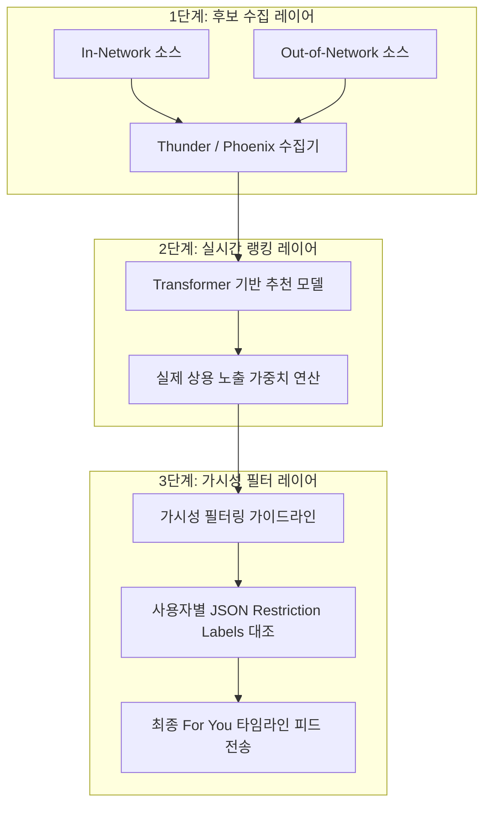

> [!IMPORTANT]
> **분야**: IT/AI/Security  
> **한 줄 요약**: 2026년 1월 대폭 확장 공개된 X의 'For You' 알고리즘 저장소를 바탕으로, 후보군 수집(Thunder/Phoenix)부터 가중치 랭킹, JSON 기반 가시성 필터링까지 이어지는 현대적 추천 파이프라인의 핵심 설계와 실무 적용 기법을 다룹니다.

---
## X의 'For You' 알고리즘 전면 개방과 실무적 의의

X(옛 트위터)가 2026년 1월, 자사의 핵심 추천 모델인 'For You' 알고리즘 저장소(`xai-org/x-algorithm`)의 공개 범위를 대폭 확대했습니다. 이번 업데이트는 지난 5월 공개된 초기 저장소와 비교했을 때 무려 **10배에 달하는 대대적인 용량 확장**을 포함하고 있습니다. 단순히 개념 분석 모델을 공유했던 과거 수준을 넘어, 실제 유저 타임라인 생성 시 적용되는 가치 점수 연산 세팅과 노출 제한 필터링 시스템의 핵심 매커니즘까지 상세하게 포함하고 있습니다.

수억 명의 유저들이 실시간으로 쏟아내는 고밀도 트래픽 환경 속에서 실시간 개인화 피드를 무중단으로 생성하기 위해, X 개발 팀은 시스템 전체를 재작성(Rewrite)하여 견고한 대규모 분산 파이프라인을 구축했습니다. 이번에 완전히 베일을 벗은 세부 랭킹 조정 수식과 필터 관리 모듈은 대형 플랫폼의 아키텍처 표준을 보여주는 교과서와 같습니다. 본 가이드에서는 X의 전체 추천 시스템 설계 패턴을 파헤치고, 이 중에서 '가중치 기반 랭킹'과 'JSON 명세를 활용한 가시성 필터링' 로직을 추출해 실무에서 바로 작동하는 프로토타입 시뮬레이터를 개발해보겠습니다.

---

## 'For You' 추천 시스템 아키텍처 분석

X의 'For You' 피드는 단순한 무작위 타임라인 조회가 아닌 정교한 다단계 분산 파이프라인을 거쳐 설계됩니다. 이 아키텍처는 원시 트윗 후보 수집 레이어, Transformer 기반의 헤비 랭킹 레이어, 규제 및 필터링 제어를 담당하는 가시성 제어 레이어로 고도로 계층화되어 있습니다.



### 1. 후보 수집 단계 (Candidate Generation)
수억 개의 원본 데이터에서 사용자가 흥미를 보일 수 있는 대표 후보군 약 1,500개를 신속하게 식별하는 단계입니다. 실시간 후보 수집을 가속하기 위해 **Thunder** 및 **Phoenix** 엔진이 긴밀히 통합 운영됩니다.
* **In-Network (관계망 내 수집)**: 팔로우 중인 사용자의 계정에서 인게이지먼트와 시의성이 높은 글을 긁어모읍니다.
* **Out-of-Network (관계망 외 수집)**: 팔로우하지 않은 계정의 글 중 사용자의 관심 벡터와 유사한 특징 공간(Embedding Space) 상에 머물고 있는 잠재적 관심 후보를 소싱합니다.

### 2. 점수 계산 및 중형 랭킹 (Heavy Ranking)
수집된 1,500개의 임시 후보군은 Transformer 구조 기반의 대형 랭킹 네트워크를 탑니다. 이번 2026년 1월 개방본에서 특히 눈에 띄는 대목은, 실제 서비스 운영 환경(Production)에서 쓰이는 가중치 튜닝 수치들이 투명화되었다는 점입니다. 좋아요, 공유(Retweet), 리플라이 등의 단순 액션뿐 아니라, 유저의 체류 시간 및 스팸성 수신 거부 피드백 데이터가 가중 점수로 정밀하게 환산됩니다.

### 3. 가시성 필터링 및 노출 제한 시스템 (Visibility Filtering)
랭킹 계산이 끝난 직후, 점수 정렬 결과를 최종 노출하기 전에 무조건 거치게 되는 게이트키퍼 모델입니다. X는 가이드라인 위반, 자극적 불일치 정보, 저품질 도배 글로 인한 사용자 이탈을 최소화하고자 안전 필터링 레이어를 매우 두껍게 구축해 두었습니다. 
새로운 기능 명세에 따르면, 사용자는 자신에게 적용되었던 전월의 제한 조치 라벨 기록(Restriction Labels)을 JSON 데이터 구조로 요청하여 열람할 수 있는 구조적 장치까지 함께 마련되어 플랫폼의 투명성을 고도화하고 있습니다.

---

## 추천 가이드를 적용한 경량 파이프라인 실무 구현

그렇다면 X가 적용한 추천 알고리즘 설계 사상을 실무에 적용해 보겠습니다. 다음 코드는 Thunder/Phoenix가 수집한 후보군을 가정한 상태에서, X의 핵심 랭킹 가중치 공식과 JSON 가시성 패널티 필터를 결합하여 최종 피드를 생성해내는 실행 가능한 Python 데모 시뮬레이터입니다.

```python
import json
from typing import List, Dict, Any

# 1. 랭킹 점수 가중치 정의
# 긍정 행동에는 가점, 유저 차단 및 부정 반응에는 큰 감점을 부여합니다.
RANKING_WEIGHTS = {
    'like': 0.6,               # 좋아요에 대한 기본 기여
    'retweet': 1.2,            # 리트윗을 통한 바이럴 공유 효과
    'reply': 1.8,              # 소통을 유발하는 댓글 가중치
    'negative_feedback': -2.5  # 스팸 신고, 감추기 등 노출 차단 요청 페널티
}

# 2. Thunder 및 Phoenix 후보 수집 엔진으로부터 추출된 가상 후보 데이터 리스트
candidate_tweets = [
    {
        'id': 'tweet_id_001',
        'author': 'tech_expert_a',
        'content': 'X AI 추천 알고리즘의 대규모 업데이트 상세 해부와 소스 분석 아키텍처 가이드입니다.',
        'metrics': {'like': 250, 'retweet': 80, 'reply': 15, 'negative_feedback': 1}
    },
    {
        'id': 'tweet_id_002',
        'author': 'clickbait_b',
        'content': '[충격!] 단 5초 만에 부자 되는 비법 대방출! 지금 즉시 확인하지 않으면 후회합니다!!',
        'metrics': {'like': 850, 'retweet': 620, 'reply': 450, 'negative_feedback': 95}
    },
    {
        'id': 'tweet_id_003',
        'author': 'developer_c',
        'content': '로컬 DuckDB와 파이썬 메모리 가속 패키지를 연동하여 분산 ETL 분석 환경을 개발했습니다.',
        'metrics': {'like': 110, 'retweet': 25, 'reply': 4, 'negative_feedback': 0}
    }
]

# 3. 지난달(Previous Month) 노출 제한 라벨 기록 명세서 (JSON 형식 가공)
# X의 투명성 패키지 규격을 간소화하여 모방한 설정입니다.
restriction_labels_json = """
{
    "restriction_records": [
        {
            "tweet_id": "tweet_id_002",
            "reason": "unverified_sensational_clickbait",
            "visibility_reduction_ratio": 0.85
        },
        {
            "tweet_id": "tweet_id_003",
            "reason": "none",
            "visibility_reduction_ratio": 0.0
        }
    ]
}
"""

def compute_raw_score(metrics: Dict[str, int], weights: Dict[str, float]) -> float:
    """사용자 참여 지표를 정량화된 가중 가점 총합으로 계산합니다."""
    raw_score = 0.0
    for metric, value in metrics.items():
        raw_score += value * weights.get(metric, 0.0)
    return raw_score

def process_recommendation_pipeline(candidates: List[Dict[str, Any]], restriction_json: str) -> List[Dict[str, Any]]:
    """가중치 기반 연산과 노출 규제 라벨링 필터를 통합 적용한 최종 정렬 파이프라인"""
    # 3.1 JSON 기반 필터 맵 작성
    parsed_restrictions = json.loads(restriction_json)
    penalty_rules = {
        record["tweet_id"]: record["visibility_reduction_ratio"]
        for record in parsed_restrictions["restriction_records"]
    }

    output_feed = []
    for tweet in candidates:
        tweet_id = tweet['id']
        # 원본 타겟 점수 연산
        base_score = compute_raw_score(tweet['metrics'], RANKING_WEIGHTS)
        
        # 제한 라벨 보유 여부에 따른 필터 감쇄비율 획득
        reduction_ratio = penalty_rules.get(tweet_id, 0.0)
        
        # 노출 제어 알고리즘 공식 적용
        final_score = base_score * (1.0 - reduction_ratio)
        
        processed_item = tweet.copy()
        processed_item['raw_score'] = round(base_score, 2)
        processed_item['applied_penalty'] = reduction_ratio
        processed_item['final_score'] = round(final_score, 2)
        output_feed.append(processed_item)

    # 점수가 가장 높은 트윗 순서대로 정렬하여 타임라인 순번 결정
    output_feed.sort(key=lambda x: x['final_score'], reverse=True)
    return output_feed

if __name__ == '__main__':
    print("--- X 'For You' 추천 알고리즘 파이프라인 가속화 시뮬레이션 ---\n")
    sorted_timeline = process_recommendation_pipeline(candidate_tweets, restriction_labels_json)
    
    for rank, tweet in enumerate(sorted_timeline, 1):
        print(f"[Rank {rank}] Author: @{tweet['author']}")
        print(f" * 요약문: {tweet['content'][:45]}...")
        print(f" * 원본 랭킹 점수: {tweet['raw_score']}점")
        print(f" * 가시성 패널티 감쇄율: {tweet['applied_penalty'] * 100}%")
        print(f" * 최종 노출 확정 점수: {tweet['final_score']}점")
        print("=" * 60)
```

---

## X 알고리즘 아키텍처 개방의 장단점 비교

X의 `xai-org/x-algorithm` 대규모 공개 결정은 AI 및 플랫폼 기술 진영 전반에 대단히 깊고 상징적인 메시지를 던집니다.

### 장점 (Pros)
1. **타의 추종을 불허하는 신뢰도와 투명성**: 외부 시스템 연구자 및 사용자가 자신의 콘텐츠가 어떠한 사유로 배제되었거나, 어떤 랭킹 계수로 증폭되어 노출되었는지 세세히 들여다볼 수 있습니다. JSON 제한 이력을 출력해 사용자 경험의 의구심을 정량적으로 입증하고 설명할 수 있는 백엔드 근거가 됩니다.
2. **대형 실시간 인프라 학습 교과서**: 트랜잭션 빈도가 비정상적으로 극심한 SNS 환경에서 리랭킹과 가시성 통제(Visibility Control) 과정을 어떠한 패러다임으로 처리했는지 직접 참조하여 소규모 스타트업 및 중소 서비스의 대형 플랫폼 업그레이드 마이그레이션 전략에 활용하기에 적합합니다.

### 단점 및 리스크 (Cons)
1. **스팸 머신 및 알고리즘 우회(Gaming) 시도의 폭발**: 세부 가중 공식의 상수와 어뷰징 억제용 패널티 계수가 노출됨에 따라 이를 영리하게 비껴가기 위한 맞춤형 스팸 피드 제작이나 의도적인 랭킹 지표 임계치 파고들기가 용이해집니다.
2. **핵심 보안 로직의 은폐에 따른 한계**: 남용 방지와 비즈니스 핵심 방어를 목표로 프로덕션에서 수시로 교체되는 민감 필터와 실시간 실험용 메인 코어 정보는 비공개 영역으로 제외되어 있으므로 완전한 동작 분석 모델을 복제하는 것은 여전히 불가능합니다.

---

## 자주 묻는 질문 (FAQ)

**Q1. 기존에 공개된 초창기 알고리즘 코드와 어떤 부분이 다른가요?**
* **A1.** 기존에는 대략적인 추론 모형과 데이터 가속 전송 파이프라인 뼈대(Thunder/Phoenix 등)의 얼개만 보였습니다. 반면, 이번 확장 개방은 트윗이 사용자의 타임라인 최상단에 올라가는 과정을 세밀하게 규율하는 '가시성 필터링 알고리즘'과 'JSON 점수 계산 매개변수 명세'까지 담고 있어, 실제 노출 감쇄 구조를 통제하는 현실성 높은 규칙들을 포함하고 있습니다.

**Q2. 소스코드에 나타난 가중치를 제 임의의 앱에 그대로 학습시킬 수 있나요?**
* **A2.** 핵심 가중치 설정 방식은 훌륭한 인하우스 추천 설계 가이드라인이 될 수 있습니다. 다만, 각 플랫폼 서비스가 관리하는 핵심 유저 세그먼트와 수집되는 상호작용 특징값(Feature)의 분포가 다르므로 반드시 서비스 데이터에 기초한 A/B 테스트 검증 및 전처리를 마친 후, 상기 제공된 코드와 같이 변동 가중치 가속화 튜닝 방식을 차용하시는 것을 추천합니다.

**Q3. 노출 제한(Visibility Filtering) 라벨 정보는 실제 유저에게 직접 배포되는 정보인가요?**
* **A3.** 네, 그렇습니다. 이번에 명시된 기능의 방향에 따라, 유저는 이전 달에 축적된 자신의 콘텐츠 정지 사유나 피드 노출 제한(Soft-shadowban 등) 원인 라벨 목록을 정형화된 JSON 오브젝트 구조 형태로 추출받아 직접 확인 및 추적이 가능하게 조치되어 한 차원 높은 투명성을 실현하고 있습니다.

---

## 총평

X가 배포한 확장판 For You 추천 알고리즘 소스코드는, 단순히 알고리즘 지식을 투명하게 밝히는 선언적 이벤트를 넘어 전 세계 추천 시스템 엔지니어들에게 완성도 높은 프로덕션 수준의 기술 자산을 고스란히 이양한 선례가 되었습니다. 대규모 병렬 분산 환경에서의 연산 처리 비용 절감과 세밀한 컨텐트 정책 가이드라인을 동시에 만족해야 하는 현대의 AI/서비스 기획 직군의 실무자라면, 이번 X의 아키텍처에서 규정한 필터링 시스템과 가중 조정 패러다임을 반드시 자사 시스템 설계 로드맵에 맞추어 검토하고 적용해 보기를 권장합니다.

## 참고자료

- https://news.hada.io/topic?id=32491
- https://xenospectrum.com/en/x-algorithm-under-the-hood-transparency/
- https://cryptobriefing.com/x-open-sources-for-you-algorithm/
