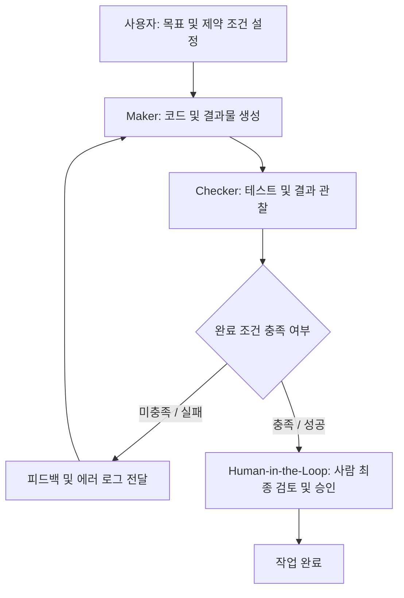

> [!IMPORTANT]
> **한 줄 브리핑**: AI가 목표를 달성할 때까지 피드백과 검증을 반복하도록 시스템을 설계하는 루프 엔지니어링의 핵심 원리와 실무 적용 방법을 소개합니다.  
> **분야**: IT/AI/Security

---
## 30초 요약
루프 엔지니어링(Loop Engineering)은 단순한 프롬프트 작성을 넘어, AI 에이전트가 특정 목표를 달성할 때까지 피드백을 바탕으로 작업을 스스로 반복 실행하도록 피드백 시스템을 설계하는 방법론입니다. 무조건적인 자율성 부여보다는 명확한 완료 조건과 제약 사항을 설정하고, 결과물을 만드는 역할과 검증하는 역할을 구조적으로 분리해 통제 가능한 자율 시스템을 만드는 것이 핵심입니다.

## 무슨 일인가
최근 AI 에이전트 및 코딩 에이전트를 다루는 핵심 패러다임이 '프롬프트 엔지니어링(Prompt Engineering)'에서 '루프 엔지니어링(Loop Engineering)'으로 빠르게 이동하고 있습니다. 과거 프롬프트 엔지니어링이 AI에게 한 번 질문하고 한 번 답변을 받는 단발성 질의응답 중심이었다면, 루프 엔지니어링은 "AI에게 매번 시키지 않고, AI를 시키는 시스템을 짜는" 방식으로의 패러다임 전환을 의미합니다.

루프 엔지니어링 환경에서 AI 에이전트는 다음과 같은 3단계 피드백 루프(Feedback Loop)를 거쳐 일련의 작업을 수행합니다.

1. 행동(Action): 부여받은 목표에 따라 코드를 수정하거나 파일 및 문서를 작성하는 작업 수행
2. 관찰(Observation): 실행 결과, 테스트 에러 로그, 외부 검증 시스템의 피드백 관찰
3. 판단 및 결정(Decision): 관찰된 결과를 분석해 목표 달성 여부를 판단하고 다음 수행 단계 결정

대표적인 예로 Anthropic의 Claude Code에서 제공하는 `/goal` 명령어 시스템을 들 수 있습니다. 이 기능은 사용자가 지정한 측정 가능한 목표가 완전히 충족될 때까지 에이전트가 작업과 검증을 반복하도록 구성되어 있습니다. 단순히 답변을 얻는 것에서 나아가 목표 달성 시까지 스스로 수정 작업을 거치는 시스템을 설계하는 것이 이번 트렌드의 본질입니다.

## 왜 중요한가
AI 에이전트 도입이 본격화되면서 단순한 자율성 확대보다는 통제 가능성과 신뢰성 확보가 핵심 과제로 떠올랐습니다. 루프 엔지니어링이 실무에서 중요하게 다뤄지는 이유는 다음과 같습니다.

### 1. 통제 가능한 자율성 구현
AI에게 일방적인 자율성을 부여할 경우 의도치 않은 방향으로 작업이 탈선하거나 예상치 못한 결과가 발생할 수 있습니다. 루프 엔지니어링은 완벽한 완료 조건과 제약 사항을 정의하고, 어떤 판단은 사람이 계속 맡을지 결정함으로써 안정적으로 통제 가능한 자율 시스템을 만듭니다.

### 2. Maker와 Checker의 역할 분리
시스템 내부에서 결과물을 작성하는 역할(Maker)과 결과물의 품질을 검증하는 역할(Checker)을 명확하게 분리합니다. 동일한 AI 모델이 자신의 작업을 판단하는 오류를 방지하고, 검증 전용 프롬프트나 자동화 테스트 도구를 Checker로 활용하여 작업의 객관성을 확보합니다.

### 3. 단계적 자율화 도입 가능 (L1 → L2 → L3)
한 번에 완전 자율화를 도입하는 위험을 줄이기 위해 레벨별 점진적 도입 체계를 제공합니다.
- L1 (수동 피드백 루프): 사람이 결과물을 검토(Checker)하고 직접 피드백을 전달하여 반복 수행
- L2 (반자동 피드백 루프): 테스트 자동화 도구가 Checker 역할을 수행하여 에러 피드백을 AI에게 전달
- L3 (고도 자율 피드백 루프): 제약 조건 내에서 에이전트가 검증과 피드백 수정을 자율적으로 지속

## 업무에 어떻게 쓸까
실무에 루프 엔지니어링 원칙을 적용하고 에이전트 작동 시스템을 구축하기 위한 4단계 절차입니다.

### 1단계: 측정 가능한 완료 조건(Exit Criteria) 정의
AI가 작업 종료 시점을 명확히 판단할 수 있도록 측정 가능한 객관적 기준을 수립합니다.
- 모호한 지시: "코드를 고치고 버그를 해결해줘."
- 측정 가능한 지시: "작성된 코드에 대해 단위 테스트 실행 시 성공률 100%를 달성하고, 린트 검사 에러가 0건일 때까지 반복 작업을 수행해줘."

### 2단계: Maker와 Checker의 구조적 분리
생성자와 검증자의 역할을 분리하여 시스템을 설정합니다.
- Maker: 소스 코드를 작성하거나 수정안을 제출하는 에이전트
- Checker: 작성된 코드의 작동 상태를 평가하는 자동화 스크립트 또는 별도의 검증 지침
- AI 에이전트가 스스로 판단하는 대신 Checker의 리턴값을 바탕으로 피드백을 수신하도록 구조화합니다.

### 3단계: Claude Code 목표 지정 방식 활용
Claude Code의 `/goal` 기능과 같은 반복 실행 환경을 설정합니다. 입력 시 반드시 포함할 구성 요소는 다음과 같습니다.
- 최종 달성 목표
- 반복 검증 시 실행할 평가 명령어 (예: `npm test` 등)
- 건드리지 말아야 할 파일 목록 및 제약 조건

### 4단계: 인간 개입 지점(Human-in-the-Loop)과 예외 처리 명시
- 루프의 무한 반복을 방지하기 위해 최대 반복 횟수(Max Iterations)를 설정합니다.
- 데이터베이스 반영, 주요 설정 변경, 최종 머지(Merge) 등 파급력이 큰 단계에는 사람의 승인을 받는 정지 지점을 명시합니다.

## 한계와 주의점
루프 엔지니어링 적용 시 고려해야 할 현실적인 한계와 사전 검증 필요 사항입니다.

### 1. 무한 루프 발생 및 리소스 과다 소모
완료 조건이 모호하거나 에이전트가 피드백을 수정하지 못할 경우 무한 루프에 빠질 수 있습니다. 이는 과도한 API 호출 비용과 시스템 리소스 소모를 야기하므로 타임아웃 및 최대 반복 실행 횟수 제한 설정이 필수적입니다.

### 2. Checker 판단 기준의 신뢰성 검증
검증자(Checker)의 평가 기준이 허술하거나 오판이 발생하면 잘못된 결과물이 최종 목표를 달성한 것으로 오인될 수 있습니다. 도입 초기에는 Checker의 평가 정확도를 사람이 직접 교정하는 검증 작업이 선행되어야 합니다.

### 3. 실제 비용 절감 및 생산성 수치 추가 확인 필요
제공된 자료만으로는 개별 기업 환경에서의 실제 개발 시간 단축 수치나 구축 비용 절감 폭을 확인할 수 없습니다. 따라서 소규모 프로젝트에 먼저 시범 적용한 후 자체적인 비용 대비 효율성을 검증해야 합니다.

## 루프 엔지니어링 아키텍처
루프 엔지니어링의 핵심 작동 알고리즘과 피드백 순환 구조는 다음과 같습니다.

## 자주 묻는 질문 (FAQ)

### Q1. 프롬프트 엔지니어링과 루프 엔지니어링의 가장 큰 차이는 무엇인가요?
프롬프트 엔지니어링이 AI에게 전달하는 지시문 자체를 다듬는 기술이라면, 루프 엔지니어링은 AI가 행동과 관찰, 판단을 반복하며 스스로 목표를 달성할 수 있도록 피드백 시스템 전체를 설계하는 방식을 의미합니다.

### Q2. 비개발 직군 업무에도 루프 엔지니어링 원리를 적용할 수 있나요?
가능합니다. 문서 작성이나 데이터 정리 업무에서도 명확한 검증 기준(예: 양식 준수 여부 체크리스트 통과 등)과 검증자 역할을 정의하면 루프 형태의 자동화 업무 흐름을 만들 수 있습니다.

### Q3. 점진적 도입 모델(L1, L2, L3) 중 어떤 단계부터 시작해야 하나요?
처음에는 사람이 직접 Checker가 되어 AI의 결과물에 피드백을 주고 AI의 수정 양상을 파악하는 L1 단계부터 시작한 뒤, 체계가 잡히면 자동화 도구를 연결하는 L2 단계로 확장하는 것을 권장합니다.

## 참고자료

- https://news.hada.io/topic?id=32519
- https://jaylenhan.tistory.com/entry/AILLM-Loop-Engineering루프-엔지니어링에-대해-자세히-알아보자-개요-및-정의-구성요소-특징-및-장단점-구축
- https://www.elancer.co.kr/blog/detail/1115
- https://goddaehee.tistory.com/614
