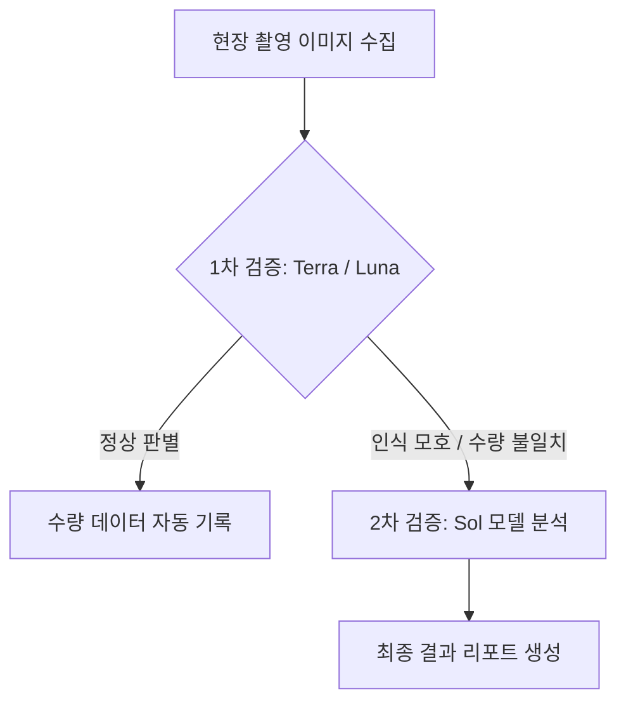

> [!IMPORTANT]
> **한 줄 브리핑**: OpenAI가 비전, 코딩, 사이버 보안 능력을 강화한 GPT-5.6 Sol 및 Terra, Luna 라인업을 공개했습니다. 객체 탐지 mAP@50이 46.2로 크게 개선되어 업무 자동화 및 데이터 추출에 높은 활용도를 제시합니다.  
> **분야**: IT/AI/Security

---
## 30초 요약
- **비전 성능의 대대적 도약**: OpenAI가 미리 선보인 차세대 모델 GPT-5.6 제품군(Sol, Terra, Luna) 중 GPT-5.6 Sol이 시각적 이해 능력(Vision) 부문에서 이전 세대를 크게 뛰어넘는 성능을 보였습니다.
- **객체 탐지 mAP@50 수치 급상승**: Roboflow 등의 평가에 따르면, 객체 탐지(Object Detection) 주요 지표인 mAP@50에서 기존 GPT-5.5 모델이 13.8점에 그쳤던 반면, GPT-5.6 Sol은 46.2점으로 비약적인 상승을 이뤄냈습니다. 경량 라인업인 Terra(44.7)와 Luna(43...) 역시 우수한 탐지 성능을 보여주었습니다.
- **실무 적용 및 비용 검토 필요**: OCR(광학 문자 인식), 데이터 추출, 개수 측정 과제에서 강점을 보이나, 커뮤니티 분석에 따르면 Gemini 3.5 Flash(약 1/3 비용) 및 Fable(OCR 우수) 등 타사 경쟁 모델과의 비용 대비 성능 비교 검증이 필수적입니다.

## 무슨 일인가
OpenAI가 코딩, 과학, 사이버 보안 기능과 더욱 고도화된 안전 스택(Safety Stack)을 결합한 차세대 모델 'GPT-5.6 Sol'의 프리뷰를 공개했습니다. 이와 함께 소형 및 경량화 라인업인 Terra와 Luna 모델도 수평적으로 평가에 포함되어 주목을 받고 있습니다.

비전 AI 관련 전문 기관인 Roboflow와 기술 커뮤니티는 GPT-5.6 Sol, Terra, Luna를 대상으로 객체 탐지(Detection), 개수 세기(Counting), 광학 문자 인식(OCR), 구조화 데이터 추출(Extraction) 등 다각도의 시각 과제를 수행하고 대표적인 VLM(시각-언어 모델)들과 비교를 진행했습니다.

그 결과 GPT-5.6 Sol은 지금까지 OpenAI가 출시한 시각 지능 모델 중 가장 뛰어난 "비전(Vision)" 성과를 기록한 것으로 확인되었습니다. 가장 눈에 띄는 변화는 객체 탐지 부문입니다. 위치와 영역을 식별하는 정밀도 지표인 mAP@50에서 이전 모델인 GPT-5.5는 13.8에 불과했으나, GPT-5.6 Sol은 46.2를 기록하며 비전 인식의 정확성을 대폭 끌어올렸습니다. 함께 공개된 Terra 역시 44.7, Luna는 43... 수준의 성능을 보여주며 다양한 크기의 모델 전반에서 시각적 이해 성능이 개선되었음을 입증했습니다.

## 왜 중요한가
시각 정보 처리 성능의 향상은 단순한 이미지 분류나 개략적인 설명 작성을 넘어, 기업의 백오피스 및 현장 실무 자동화 수준을 한 단계 끌어올리는 중요한 전환점입니다.

### 1. 객체 탐지(Object Detection) 정밀도의 비약적 개선
기존 비전 LLM 모델들은 전체적인 이미지 분위기나 대표적인 물체는 잘 알아챘으나, 이미지 내 세부 물체의 위치를 정밀하게 파악하는 객체 탐지 영역에서는 한계가 명확했습니다. GPT-5.5의 mAP@50 점수가 13.8에 그쳤던 이유도 여기에 있습니다. 그러나 GPT-5.6 Sol이 46.2라는 수치를 기록함에 따라, 복잡한 그래픽, 물류 현장 사진, 인포그래픽 내 개별 요소들을 정확하게 식별하고 경계 영역을 지정하는 작업이 한층 원활해졌습니다.

### 2. 업무 환경에 맞춘 라인업 분화 (Sol, Terra, Luna)
플래그십 모델인 Sol 외에도 경량화 모델인 Terra(44.7)와 Luna(43...)가 높은 수준의 탐지 능력을 보여주었습니다. 이는 고도의 정확도와 종합적 추론이 요구되는 핵심 업무에는 Sol을 적용하고, 빠른 응답 속도와 비용 절감이 중요한 반복적 현장 모니터링에는 Terra나 Luna를 선택하여 구축할 수 있는 설계적 유연성을 제공합니다.

### 3. 멀티모달 통합 역량 및 안전 스택 강화
OpenAI의 발표에 따르면 GPT-5.6 Sol은 단순 비전 모델에 그치지 않고 코딩, 과학적 추론, 사이버 보안 기능이 고도화된 안전 스택과 결합되어 있습니다. 즉, 다이어그램이나 웹 화면 캡처, 시스템 구조도를 비전 기능으로 읽어 들인 뒤 이를 기반으로 안전하게 소스 코드를 작성하거나 보안 취약점을 검토하는 고차원 복합 업무 흐름을 만들 수 있습니다.

## 업무에 어떻게 쓸까
GPT-5.6 Sol 및 경량 라인업이 제공하는 비전 성능을 실제 업무에 즉시 도입해 볼 수 있는 단계별 가이드와 적용 프롬프트 패턴입니다.

### 1단계: 시각적 영수증 및 문서 데이터 추출 파이프라인 구축
비전 모델의 OCR 및 데이터 추출 능력을 활용하여 스캔된 이미지 문서나 영수증, 송장 데이터를 정형화된 JSON 형태로 자동 전환합니다.

* **적용 조건**: 이미지 형태의 비정형 문서가 지속적으로 접수되는 정산 및 백오피스 파이프라인
* **실행 절차**:
  1. 입력 이미지(영수증 또는 송장)를 API에 전달합니다.
  2. 추출 데이터 항목과 데이터 타입을 명확히 정의한 프롬프트를 함께 전송합니다.

```json
{
  "instruction": "다음 영수증 이미지에서 주요 정보를 추출하여 지정된 JSON 구조로 반환하십시오.",
  "required_fields": {
    "merchant_name": "상호명 (string)",
    "transaction_date": "거래 일자 (YYYY-MM-DD)",
    "items": [
      {
        "item_name": "품목명 (string)",
        "quantity": "수량 (number)",
        "unit_price": "단가 (number)"
      }
    ],
    "total_amount": "총 금액 (number)"
  }
}
```

### 2단계: 이미지 내 개수 세기 및 객체 탐지 현장 점검
향상된 객체 탐지(mAP@50 = 46.2) 및 계수(Counting) 능력을 활용해 매장 진열대, 물류 창고, 선적 수량 등의 이미지 데이터를 자동 판별합니다.

* **적용 조건**: 제품 수량 점검 및 이상 유무를 정기적으로 확인해야 하는 물류/유통 관리 업무
* **실행 절차**:
  1. 현장 카메라 또는 작업자 단말기로 촬영된 이미지를 백엔드로 수집합니다.
  2. Terra나 Luna 같은 소형 모델을 우선 활용하여 빠른 응답 속도로 객체 수량을 측정하고, 특정 임계값 이하이거나 누락이 의심될 경우 Sol 모델로 재검증을 진행하는 2단계 파이프라인을 구축합니다.



### 3단계: 시스템 다이어그램 분석을 통한 사이버 보안 및 코딩 검토
강화된 코딩 및 사이버 보안 능력과 비전 기능을 결합하여, 네트워크 아키텍처 다이어그램이나 데이터 흐름도(DFD) 이미지를 분석하고 보안 가이드를 수립합니다.

* **실행 프롬프트 예시**:
  > "제공된 네트워크 다이어그램 이미지를 바탕으로 외부 망과 내부 DB 간의 접속 구간을 분석해 주세요. 발생 가능한 보안 취약점을 점검하고, 이를 방지하기 위한 보안 설정을 Python 코드로 제시해 주십시오."

## 한계와 주의점
GPT-5.6 Sol이 대폭 향상된 비전 성과를 보였으나, 실제 운영 환경에 도입하기 전 객관적으로 검토해야 할 한계점이 명확히 존재합니다.

### 1. 경쟁 모델과의 비용 및 성능 대비 우위 검토
Hacker News 등 개발자 커뮤니티의 벤치마크 분석 논의에 따르면, 타사 모델인 Gemini 3.5 Flash가 OCR 전용 과제를 제외한 대다수 비전 벤치마크 평가에서 GPT-5.6 Sol을 앞서는 성능을 보였다는 지적이 있습니다. 특히 Gemini 3.5 Flash는 GPT-5.6 Sol 비용의 약 3분의 1(1/3) 수준에 불과하므로, 대용량 이미지 처리 파이프라인을 구축할 때 대안 모델과의 비용 대비 효과(ROI)를 면밀히 비교해야 합니다.

### 2. OCR 특정 과제에서의 전문 모델 격차
문자 인식 및 추출 영역의 벤치마크 결과에 따르면, OCR 과제에서는 Fable 모델이 가장 뛰어난 성능을 기록한 것으로 파악되었습니다. 범용 VLM으로서 Sol이 우수한 통합 성과를 가져다줄 수는 있으나, 오직 텍스트 extraction만 수행하는 전문 업무의 경우 Fable이나 전용 OCR 솔루션이 더 높은 정확도를 보일 수 있습니다.

### 3. 검증 데이터의 한계 및 추가 테스트 필요성
본 리포트에 인용된 mAP@50 지표(GPT-5.5의 13.8 -> Sol의 46.2)와 관련 수치(Terra 44.7, Luna 43...)는 Roboflow의 테스트 결과 및 OpenAI 프리뷰 자료에 근거합니다. 실제 실무 환경의 저화질 이미지, 조명 변화, 가림 현상(occlusion) 등 실제 필드 데이터셋에서는 성능 차이가 발생할 수 있으므로 자사 보유 데이터로 A/B 테스트를 사전 수행해야 합니다.

## 자주 묻는 질문 (FAQ)

### Q1. GPT-5.6 Sol과 기존 GPT-5.5의 가장 큰 차이는 무엇인가요?
가장 뚜렷한 차이는 비전 및 객체 탐지 성능입니다. 객체 탐지의 정밀도를 나타내는 mAP@50 지표에서 GPT-5.5가 13.8이었던 것에 비해 GPT-5.6 Sol은 46.2로 3배 이상 성장했습니다. 또한 코딩, 과학, 사이버 보안 기능과 안전 스택이 고도화되었습니다.

### Q2. Sol, Terra, Luna 중 어떤 모델을 선택해야 하나요?
정밀한 객체 탐지와 복잡한 다이어그램 분석, 보안 추론이 필요한 고성능 작업에는 플래그십인 GPT-5.6 Sol이 적합합니다. 반면 실시간 응답성이나 처리 비용 절감이 중요한 일상적인 이미지 분류 및 수량 파악에는 mAP@50 44.7 / 43... 수준을 기록한 Terra나 Luna를 선택하는 것이 대안이 될 수 있습니다.

### Q3. OCR 및 데이터 추출 작업 시 다른 대안 모델도 고려해야 하나요?
네, 커뮤니티 벤치마크 데이터에 따르면 OCR 영역에서는 Fable 모델이 우수한 성능을 보였고, 전반적인 성능과 1/3 수준의 비용 효율성을 고려할 때 Gemini 3.5 Flash 역시 강력한 대안입니다. 따라서 비전 AI 도입 시 단일 모델에 고착되지 않고 과제별 모듈화 테스트를 거치는 것이 바람직합니다.

## 참고자료

- https://news.hada.io/topic?id=32594
- https://openai.com/index/previewing-gpt-5-6-sol/
- https://blog.roboflow.com/openai-gpt-5-6/
- https://news.ycombinator.com/item?id=49329575
